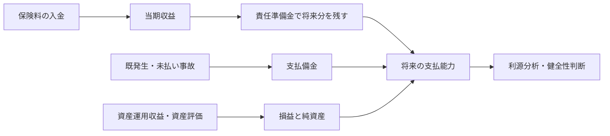
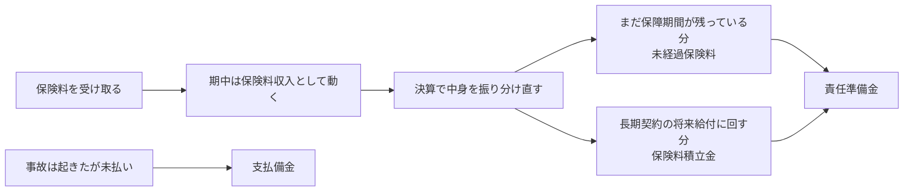

# 生命保険会計

## この資料の狙い

この章は、用語が多いわりに、何を解いている章なのかが見えにくい。  
だからこの資料では、先に「生命保険会社は何に困っていて、その困りごとを会計でどう整えているのか」を一本の流れでつかめるようにする。

狙いは、定義をきれいに暗記することだけではない。  
「なぜその処理になるのか」が腹に落ちるところまで持っていくことにある。そこまで見えると、穴埋めも短答もかなり崩れにくくなる。

## 教科書との対応

教科書の第1章は、だいたい次の順で組まれている。

1. 生命保険会計の意義と特徴
2. 保険契約関係収支
3. 保険契約準備金
4. 資産運用関係収支
5. 資産評価
6. 利源分析・基礎利益・配当
7. 生命保険会社税制

前回の版は、1から3を中心に書いていて、4以降が少し薄かった。  
今回は、この教科書の流れを意識して、章全体が見えるように読み直している。

## 教科書本文の節ごとの読み方と第I部想定問題

ここでは、第1章を教科書の流れに沿って見直しながら、「この節は何を言いたいのか」と「第I部ならどう問われやすいか」を先に置いておく。  
先に地図を持っておくと、後ろの本文を読むときに、いまどの論点を読んでいるのか見失いにくい。

### 1.1 生命保険会計の意義と特徴

教科書の出発点は、生命保険会計が単なる会社の家計簿ではない、という確認である。  
一般の事業会社の会計は、期間損益や投資家・債権者への情報提供が前に出やすい。これに対して生命保険会計は、契約者保護、つまり超長期にわたり約束を履行できるかを特に重く見る。ここが一番の違いである。

そのうえで、超長期性、群団性、保険料構成要素の多様性、契約件数の多さ、相互会社の存在などが、生命保険会計に独特の原則を要請している。  
この節は「なぜ生命保険会計は普通の会計と同じでは足りないのか」を説明する土台である。

- 第I部想定問題: 生命保険会計の意義を説明せよ。
- 第I部想定問題: 生命保険会計の特徴を列挙し、それぞれが会計へ与える影響を述べよ。

### 1.2 保険契約関係収支

ここは、保険料と保険金・返戻金等の支払いをどう会計に落とすかの節である。  
保険料は現金主義で入るが、そのまま全部を当期利益にはしない。将来分は責任準備金に逃がすし、すでに事故は起きているが未払いのものは支払備金で拾う。生命保険会計の入口として、いちばん手を動かしやすい部分でもある。

さらに、契約変更や前納のように、「現金の動いた時点」と「保障の意味が変わった時点」がずれる場面も多い。  
この節が言いたいのは、生命保険会計は、日々の取引は現金主義で動かしつつ、決算で責任準備金や支払備金を通じて実質的な発生主義へ寄せる、という二段構えでできているということだ。

- 第I部想定問題: 保険料の収益計上基準を説明せよ。
- 第I部想定問題: 限度積立の趣旨と計算の考え方を述べよ。
- 第I部想定問題: 支払備金の意義と IBNR の考え方を説明せよ。

### 1.3 保険契約準備金

第1章の中心がここである。  
責任準備金の意義、会計目的との関係、法制上の位置づけ、標準責任準備金、追加責任準備金、再保険、実務計算、評価方式、財務会計上の負債性、危険準備金、価格変動準備金まで、この章の核がほぼ詰まっている。

読み方としては、まず「何を守る負債か」を押さえ、その後に「法律上どう最低ラインを置くか」「実務でどう計算し、どう積み増すか」「通常の予測を超えるぶれには何で備えるか」と順に追うのが分かりやすい。  
ここを名前の暗記で終わらせず、`責任準備金が基本の負債`、`標準責任準備金が最低ライン`、`追加責任準備金が個別補強`、`危険準備金と価格変動準備金が異常なぶれへの備え` という関係でつかむと崩れにくい。

- 第I部想定問題: 標準責任準備金制度の目的と概要を説明せよ。
- 第I部想定問題: 追加責任準備金とセルフサポート原則の関係を述べよ。
- 第I部想定問題: 平準純保険料式、チルメル式、初年度定期式、営業保険料式の違いを説明せよ。
- 第I部想定問題: 危険準備金と価格変動準備金の違いを述べよ。

### 1.4 資産運用関係収支

この節は、生命保険会社を負債だけで見ないためにある。  
保険会社は保険料を受け取ったあと、それを長期間運用して将来給付をまかなう。だから、利息配当金、有価証券売却損益、評価損、為替差損益、デリバティブ損益をどう読むかは、支払能力にも期間損益にも直結する。

ここでの要点は、「資産運用益」と一言で言っても中身が違うことだ。  
平常的に積み上がるインカム収益もあれば、売却タイミングや評価方法に左右されるものもある。つまりこの節は、どの利益が持続的で、どの利益が一時的かを見分ける練習でもある。

- 第I部想定問題: 資産運用関係収支の主な項目を挙げ、その性格の違いを述べよ。
- 第I部想定問題: ヘッジ会計をここで学ぶ理由を説明せよ。

### 1.5 資産評価

ここは、会計上の数字がどう作られるかを読む節である。  
原価基準、時価基準、低価基準、時価の考え方、減損会計が並ぶが、全部に共通する問いは「どこまで現在の市場情報を会計へ入れるか」である。

生命保険会社でこれが重いのは、長い負債を抱えながら資産を保有しているからだ。  
資産だけ時価で大きく揺れ、負債はロックイン評価であまり動かないと、会計上の純資産が大きくぶれる。だから資産評価は、単なる会計技術ではなく、会社をどの物差しで測るかの問題として読む必要がある。

- 第I部想定問題: 原価基準、時価基準、低価基準の違いを説明せよ。
- 第I部想定問題: 減損会計を学ぶ必要性を述べよ。

### 1.6 利源分析・基礎利益・配当

この節は、第1章の中ではやや後ろにあるが、実務感覚を作るうえでかなり大事である。  
損益計算書だけでは「何がよくて、何が悪かったのか」が十分に分からないので、死差、利差、費差、責任準備金関係損益、価格変動損益などへ分解する。さらに基礎利益で、より経常的な収益力を読む。

教科書がここで配当準備金や社員配当の経理処理も扱うのは、利源分析がそのまま契約者配当の公平性確認へつながるからである。  
第3章へ渡す橋の役目をしている節だと考えるとよい。

- 第I部想定問題: 利源分析の意義を説明せよ。
- 第I部想定問題: 基礎利益が何を見るための指標か述べよ。

### 1.7 生命保険会社税制

ここは、会計をそのまま税務が受け入れるわけではないことを学ぶ節である。  
責任準備金繰入額、配当準備金、IBNR、受取配当金の益金不算入、法人事業税などが並ぶが、全部に共通しているのは、「会計上必要な費用や留保を、税務ではどこまで認めるか」が問題になっていることだ。

税制は個別論点が散らばって見えやすいが、会計と税務のずれをどう調整するか、という一本の問いで見ると整理しやすい。  
この節は暗記色が強いが、背景を押さえておくと忘れにくい。

- 第I部想定問題: 生命保険会社税制の特徴を述べよ。
- 第I部想定問題: 受取配当金の益金不算入が生命保険会社では単純な恩恵になりにくい理由を説明せよ。

### 1.8 経済価値ベースによる責任準備金評価

教科書の最後にこれが置かれているのは、現行法定会計だけでは生命保険会社の実態を十分に表し切れない、という問題意識があるからである。  
法定責任準備金は契約時前提が強く、支払能力の最低ラインを守るには向いているが、金利変動やオプション価値を含む経済実態をそのまま映すものではない。そこで、将来キャッシュフローと経済前提を重く見る見方が必要になる。

ただし、第I部では具体的な最新制度計算を細かく問うというより、「なぜ経済価値ベースで見たいのか」「現行会計のどこが見えにくいのか」を押さえる方が先である。  
この節は、第4章のリスク管理や経済価値ベース規制の話へつながる入口だと考えるとよい。

- 第I部想定問題: 経済価値ベースによる責任準備金評価を考える理由を述べよ。
- 第I部想定問題: 法定責任準備金評価と経済価値ベース評価の見方の違いを説明せよ。

## まず、この章は何を解決したいのか

生命保険会社の商売は、ふつうの商売と時間の向きがかなり違う。  
多くの契約では、先に保険料を受け取り、ずっと後に保険金や給付金を払う。しかも、その支払いは数年先どころか、二十年後、三十年後ということも珍しくない。

ここで起きるいちばん大きな問題は、今手元に入ってきたお金を、そのまま今の利益だと思ってしまうと、会社の姿が大きくゆがむことにある。  
現金は増えていても、その現金のかなりの部分は、将来の支払いのために取っておかなければならない。つまり、「お金が入った」という事実と、「自由に使える利益が増えた」という事実は、生命保険では一致しない。

生命保険会計がやっているのは、このずれを整える仕事である。  
言い換えると、

- どこまでを今期の収益として見てよいのか
- どこから先は将来の負債として残しておくべきか
- まだ払っていないが、もう支払義務が生じているものをどう拾うか
- 資産側の価格変動や運用成果を、どう読むと会社の実態に近づくか

を整理する章だと考えると、全体がかなり見えやすくなる。

### 図で先に全体像を見る

この章は、`入ってきたお金`、`まだ払っていないが払うべきお金`、`市場で動く資産価値` を同じ決算書の上でつなぐ章である。
会計処理を個別に覚えるだけでなく、この流れのどこを整える処理なのかで読むと、責任準備金、支払備金、資産評価、利源分析がばらけにくい。

## 生命保険会計の全体像

この章を最初にざっくりつかむなら、次の4本柱で見るとわかりやすい。

### 1. 保険料は入金時に収益計上する

生命保険の保険料は、原則として現金主義で計上する。  
理由は単純で、払込期日が来たからといって、必ずしも入金されるとは限らないからである。契約者は以後の保険料を払わないこともできるし、失効や解約で将来の保険料が入ってこないこともある。未収保険料は、一般の売掛金のような「かなり確からしい債権」とは言いにくい。

だから、入金前の保険料まで先に収益にしてしまうと、保守的ではない。  
ここは、生命保険会計が「まだ確かなものではない収益を先に立てない」ようにしている部分である。

### 2. ただし、入金された保険料を全部その年の利益にはしない

ここが生命保険会計の核心である。  
保険料が入ったときに全額を収益として立てるだけでは、今期の利益が過大に見える。なぜなら、その保険料の中には、将来の給付や将来の費用に対応する部分が大量に含まれているからである。

そこで、決算では責任準備金を積む。  
この処理を通じて、「入ってきた保険料のうち、将来に回すべき部分は今期の自由な利益ではない」と整理する。ここで大事なのは、責任準備金は単なる現預金の別口座ではなく、将来債務を負債として認識する仕組みだということである。

### 3. もう事故は起きているのに、まだ支払っていないものは支払備金で拾う

責任準備金は、将来の保険事故全体に備えるための負債である。  
これに対して支払備金は、もう支払うべき事故が起きているものを、まだ未払いだからといって見落とさないための負債である。

この2つを混同すると一気に崩れる。  
責任準備金は「将来に向けた備え」、支払備金は「すでに発生している債務の未払い分」という位置づけで分けておくと整理しやすい。

### 4. 法定会計の数字だけでは実態を読み切れないので、補助線が要る

生命保険会社の利益や健全性は、損益計算書の当期利益だけ見ても十分にはわからない。  
保険料の現金主義、責任準備金の評価、資産評価、配当、税制などが絡むので、表面の利益数字だけで「今年は良い」「悪い」と言うと誤ることがある。

そのため、利源分析、有価証券評価、責任準備金対応債券、各種準備金の見方など、補助線が必要になる。  
第I部でこの章が重いのは、まさにここである。会計処理の条文だけでなく、その数字をどう読むかまで問われやすい。

## この章でずっと相手にしている三つのずれ

生命保険会計が難しく見えるのは、論点が多いからというより、同じ種類のずれがいろいろな場所で顔を出すからである。  
そのずれを先に三つに分けておくと、後ろの話がかなり読みやすくなる。

一つ目は、時間のずれである。  
保険料は先に入るが、保険金や給付金はずっと後に出ていく。このずれがあるので、入金をそのまま利益にすると、早い年度の利益が膨らみすぎる。責任準備金や未経過保険料は、この時間のずれをならすための装置である。

二つ目は、確実性のずれである。  
将来の死亡率、解約率、事業費、運用利回りは、契約時点ではまだ確定していない。にもかかわらず、会社は今の時点で財務諸表を作り、健全性を示さなければならない。だから、生命保険会計では「まだ起きていない将来」を一定の前提で見積もり、その見積もりが甘すぎないように安全側の考え方を入れている。標準責任準備金、追加責任準備金、危険準備金は、このずれへの対応として読むとつながる。

三つ目は、測り方のずれである。  
資産は時価に近い見方をする場面がある一方で、負債は契約時の基礎率を引きずる場面がある。すると、経済実態としては大きく変わっていなくても、会計上の純資産や損益が大きく動くことがある。資産評価、責任準備金対応債券、経済価値ベース評価は、この測り方のずれをどう読むかという話である。

この三つをまとめると、生命保険会計は「長い時間」「不確実な将来」「資産と負債の別々の物差し」を無理なく同じ財務諸表にのせるための工夫だと言える。  
教科書の各節は別々の知識に見えるが、実際にはこの三つのずれを、場所を変えながら順番に整えている。

## 保険料を現金主義で計上するのはなぜか

この論点は、ただ「未収保険料は確定債権ではないから」で終わらせると薄い。  
もう一段掘ると、生命保険契約では、契約者が将来の保険料を払い続けるかどうか自体が、契約の継続に依存している。保険料を請求できる権利があるように見えても、一般企業の売掛金ほど強く固定された請求権ではない。

だから、期日が来た分を自動的に収益認識してしまうと、

- 実際には入ってこない保険料まで収益に乗る
- 契約の失効・解約の影響を後追いでしか修正できない
- 契約者保護を重視する法定会計としては楽観的すぎる

という問題が出る。

ただし、現金主義だからといって、期間損益の考え方を捨てているわけではない。  
そこが大事で、生命保険会計は「期中は現金主義で動かし、決算で責任準備金や支払備金を通じて実質的に発生主義へ寄せる」というつくりになっている。

つまり、雑だから現金主義なのではない。  
むしろ、保守性を優先しつつ、決算で必要な修正を入れて整える、という二段構えでできている。

## 前納と未経過保険料をどう理解するか

前納は、この章を理解するのにとてもいい例である。  
たとえば、次年度以降の保険料をまとめて受け取ると、入金の瞬間には現金が大きく増える。このまま全部を今年の収益にすると、今年だけ利益が膨らみ、翌年以降は逆に収益が細る。これでは、契約全体の経済実態と合わない。

そこで、翌年度以降に対応する部分は未経過保険料として責任準備金に積み立てる。  
やっていることを平たく言えば、「もうお金は受け取ったが、まだ会社が提供し終わっていない保障期間の分は、今期の稼ぎとして確定させない」という調整である。

この感覚は、責任準備金全般を理解する入口にもなる。  
生命保険会計では、現金が入ったことと、利益が確定したことを、いったん切り分ける必要がある。その代表例が前納である。

### ミニ例: 2年分を前納したとき、なぜ全部を今年の利益にしないのか

| 項目 | 金額 | 今年どう見るか |
| --- | --- | --- |
| 2年分まとめて受け取った保険料 | 24 | 現金は 24 入る |
| 今年の保障期間に対応する部分 | 12 | 今年の収益として見る余地がある |
| 来年の保障期間に対応する部分 | 12 | 未経過保険料として残す |

このとき、現金は 24 増えていても、今年の自由な稼ぎが 24 増えたわけではない。
来年の保障に対応する 12 を今年の利益にしてしまうと、今年は良く見え、来年は逆に細く見える。未経過保険料で残すのは、この時間のずれをならすためである。

## 保険料が入ってから、どの負債へどう流れるのか

前納の論点で本当に見たいのは、`保険料収入 = そのまま利益` ではない、という一点である。
会社は決算で、「まだ保障期間が残っている分」「長期契約の将来給付に回す分」「事故は起きたが未払いの分」を切り分け直す。ここが見えると、未経過保険料、保険料積立金、支払備金がばらばらに見えなくなる。

図では、理解のために、責任準備金の中を `未経過保険料` と `保険料積立金` に分けて見ている。
ここで言いたいのは、同じ「負債に残す」といっても、`何を理由に残すのか` で中身が違うということだ。

### ミニ例: 同じ契約でも、見ている場面で負債の名前が変わる

20年満期の養老保険で、4月1日に年払保険料 12 を受け取り、9月30日に決算を迎える場面を考える。

| 場面 | 何が起きているか | 決算で見る負債 |
| --- | --- | --- |
| 4月1日から翌3月31日までのうち、10月1日以降の保障がまだ残っている | 今年受け取った 12 のうち、まだ経過していない保障期間がある | 未経過保険料 |
| その契約は20年の平準保険料で、若い時期には将来の満期保険金原資も先にためる必要がある | `今年の残り半年` という話ではなく、契約全期間を通じた将来給付への備えが要る | 保険料積立金 |
| 9月25日に保険事故が起き、保険金はまだ支払っていない | 将来事故への備えではなく、すでに起きた事故の未払い分である | 支払備金 |

この表の見方に慣れると、混線しにくい。
`まだ時期が来ていない保障期間` を見るのが未経過保険料、`長期契約全体の将来負担` を見るのが保険料積立金、`もう起きた事故の未払い` を見るのが支払備金である。

## 契約変更の経理処理が難しいのはなぜか

教科書が契約変更を独立で置いているのは、ここで「同じ契約が続いているように見えても、中身はかなり変わる」からである。  
減額、延長、払済、特約変更などが起きると、将来給付、保険料、責任準備金、事業費負担、解約返戻金の関係が変わる。すると、変更前の契約をそのまま引きずって処理すると、収益と負債の見え方がゆがむことがある。

この論点の本質は、契約変更を「単なる事務変更」と見ないことだ。  
生命保険会計では、契約条件が変われば、将来キャッシュフローの形が変わる。だから、責任準備金の見直しや、変更前後の収支の切り分けが必要になる。教科書がここを保険契約上の支払いの流れの中で扱うのは、そのためである。

## 保険料の区分を分けて見る意味は何か

保険料は一つの数字で収納されるが、中身は一色ではない。
教科書があえて区分を意識させるのは、`同じ 1 円でも損益への効き方が違う` からである。危険保険料、貯蓄保険料、付加保険料という見方を持つと、「保険料収入が増えたのに、なぜ利益が思ったほど増えないのか」が具体的に見えてくる。

### ミニ例: 保険料 100 をそのまま利益と見てはいけない理由

| 保険料の見方 | 例 | 今年の損益への効き方 |
| --- | --- | --- |
| 危険保険料 | 30 | 事故率が予定より低ければ死差益が出やすい |
| 貯蓄保険料 | 50 | 将来返す・将来給付に回る性格が強く、そのまま今年の利益にはなりにくい |
| 付加保険料 | 20 | 事業費をまかなう。初年度は募集費が重く、すぐ利益に残らないことも多い |

この区分は、帳簿上で必ず三つの箱に仕訳している、という意味ではない。
むしろ、保険料という一つの数字を読み解くための補助線である。`収入保険料が大きい会社 = その年によく儲かった会社` と言い切れないのは、この中身が違うからである。

## 群団性を無視すると何が壊れるのか

教科書が早い段階で群団性を置いているのは、ここを落とすと生命保険会計が全部ばらばらに見えてしまうからである。  
生命保険は、一件ごとに完結した売買ではない。大数の法則を前提に、一定の契約群団の中で保険料と保険金をならしている。

このため、保険料も責任準備金も、本来は群団の概念を背負っている。  
一人ひとりの契約を完全に独立した箱として見てしまうと、

- その契約だけで将来収支を閉じるべきなのか
- 解約返戻金は責任準備金と同額でなければならないのか
- 新契約世代と旧契約世代をどこまで分けるべきか

といった論点で行き詰まりやすい。

教科書が言いたいのは、生命保険会計は個別契約を無視してよいということではなく、個別契約だけでは正しく見えない、ということだ。  
群団として見てはじめて、保険料設定、責任準備金評価、配当、公平性の話が一本につながる。

## 保険料の中にいろいろなものが混ざっているのはなぜか

教科書は保険料構成要素の多様性も生命保険会計の特徴として強調している。  
これはかなり大事で、保険料は単純な「サービスの対価」ではない。

ざっくり分けると、保険料の中には、

- 将来の保険金支払いに回る部分
- 将来の事業費をまかなう部分
- 予定利率の前提のもとで運用される部分

が混ざっている。

だから、保険料が増えたからといって、そのまま単年度剰余が比例的に増えるわけではない。  
危険保険料部分は比較的まっすぐ剰余に効いても、付加保険料部分は費用の時間差があり、貯蓄保険料部分は預り金に近い性格を持つ。教科書がここを厚く扱うのは、「保険料収入が大きい ＝ その年によく儲かった」とは言えないことを理解させるためである。

## 責任準備金は何のためにあるのか

責任準備金は、この章の中心であり、同時にいちばん誤解されやすい。  
よくある誤解は、「契約者ごとに積み立てておくお金」とだけ見ることである。もちろん直感としては近いが、それだけでは足りない。

責任準備金が本当にやっていることは、将来の保険給付に備えて、会社が今の時点で負っている債務を負債として表すことである。  
生命保険は群団を前提に保険料を決める。つまり、一件一件の契約が払った保険料と、その契約が将来受け取る給付が、一対一でぴったり対応しているわけではない。大数の法則のもとで、群団全体として収支が組み立てられている。

そのため、責任準備金も「この人の口座残高」というより、「この契約群団について、将来の給付に備えて今の時点で認識しておくべき負債」と見る方が実態に近い。

ここで会計上大事なのは、責任準備金を積むことで、

- 今日入った保険料のうち将来分を利益から外す
- 将来の給付義務を負債として見えるようにする
- 会社の支払能力を保守的に測る

という3つを同時にやっていることである。

## 責任準備金を積むとは、将来の収支をどう現在へ持ち込むことか

責任準備金を「将来のために積み立てるお金」とだけ覚えると、会計処理の意味が少し曖昧になる。  
もう少し正確に言うと、責任準備金を積むとは、将来にわたって続く給付と保険料の関係を、いまの決算時点へ引き寄せて負債として表すことである。

たとえば、ある契約群について、今後受け取る保険料の見込みと今後支払う保険金・給付金・事業費の見込みを並べたとする。  
このとき、将来支払う側の重みの方が今後受け取る側より大きければ、その差を「まだ表面化していないが、会社がすでに負っている将来負担」と見て、今の貸借対照表にのせる必要がある。責任準備金は、その差額を保険数理で表したものだと考えると分かりやすい。

ここで大事なのは、責任準備金は将来支払額そのものではないということである。  
将来には、まだ受け取る予定の保険料もある。だから、単に「将来払う保険金の合計」を積むわけではない。将来の入りと出を見比べたうえで、なお今の時点で会社が背負っている部分を負債化する。それが責任準備金である。

この見方が入ると、平準純保険料式やチルメル式の違いも、「どの将来キャッシュフローを、どの年度へ配分するかの違い」として読める。  
責任準備金は残高の暗記ではなく、将来収支の切り取り方そのものだと捉えた方が、この章全体に一本筋が通る。

## 会計の目的が違うと、責任準備金の見え方も変わる

教科書はここで、「責任準備金は一個の絶対的な答えではない」と丁寧に説明している。  
これはとても大事で、責任準備金という言葉は一つでも、何を目的に見るかで求めたい水準は変わりうる。

たとえば、期間損益をより素直に見たいのか、支払能力の確保を強く見たいのかで、評価の置き方は変わる。  
保険料計算基礎率と同じ基礎率で評価するのが自然な場面もあれば、将来の保険事故率や経済環境を踏まえて、より保守的な評価が必要な場面もある。

ここで教科書が伝えたいのは、責任準備金は機械的な残高ではなく、会計目的と将来見通しを反映した評価だということだ。  
だから、後で出てくる標準責任準備金、追加責任準備金、キャッシュ・フロー・テストも、全部「何を守るための評価か」という問いに戻って理解するとつながる。

## 基礎率の評価性と「相当程度の確度」は何を意味しているのか

基礎率の評価性という教科書の言い方は、最初は少し抽象的に見える。  
でも要するに、「責任準備金は過去の計算式をそのままなぞるだけではなく、将来をどう見積もるかという判断を含む」ということである。

もし将来の死亡率や解約率、事業費水準が、いままでより悪化することが相当程度の確度で見込まれるなら、その変化を無視して低い責任準備金のままにしておくのは危うい。  
なぜなら、そのまま剰余があるように見えて配当や税金として外へ出してしまうと、本来は将来の支払いに必要なお金を先に手放してしまうからである。

ここでいう「相当程度の確度」は、確実でないから何もしない、という逃げ道を塞ぐ考え方でもある。  
生命保険は超長期なので、完全に確定した事実だけ待っていたら遅い。まだ不確実でも、かなり起こりそうで、起これば支払能力に効くなら、評価へ織り込む必要がある。

## 限度積立は何を守っているのか

限度積立は、言葉だけ追うとやや機械的に見える。  
でも中身はかなり自然で、「入ってもいない保険料を前提にして責任準備金まで積みすぎない」という話である。

保険料は現金主義で、未収保険料を収益に計上しない。  
その一方で、責任準備金だけは「払込期日が来ているはずの保険料が全部入ったもの」とみなして積んでしまうと、収益側と負債側の前提が食い違ってしまう。そこで、未収に対応する部分は控除し、実際に入ってきた保険料の範囲に責任準備金を合わせにいく。

ただ、ここでも一筋縄ではいかない。  
保険料が入っていない契約でも、猶予期間中であれば保険事故が起きる可能性はある。だから、まるごとゼロにしてよいわけではなく、危険保険料相当額は加算する。この処理は、収益の保守性と保障責任の継続を両方見ている。

ここも数字を一つ置くと見えやすい。  
年末時点で、本来なら保険料は入っている前提で責任準備金を 100 積む契約群があるとする。ただ、その中に未収保険料に対応する保険料積立金相当額 8 と未経過保険料相当額 2 が含まれているなら、その 10 はそのままでは積みすぎである。そこで 100 から 10 を引いて 90 に寄せる。  
ただし、猶予期間中は事故が起きうるので、保障責任をゼロ扱いにはしない。そこに危険保険料相当額を少し戻す。限度積立は、単に引く計算ではなく、「まだ入っていない保険料は外すが、もう引き受けている危険までは消さない」という調整である。

## 保険料積立金と未経過保険料を分ける意味は何か

この二つは、どちらも「いま自由に使える利益ではない」という点では似ている。
ただし、見ているずれが違う。未経過保険料は `期間のずれ` をならすための負債であり、保険料積立金は `長期契約の年次間の負担差` をならすための負債である。

1年更新の短い契約をイメージすると、話は比較的簡単である。年払保険料を先に受け取っても、まだ経過していない月数の分は未経過保険料として残す。
これに対して終身保険や養老保険では、若い時期の保険料は、その年の死亡保障だけに対応しているわけではない。平準保険料方式では、若い時期に相対的に余裕のある分を後年の重い給付原資へ回す。その残り方を表しているのが保険料積立金である。

### 表で整理するとこうなる

| 項目 | 何を拾う負債か | 典型場面 | 一言で言うと |
| --- | --- | --- | --- |
| 責任準備金 | 保有契約について、将来の保険給付に備えて今の時点で認識すべき大きな負債 | 長期の生命保険契約全般 | 将来債務を今の B/S に乗せる負債 |
| 保険料積立金 | 平準保険料方式のもとで、将来年度の給付原資として残すべき部分 | 終身保険・養老保険などの長期契約 | 長期契約の年次間ならし |
| 未経過保険料 | すでに受け取ったが、まだ経過していない保障期間に対応する部分 | 前納、年払契約、年度途中決算 | まだ時期が来ていない保障の分 |
| 支払備金 | すでに発生しているが未払いの保険金・給付金等。IBNR を含む | 事故発生済・未払 | 未来事故ではなく既発生事故の分 |

この表で特に押さえたいのは、`責任準備金` は大きなくくりであり、その中の代表的な中身として `保険料積立金` と `未経過保険料` がある、という関係である。
したがって、試験で「責任準備金と支払備金の違い」を聞かれたら `将来事故への備え` と `既発生事故の未払い` を答える。逆に「保険料積立金と未経過保険料の違い」を聞かれたら `長期契約の年次間配分` と `保障期間の未経過分` を答える。ここを言い分けられると強い。

## 支払備金は何を拾う負債か

支払備金は、「もう支払う段階に入っているもの」を落とさないための負債である。  
生命保険会社では、期中は実務上、保険金や解約返戻金を支払時点で処理することが多い。けれども、決算時点で見ると、事故はもう起きているのにまだ払っていないものが必ず出てくる。

これを放置すると、本来その年度に帰属する費用が翌年度にずれ込んでしまう。  
つまり、今期の損益が良く見えすぎる。支払備金はそのゆがみを直す役割を持つ。

さらに IBNR が入る。  
これは、事故自体はもう起きているのに、まだ会社に報告されていないため、帳簿に乗ってこないものを見積もって積む考え方である。ここが重要なのは、会社の目に見えていないからといって、経済実態として債務がないわけではないからである。

決算日を 3/31 とすると、4/1 以降に起こりうる事故へ備えるのは責任準備金であり、3/31 までにすでに起きていて、まだ払っていないものを拾うのが支払備金である。
境目は `払ったかどうか` ではなく、`事故が起きたかどうか` にある。この切り分けができると、責任準備金との混同がかなり減る。

責任準備金が「将来の事故に備える負債」だとすれば、支払備金は「すでに起きた事故の未払い分を拾う負債」である。  
この違いを言葉だけでなく場面で区別できるようになると、穴埋めも記述もかなり安定する。

## 標準責任準備金はなぜ必要になったのか

標準責任準備金は、`自由化を進めるなら、積立の下限は共通に持たないと危ない` という発想から生まれた。
保険料率や予定利率の設計自由度が広がると、販売競争では「より安く見せる」圧力が強くなる。ところが、生命保険は売った時点では良く見えても、何十年もたってから備え不足が表面化する商品である。

### 流れで押さえる

| 段階 | 何が起きたか | どこが危ないか |
| --- | --- | --- |
| 商品・価格の自由化 | 各社が予定利率や保険料率を工夫できる | 売りやすさを優先して前提を楽観に置きやすい |
| 高予定利率契約の積み上がり | 販売時点では保険料を安く見せやすい | 将来の運用が前提どおりいかなければ備え不足になりうる |
| 低金利化・逆ざやの顕在化 | 実際の運用利回りが高予定利率を下回る | 契約時の楽観前提が後から傷む |
| 行政対応 | 最低限の積立水準を共通ルールで置く | 契約者保護の床をつくる |

たとえば、販売時に予定利率 4% を前提に保険料を安くした契約を考える。
当時は魅力的に見えても、その後の長期低金利で実際の運用利回りが 1% 台にとどまれば、契約時の見込みどおりには資産が育たない。すると、`売るときの値付け` と `将来払うための備え` の間にずれが出る。標準責任準備金は、そのずれが大きくなりすぎないように、少なくともここまでは積みなさいと線を引く制度である。

だから、標準責任準備金を短く言い直すなら、`自由化の時代に、安売り競争で備えまで薄くならないように置かれた最低限の積立基準` である。
各社の工夫を否定する制度ではなく、工夫の自由を認める代わりに、契約者保護の床を共通化した制度だと捉えるとぶれにくい。

## 標準責任準備金で、試験が細目を聞いてくるのはどこか

ここは `標準責任準備金=最低線` までで止まると、過去問に届かない。
実際には、`どの契約が対象外か` と `標準利率がどこで効くか` を短く切れるかが問われやすい。

### 1. 対象外契約は、なぜ外れるのか

覚え方の芯は一つで、`長期・固定・一般勘定で会社が背負い込む負債` から外れるものは、標準責任準備金の守備範囲からも外れやすい。

| 対象外契約 | なぜ外れるか |
| --- | --- |
| 最低保証のない特別勘定連動契約 | 一般勘定で固定利率保証を長く背負う構造が弱い |
| 保険料積立金・払戻積立金を積まない契約 | そもそも標準責任準備金で下支えすべき長期積立負債が薄い |
| 予定利率を変更できる契約 | 契約時の利率を何十年も固定で抱える契約とは性格が違う |
| 保険期間1年以下の契約 | 長期固定負債の健全性確保という制度趣旨から外れやすい |
| 米ドル・豪ドル以外の外国通貨建契約 | 標準的な基礎率設定の前提がずれやすい |

### ミニ例: 何が外れ、何が外れないか

| 契約 | 標準責任準備金の発想との関係 |
| --- | --- |
| 30年の固定利率保証を含む一般勘定契約 | まさに制度が守りたい典型。対象に入りやすい |
| 1年更新の団体定期保険 | 長期固定負債を抱え続ける構造が弱く、対象外になりやすい |
| 最低保証のない変額商品 | 特別勘定連動が中心で、一般勘定での固定保証負担が薄い |

### 2. 標準利率は、どこで効くのか

標準責任準備金制度の細目で混ざりやすいのが、`保険料計算の予定利率` と `標準責任準備金計算の標準利率` である。
前者は販売時の値付けに使う会社前提、後者は最低限ここまでは積みなさいという規制上の物差しである。別物として見る必要がある。

| 項目 | 自社の保険料計算 | 標準責任準備金計算 |
| --- | --- | --- |
| 予定利率・標準利率 | 販売時の会社前提 | 監督上の最低線として置かれる基礎率 |
| 何に効くか | 保険料の水準 | 積むべき責任準備金の下限 |
| 金利が低く置かれたとき | 保険料は高くなりやすい | 必要積立額は大きくなりやすい |

たとえば、会社が市場金利を見て予定利率 2.0% で商品を売っていても、標準責任準備金計算上の標準利率が 1.5% なら、規制上はより低い利率で将来給付を評価する。
利率を低く置くほど将来負債の現在価値は重くなるので、販売時の感覚より多く積まなければならない。ここで `標準責任準備金積増し` が発生しうる。

さらに、標準責任準備金は死亡率や積立方式も含めた制度であり、契約時にロックインされる基礎率で計算される。
要するにここで見ているのは、`売るときは各社が工夫してもよいが、積立の下限だけは公的なものさしで縛る` という構造である。契約者価額を下回れない、という下限意識まで一緒に置いておくと崩れにくい。

## 追加責任準備金とセルフサポート原則はどうつながるのか

教科書本文を追うと、標準責任準備金の話は「最低ラインを置く」で終わっていない。  
その先に、実際に将来収支が苦しくなる契約群団をどう見るか、という問題が続く。

セルフサポート原則は、その群団が自分の将来負担を自分で支えられるか、という発想である。  
新契約で集めた保険料や、別の商品群の剰余に頼らないと維持できない状態は、本来は健全とは言いにくい。そこで、将来収支分析や責任準備金不足相当額の議論が出てくる。

追加責任準備金は、そうした不足を見つけたときに、「足りない分をいま積み増す」という対応として位置づけると理解しやすい。  
標準責任準備金が床なら、追加責任準備金は、床を満たしていてもまだ危ない群団に対する個別の補強である。

ここでイメージしやすいのは、予定利率が高かった古い契約群である。  
契約時には 4% 前後の運用を見込んで組んでいたのに、その後の長い低金利で実際にはそこまで稼げない。すると、その契約群は、新契約や他群団の剰余に助けてもらわないと将来給付をまかなえない状態になりうる。  
このとき「会社全体ではまだ持っているからよい」とは見ない。その群団自身が将来負担を支え切れないなら、足りない分を追加責任準備金で埋める。セルフサポート原則は、群団ごとの自立性を見るための物差しである。

## 標準責任準備金と追加責任準備金を分ける意味

この二つは、どちらも「責任準備金を厚くする話」に見えるので混ざりやすい。  
ただ、見ているタイミングと役割がかなり違う。

標準責任準備金は、商品を売る段階から共通にかかる最低限の床である。  
つまり、「各社の設計は尊重するが、契約者保護のためにここまでは積んでください」という、制度としての一律の安全柵である。販売時点の過度な楽観や、競争の行きすぎを抑える役割が強い。

これに対して追加責任準備金は、売った後に見えてきた個別事情へ対応する。  
当初は制度上問題なく見えていた契約群でも、低金利の長期化、解約動向の悪化、将来収支分析の結果などから、あとで不足が見えてくることがある。そのときに、「一般的な床は守っていたが、この群団はそれでも足りない」と判断して積み増すのが追加責任準備金である。

言い換えると、標準責任準備金は入口管理、追加責任準備金は事後補強である。  
入口で最低ラインを置き、それでも将来の支え切れなさが見えたら個別に厚くする。この二段構えで読むと、なぜ両方が要るのかがかなり分かりやすくなる。

## 再保険しても責任が消えないのはなぜか

教科書が責任準備金の中で再保険を扱うのは、ここを誤解しやすいからである。  
再保険に出したからといって、元受会社の契約者に対する責任がそのまま消えるわけではない。契約者から見た相手方は、あくまで元受会社である。

だから、会計でも監督でも、再保険回収額や再保険控除をどう見るかには慎重さが要る。  
再保険先が払えない可能性まで含めて考えないと、見かけ上だけ責任準備金が軽くなり、支払能力を甘く見積もることになりかねない。

## 責任準備金の負債性はなぜ強調されるのか

教科書の 1.3.5 は、責任準備金を単なる内部留保と誤解しないための節である。  
責任準備金は、会社が将来払う義務を表す負債であり、「余った利益を積んでいる箱」ではない。

ここがぼやけると、解約返戻金との関係や、配当・税金との関係で判断を誤りやすい。  
責任準備金は、契約者から見れば将来の給付の裏付けであり、会社から見れば自由に使えるお金ではない。教科書が負債性を強く押すのは、その線を曖昧にすると生命保険会計全体が崩れるからである。

## 会計監査人との関係はなぜ論点になるのか

責任準備金は巨大な負債であり、しかも見積りを含む。  
だから、会社内で計算して終わりにはできない。教科書が会計監査人との関係を置くのは、責任準備金が財務諸表の中心であり、外部からの検証対象でもあるからである。

ここでアクチュアリーの役割が重くなる。  
単に数式を回すのではなく、どの前提が妥当か、どの水準が健全な保険数理に基づくかを説明しなければならない。つまり、この節は「責任準備金は技術でありながら、同時にガバナンスの対象でもある」と言っている。

## 実務で責任準備金をどう処理するのか

教科書は、責任準備金の実務的な経理処理として、期中ではなく期末に洗替で処理する点も説明している。  
これは、責任準備金が日々の取引ごとに動く費用ではなく、決算時点で評価し直す負債だからである。

前期末残高を戻し、当期末残高を新しく立てる。  
その差額が責任準備金繰入額として損益計算書に出る。ここを理解すると、責任準備金は「積んだ現金」ではなく「決算で再評価される負債」だという感覚がかなり強くなる。

たとえば、前期末の責任準備金が 980、当期末に評価し直した結果が 1,030 だったとする。  
このとき見たいのは「今年いくら現金を別口座へ移したか」ではなく、「今年末時点で負っている将来給付義務はいくらか」である。だから、会計上は 980 をいったん戻し、1,030 を新たに立て、差額 50 を当期の責任準備金繰入額として読む。  
この処理に慣れると、責任準備金は貯金箱ではなく、決算ごとに測り直す負債だということが腹に落ちやすい。

## 平準純保険料式、チルメル式、初年度定期式、営業保険料式を並べて学ぶ意味

教科書が各種の責任準備金評価方式を並べるのは、試験で名前を答えさせたいだけではない。  
何を費用としてどの年度へ配分するか、どこまで新契約費を先送りするか、という会計と保険数理の思想の違いを見せている。

新契約費が重い生命保険では、どの方式を使うかで初年度と次年度以降の損益の見え方が変わる。  
だから、方式の名前と式だけでなく、「どのずれをどう平らにしようとしているのか」で覚えた方が定着する。

かなり単純化して言えば、初年度に新契約費 30 がかかる契約を考えると分かりやすい。  
平準純保険料式は、新契約費を責任準備金へ直接は織り込まないので、初年度は費用負担が重く見えやすい。チルメル式は、その初年度負担の一部を後年へ回す考え方で、初年度の責任準備金を相対的に軽くする。初年度定期式はさらに強く、初年度を 1 年定期保険のように見て、契約当初 1 年の責任準備金をゼロに寄せる。  
営業保険料式は、純保険料だけでなく事業費まで含めて見ようとするので、純保険料式とはそもそも見ているキャッシュフローの範囲が違う。要するに各方式は、「初年度の重い費用をどう扱うか」という一点で並べるとかなり整理しやすい。

## 危険準備金と価格変動準備金は何が違うのか

責任準備金だけでは、将来の不確実性や資産価格の大きな変動まで吸収しきれないことがある。  
そこで別の準備金が要る。

危険準備金は、予定を超える保険事故や予定利率リスクなど、保険引受や長期負債にかかわる不確実性に備える色合いが強い。  
一方、価格変動準備金は、株式その他の資産価格の変動による損失に備える色合いが強い。

直感的に言えば、

- 責任準備金は、保険契約そのものから生じる基本の負債
- 危険準備金は、その負債や引受リスクが想定よりぶれたときの備え
- 価格変動準備金は、保有資産の価格変動に対する備え

という分担で見ておくと整理しやすい。

たとえば、死亡率が悪化して死差損が出た年に効いてくるのは危険準備金である。  
一方、株式相場の急落で保有株に大きな価格下落が出た年に効いてくるのは価格変動準備金である。両方とも「悪い年への備え」ではあるが、前者は保険負債と引受リスクのぶれ、後者は資産価格のぶれを受ける箱だと分けて見ると混ざりにくい。  
教科書や法令が危険準備金を I、II、III、IV のように区分しているのも、何に備えるお金かを混ぜないためだと考えると自然である。

## 危険準備金IIと旧保険業法第86条準備金は、何を守る箱なのか

ここは名前が似ていないのに、過去問ではしばしば混ざる。
理由は、どちらも「悪い年への備え」に見えるからである。だが、守っているものは同じではない。

| 制度 | 何に備えるか | 典型場面 | 発想 |
| --- | --- | --- | --- |
| 危険準備金II | 予定利率リスク | 高予定利率契約を低金利下で抱え続ける逆ざや | 保険負債側の苦しさに備える |
| 価格変動準備金 | 株式等の価格変動リスク | 保有資産の時価下落 | リスク性資産を保有すること自体に先回りして備える |
| 旧保険業法第86条準備金 | 実現キャピタルゲインを基礎にした備え | 利益が出た後で積む | 後追い型の備え |

危険準備金IIは、1990年代の高予定利率契約を想像すると分かりやすい。
たとえば予定利率 4% で売った契約を、のちの低金利局面で長く抱えると、毎年の運用で 4% を稼ぎ続けるのが苦しくなる。ここで傷むのは資産価格そのものではなく、`過去に約束した利率を負債側で背負っていること` である。だから危険準備金IIは、価格変動準備金とは別箱になる。

現行の危険準備金IIは、責任準備金残高に予定利率区分ごとのリスク係数を掛けて `予定利率リスク相当額` を作り、高い予定利率の契約ほど重く見る。
積立基準は `予定利率リスク相当額の増加額 + 利差益×5%`、積立限度は `予定利率リスク相当額 + 責任準備金×3%` と整理すると、いまの制度が「逆ざやリスクへ平時から厚く備える」形に変わっていることが見えやすい。

一方、旧保険業法第86条準備金と現行の価格変動準備金の違いは、`利益が出てから積むか` と `保有しているだけで先に積むか` の違いである。
旧86条は実現キャピタルゲイン基礎の色が強かったが、現行の価格変動準備金は、まだ売っていなくても価格変動リスクを抱えている以上は備えろという発想である。ここを危険準備金IIと一緒にせず、`負債の約束に備える箱` と `資産価格のぶれに備える箱` に分けておくことが大事である。

## 資産評価と責任準備金対応債券をなぜ学ぶのか

生命保険会社の問題は、負債だけ見ても解けない。  
将来の給付をまかなうのは資産だからである。資産の評価方法が変われば、会社の純資産や損益の見え方も変わる。

とくに長期の保険負債を持つ会社では、金利が動いたときに資産価値がどう動くかが重い。  
ここで資産側だけ時価で大きく振れ、負債側はロックイン評価であまり動かないと、会計上の純資産が大きくぶれる。経済実態に照らすと必ずしもそれほど悪化していなくても、会計数値だけが大きく揺れる場面が出る。

責任準備金対応債券は、こうした資産と負債の対応関係を踏まえて、一部の評価のぶれをならす仕組みとして位置づけるとわかりやすい。  
ただし、これで ALM の問題が全部なくなるわけではない。あくまで現行会計の枠内で、負債特性に対応した資産運用を会計上も読みやすくする一つの工夫である。

ここは制度要件も一つだけ手で動かすと覚えやすい。  
責任準備金のデュレーションを 12、対応させる債券ポートフォリオのデュレーションを 10 とすると、`D(L)=k×D(A)` の見方では `k=1.2` で、許容範囲の中に入る。ところが資産側デュレーションが 8 しかなければ `k=1.5` となり、対応関係が弱すぎる。  
つまり責任準備金対応債券は、「長い負債を持っています」と言うだけでは使えず、実際にその小区分で資産と負債の時間構造がそこそこ合っていることまで要る、という制度である。

## 時価と減損会計をここで分けて学ぶ意味は何か

時価評価と減損会計は、どちらも資産価値の見直しに見えるが、問題意識は少し違う。  
時価評価は、現在の市場価格をどこまで会計へ反映させるかの話である。これに対して減損会計は、回復が見込みにくい価値低下をどう認識するかの話である。前者は市場情報を会計へ入れる発想、後者は保守的に損失認識を前倒しする発想、と見ると違いが見えやすい。

生命保険会社でこの違いが大事なのは、資産を長く持つことが多いからである。  
一時的な市場変動なのか、より本質的な価値低下なのかを区別しないと、健全性の見え方も期間損益の見え方もぶれやすい。教科書が時価と減損を分けて置くのは、その読み分けをさせたいからである。

## 貸倒引当金と第112条評価益は、資産をどう見せないための制度か

この二つは向きが逆である。
貸倒引当金は `資産を楽観に見せない` ための制度、第112条評価益は `含み益を勝手に利益化させない` ために特則の枠をはめた制度である。

| 論点 | 何を慎重に見ているか | 試験で落としたくない芯 |
| --- | --- | --- |
| 貸倒引当金 | 回収不能リスク | 資産の価値を先に控えめに見る |
| 保険業法第112条評価益 | 未実現の株式含み益 | 契約者利益へ還元する場合だけ特則で認める |

貸倒引当金は、まだ貸倒れが確定していなくても、回収不能や回収懸念が見えたら資産をそのぶん控えめに見る仕組みである。
生命保険会社では長期負債を支える資産の見積もりが甘いと支払能力の見え方までゆがむので、ここは地味でも重要である。答案では、`一般貸倒引当金` `個別貸倒引当金` `特定海外債権引当勘定` の三つを落とさないようにしたい。

一方、保険業法第112条評価益は、一般勘定の市場価格のある株式について、帳簿価額を超える差額を評価益として計上できる特則である。
ただし、ここで大事なのは「含み益を自由に利益計上してよい」という話ではないことだ。会社法上の取得原価主義に対する例外を認める代わりに、その評価益は責任準備金や社員配当準備金へ積み、契約者利益の確保・増進へつなげることが前提になっている。

### ミニ例: 30 の含み益をそのまま利益にしてよいのか

一般勘定の上場株式に 30 の含み益があっても、生命保険会社がそれを「今年の自由な利益」としてそのまま抱え込めるわけではない。
第112条評価益として計上が認められるのは、監督のもとで責任準備金や契約者配当準備金へ回し、契約者へ還元される筋道があるときである。ここが `未実現利益の内部留保を防ぐ仕組み` だと分かると、この特則の意味が急に分かりやすくなる。

## 資産運用関係収支をこの章で扱うのはなぜか

教科書の第1章は、保険料や責任準備金の話だけで終わらない。  
そこから先に、利息及び配当金等収入、有価証券売却損益、有価証券評価損、為替差損益、金融派生商品収益・費用などの資産運用関係収支が続く。これは自然で、生命保険会社の経営実態は、負債だけ見ても読めないからである。

生命保険会社は、保険料を受け取ったあと、それを長期間運用する。  
だから、どの資産をどんな評価方法で持ち、どんな収益や損失がどこに出るかは、会社の支払能力にも期間損益にも直結する。

ここで大事なのは、資産運用収益といっても中身が一つではないことだ。  
利息や配当のように比較的平常的に積み上がるものもあれば、売却益・売却損のように実現時点で出るものもあり、評価損のように時価変動が会計に反映される形で出るものもある。だから、同じ「利益」でも質が違う。

教科書がこの部分を細かく分けているのは、単なる勘定科目暗記のためではない。  
どの利益が持続的で、どの損益が評価替えや売却タイミングに左右されやすいかを見分けるためである。

## 資産運用関係収支は、なぜひとまとめに読むと危ないのか

ここは、勘定科目が多いので、つい「運用で稼いだお金」と一つにまとめて見たくなる。  
でも生命保険会社では、そのまとめ方がいちばん危ない。

たとえば、利息及び配当金等収入は、保有している資産から比較的継続的に入ってくる。  
これは翌年度以降もある程度続く可能性があるので、収益力を見るときの土台になりやすい。

これに対して有価証券売却益は、売った時点で初めて表に出る。  
もちろん売却で利益を確定させること自体は悪くないが、毎年の利益がこの売却益に大きく依存していると、将来の収益力を前借りしているだけかもしれない。今日は利益が厚く見えても、明日以降その資産から受け取れる利息や配当は減るからである。

有価証券評価損や為替差損益も、さらに性格が違う。  
これらは、実際に現金が出ていなくても、評価や相場変動によって数字が動く。つまり、今の経営にとって大事なシグナルではあるが、そのまま「本業の稼ぎ」とは読みにくい。

生命保険会社がここを細かく分けるのは、利益の大きさより、利益の顔つきを見たいからである。  
どこまでが安定的なインカムで、どこからが売却タイミングや相場環境に左右される損益なのか。ここを見分けないと、利差益や基礎利益の読み方もずれてしまう。

## 金銭の信託や商品有価証券まで細かく見るのはなぜか

教科書は資産勘定の中で、普通預金や有価証券だけでなく、金銭の信託や商品有価証券まで分けている。  
ここで見ているのは、同じ資産でも「何の目的で保有しているか」で会計上の読み方が変わることだ。

たとえば転売目的で持つ商品有価証券と、本来業務としての資産運用で持つ有価証券では、利益の意味合いが違う。  
金銭の信託も、かつては会計上の取り扱いとの関係で独特の役割を持っていた。つまり資産区分は、単なる名称の違いではなく、利益の質と評価の仕方の違いを示している。

もう少し踏み込むと、ここで見ているのは「会社がその資産で何をしようとしているか」である。  
不特定多数への転売を前提に持つ商品有価証券なら、その資産は日々の市場価格で読む方が自然である。売ること自体が前提なので、いまいくらで売れるかが重要だからである。

これに対して、保険負債を支えるために長く持つ有価証券は、必ずしも毎日の売買益を稼ぐための箱ではない。  
ここでは、保有目的、回収の見込み、負債との対応関係が前に出る。だから、同じ債券や株式でも、区分の違いで評価と損益の読み方が変わる。

金銭の信託も、見た目には「預けて運用しているだけ」に見えやすい。  
でも会計上は、信託の中身をどう見るか、元本と運用成果をどう切り分けるかで、利益の見え方が変わる。教科書がここまで細かく区分するのは、資産の名前を増やしたいからではなく、保有目的が違えば利益の意味も違うことを見せるためである。

## 原価基準・時価基準・低価基準を分けるのはなぜか

資産評価の論点は、会計基準の用語として覚えるだけだと定着しにくい。  
見方としては、「どのくらい現在の市場情報を会計に反映させたいか」「どこまで保守的に見たいか」の違いだと考えると整理しやすい。

原価基準は、取得したときの価格を土台に据える考え方である。  
市場が日々動いても、それをすぐには会計へ入れないので、数値は安定しやすい。ただし、いま売ればいくらか、という情報は見えにくい。

時価基準は、現在の市場価格を重く見る考え方である。  
こちらは経済価値に近い姿を映しやすいが、市場変動がそのまま純資産や損益に入りやすい。

低価基準は、保守性を前に出した考え方で、値下がりしたときの痛みは早めに認識し、値上がりの恩恵は慎重に見る色合いが強い。  
生命保険会社では、どの資産にどの基準を当てるかで、健全性の見え方も期間損益の見え方も変わる。だから資産評価は、単なる会計技術ではなく、会社をどう見せるかではなく、会社をどう測るかの問題として学ぶ必要がある。

## 資産評価の違いが、純資産や損益をどう揺らすのか

ここは、評価方法の名前だけだと少し遠い。  
実際には、どの基準を使うかで、同じ資産を持っていても会社の見え方が変わる。

たとえば、帳簿価額 100 の債券の市場価格が 90 まで下がったとする。  
時価基準を強く当てるなら、この 10 の下落は早い段階で純資産や損益へ表れやすい。市場の痛みをすぐ見せる代わりに、短期の金利変動でも数字は大きく揺れる。

原価基準なら、その下落はすぐには前面に出にくい。  
数字は安定しやすいが、いま売れば 90 しか回収できないという情報は表面から見えにくくなる。つまり、安定性は上がるが、現在の経済価値は見えにくい。

低価基準は、その中間というより、痛みだけは早めに拾う考え方に近い。  
下がったときは素早く反映し、上がったときは慎重に扱うので、支払能力を守る発想とは相性がよい。ただ、そのぶん景気が悪いときには損失が前倒しで表れやすい。

生命保険会社でこの違いが重いのは、負債が長く、資産量も大きいからである。  
少しの評価ルールの違いでも、純資産や期間損益の見え方が大きく変わる。だから資産評価は、簿記の細目というより、「何を重視して会社を測るのか」を決める物差しだと考えた方が腹に落ちやすい。

### ミニ例: 同じ債券でも、評価基準で会社の見え方が変わる

| 前提 | 原価基準での見え方 | 時価基準での見え方 | 低価基準での見え方 |
| --- | --- | --- | --- |
| 帳簿価額 100、時価 90 の債券を保有 | すぐには 100 を強く残しやすい | 90 に近づけて評価しやすい | 下落 10 を早めに拾いやすい |

同じ債券を持っていても、どの基準で見るかで、`いまの市場の痛みをどこまで前に出すか` が変わる。
生命保険会社では保有資産も大きく、負債も長いので、この 10 の違いがそのまま純資産や健全性の読み方の違いにつながる。

## デリバティブとヘッジ会計をここで学ぶ理由

教科書が先物、オプション、スワップ、ヘッジ会計をこの章に入れているのも意味がある。  
生命保険会社は長期負債を抱えているので、金利や為替の変動に対して資産側で調整をかける必要が出てくる。デリバティブは、その調整の道具になりうる。

ただし、経済的にヘッジしていても、会計上の扱いが資産本体とずれると、損益がかえって見えにくくなることがある。  
そこでヘッジ会計が要る。ここで見ているのは、「実態として打ち消し合っているものを、会計の見え方でも極端に引き離さないようにする」という発想である。

つまり、デリバティブの会計は、投機の話ではなく、長期負債を抱える会社が評価のぶれをどう管理するかという文脈で読むのが自然である。

## 利回りが一つでは足りないのはなぜか

教科書の後半に資産利回りの計算が入っているのは、利差を読むためである。  
でも、利回りは一個の数字で済む話ではない。平均利回りの取り方によって、見える景色が少し変わる。

たとえば、帳簿価額ベースで見るのか、トータルリターンベースで見るのかで、短期の価格変動をどの程度反映させるかが違う。  
利差益が出ているように見えても、その中に売却益依存がどれだけ含まれるかで持続性の見え方は変わる。だから利回り論点は、式を覚えるだけでなく、「何を見たいからこの利回りを使うのか」を一緒に押さえた方がよい。

## 利源分析はなぜ必要なのか

この論点は、第I部では計算や定義に見えやすいが、本質はかなり経営寄りである。  
生命保険会社の損益計算書だけでは、「何がよくて、何が悪かったのか」が十分にわからない。なぜなら、生命保険の利益は、予定死亡率、予定利率、予定事業費率、解約動向、配当など、複数の前提が重なってできているからである。

たとえば今年の利益が良かったとしても、

- 死亡率が想定より低かったからなのか
- 運用利回りが予定より高かったからなのか
- 事業費が抑えられたからなのか
- 解約や新契約の動きが想定と違ったからなのか

が分からなければ、来年以降の経営判断に使えない。

利源分析は、この「利益の分解」をやるための道具である。  
さらに重要なのは、これは単なる社内管理にとどまらず、計算基礎率の妥当性確認や契約者配当の公平性確認にもつながることだ。第3章の契約者配当に利源分析が深く関わるのはそのためである。

ここも一つ分解してみると手触りが出る。  
たとえば今年の利益が良かったとして、予定より死亡率が低く保険金支払が少なかったなら死差益が出ている。運用利回りが予定より高ければ利差益が出る。事業費が予定より抑えられていれば費差益が出る。逆に、標準責任準備金の積増しや追加責任準備金の積立てが増えれば、責任準備金関係損益は悪化する。  
同じ「利益が 100 出た」でも、中身がどこから来たのかで来年以降の見方はまるで違う。利源分析は、その違いを見える形にほどく作業である。

## 生命保険会計が利源分析と契約者配当につながるのはなぜか

このつながりが見えないと、第1章と第3章が別の科目に見えてしまう。
でも実際には、第1章でやっているのは `利益がどこで生まれ、どこでまだ確定していないか` を会計上切り分けることなので、その続きとして利源分析と契約者配当が出てくる。

### つながりを一枚で見る

| 第1章で見ていたもの | 後で何に化けるか | 何を確かめたいか |
| --- | --- | --- |
| 保険料の内訳 | 死差・利差・費差の分析 | どの前提が実績とずれたか |
| 責任準備金・追加責任準備金 | 責任準備金関係損益 | 利益が本当に自由に配れるものか |
| 群団性 | 商品区分・契約群団ごとの配当確認 | 他の契約者に無理をさせていないか |
| 資産運用収益 | 利差益・特別配当の論点 | 一時的成果まで安易に返してよいか |

たとえば今年の利益が 100 出たとしても、
その中身が `死亡率が予定よりよかった 40` `運用が想定よりよかった 50` `費用削減が効いた 20` `追加責任準備金の積増しで 10 減った` なのかで、翌年以降の見方は全く変わる。さらに、有配当契約なら、その剰余のどこまでが契約者に帰属しうるかも見ないといけない。

つまり、第1章は `利益の箱を作る章`、利源分析は `その箱の中身をほどく章`、契約者配当は `ほどいた中身を誰に返せるかを決める章` である。
この順番で見ると、第1章の会計処理が第3章の配当論点にそのままつながる。

## 利源分析の各利源をどう読み分けるのか

利源分析は、名前だけ並べるとすぐ散らばる。  
でも実際には、「どの前提がどちらへずれたか」を見ているだけである。そこを軸にすると、各利源の意味がかなり整う。

死差益は、死亡率や発生率に関する前提と実績のずれを見る。  
予定より保険事故が少なければプラスに出やすいし、多ければマイナスに出やすい。ここは保険引受そのものの成績表に近い。選択効果や群団の質、危険保険料の置き方が効いてくる。

利差益は、予定利率に対して実際の運用成果がどうだったかを見る。  
ただし、ここで大事なのは、利回りが高かったか低かったかだけではない。売却益に支えられているのか、経常的な利息収入で出ているのかで、利差益の質はかなり違う。低金利期にここが重くなるのは、単に数字が下がるからではなく、契約時に約束した予定利率との距離が開きやすいからである。

費差益は、事業費率の前提と実績のずれを見る。  
新契約費が想定より重かったのか、維持費が抑えられたのか、販売経路の違いがどう出たのか、といった運営面の成果や課題がここへ出やすい。だから費差は、単なるコスト節約というより、事業運営の効率性を見る窓でもある。

そして責任準備金関係損益や解約関係損益を見ると、単純な三利源だけでは拾い切れない動きが見えてくる。  
標準責任準備金の積増しや追加責任準備金の負担が大きい年は、表面上の三利源が悪くなくても全体の収益は重くなる。逆に解約の増減は、将来利益の取り崩しにも、短期の資金繰りにも影響する。利源分析は「利益を三つに分ける作業」ではなく、長期契約の損益がどこでゆがんだかを順番に見に行く作業だと考えた方が実務に近い。

## 基礎利益は何を見るための数字なのか

教科書は利源分析の近くで基礎利益にも触れている。  
これは、生命保険会社の経常利益がそのまま本業の力を表すとは限らないからである。売却益や一時的要因が大きく動くと、表面の利益はぶれやすい。

基礎利益は、保険本業と資産運用のうち、より経常的な部分を見ようとする補助線だと考えるとよい。  
もちろん、これだけで会社の実力を言い切れるわけではないが、少なくとも「たまたま今年出た売却益」に引きずられにくい見方を与えてくれる。

つまり、利源分析が利益を細かく分ける道具だとすれば、基礎利益は生命保険会社の収益力をもう少し太い線で読むための指標である。

## 金融庁提出用の利源分析で、両建勘定が要るのはなぜか

ここは `利源分析=死差・利差・費差に分ける` だけだと足りない。
金融庁提出用の利源分析では、損益計算書にそのまま出てこない分析用の部品として、両建勘定を4つ置く。

| 両建勘定 | 何を入れるか | どこで効くか |
| --- | --- | --- |
| 予定事業費 | 営業保険料に含まれる付加保険料部分 | 費差損益を出す。死差計算では純保険料を取り出す |
| 予定利息 | 責任準備金に予定利率で見込んだ利息 | 利差損益の対抗軸になる。死差計算では貯蓄部分を分ける |
| 諸積増 | 会計上責任準備金と分析基準の責任準備金との差 | 分析基準へ責任準備金をつなぎ替える |
| 消滅時責任準備金 | 解約・失効契約の保険料積立部分 | 解約失効益や責任準備金関係損益を見る橋渡しになる |

なぜこんな手間をかけるのかというと、利源分析は `実績を眺める作業` ではなく、`予定と実績をぶつけて差を切り出す作業` だからである。
PL には実績の事業費や実績の運用収益しか出てこない。しかし、費差益や利差益を出すには、そもそも `予定ではいくら見込んでいたか` が要る。

### ミニ例: PL だけでは死差が出ない

営業保険料 100、実際の事業費 18 とだけ見ても、これだけでは費差益が出たかどうかは分からない。
予定事業費が 20 なら 2 の費差益だし、予定事業費が 15 なら 3 の費差損である。利差も同じで、実際の運用収益だけでは足りず、責任準備金に対して `本来いくら利息を見込んでいたか` を置かないと、差が出せない。両建勘定はこの `予定の物差し` を作るための分析用部品である。

## 保険会社税制はどう見るべきか

税制は、暗記項目としてだけ追うととても散らばって見える。  
でも考え方は比較的一貫していて、生命保険会社の会計では、長期負債に備えるための保守的な処理が多いので、税務上どこまで損金算入や益金算入を認めるかが論点になる。

言い換えると、税制は「会計上の保守的な積立を、そのまま税務でも費用として認めるのか、それとも別の調整を入れるのか」を決める場所である。  
だから、税務論点も単独で覚えるより、「会計と税務の認識のずれをどう扱うか」という目で見ると整理しやすい。

教科書で税制が最後に置かれているのも自然である。  
先に会計の全体像、準備金、資産評価、利源分析を理解していないと、税務で何が調整されているのかが分からないからである。税制は独立した枝ではなく、会計の読み方の延長にある。

## 税務が会計をそのまま受け入れないのはなぜか

ここで税務がやっているのは、会計を否定することではない。  
会計には、契約者保護や期間損益の適正化のために、かなり保守的な処理が入っている。税務はその全部をそのまま費用として認めると、課税所得が必要以上に小さく見えるおそれがあるので、どこまで認めるかを別の物差しで決めている。

逆から言うと、会計は「支払能力を守るために今どこまで備えるか」を重く見ている。  
税務は「その備えを、今期の課税所得を減らす費用としてどこまで認めるか」を見ている。見たいものが少し違うので、同じ責任準備金や支払備金でも、会計と税務で扱いがずれる。

このずれは、生命保険会社だから余計に大きくなりやすい。  
将来の支払いに備える負債が巨大で、契約者配当のように契約者へ戻す仕組みもあり、資産運用収益も厚い。一般会社の税務ルールをそのまま当てると、どこかで中立性や公平性が崩れやすい。だから生命保険会社税制は、会計を前提にしながら、税務目的で切り直した仕組みになっている。

## 税務で見ておきたい具体例

教科書本文では、支払備金、受取配当金の益金不算入、法人事業税などが出てくる。  
これらを別々に覚えるより、「税務は会計をそのまま受け入れないことがある」という共通点で見る方が整理しやすい。  

支払備金は、将来の支払いに備えるという会計上の必要性がありつつ、税務ではどこまで損金算入を認めるかが細かく決まる。  
受取配当金の益金不算入も、一般法人では二重課税排除のため意味があるが、生命保険会社では契約者配当との関係で単純ではない。法人事業税も、生命保険会社の事業構造に即した見方が必要になる。

要するに税制は、「会計でそう見える」からといって、そのまま課税所得になるわけではないことを学ぶ場所である。

## 契約者配当準備金の損金算入には、どんな上限があるのか

ここは短い論点だが、過去問ではそのまま切られる。
生命保険会社では契約者配当準備金繰入額の損金処理が認められるが、無制限ではなく、上限は `翌期配当所要額` である。

この上限がある理由は単純で、契約者へ返すお金だから損金性は認めるが、利益調整の道具にはさせないためである。
たとえば会計上 120 を契約者配当準備金へ繰り入れていても、翌期に本当に必要な配当所要額が 90 なら、税務上の損金算入限度は 90 までである。超えた 30 は「将来返すかもしれない」というだけでは課税所得を減らせない。

ここで税務が見ているのは、`契約者へ返る性格` と `恣意性の抑制` の両立である。
受取配当金の益金不算入論点ともつながっていて、生保税制が個別条文の寄せ集めではなく、全体の中立性で作られていることがよく出る箇所である。

## 受取配当金の益金不算入が、生保では単純な得にならない理由

一般の会社でこの論点を見ると、話は比較的まっすぐである。  
配当を出した会社でいったん法人税がかかっているので、受け取る側でも丸ごと課税すると二重課税になる。だから、受取配当金の一部を益金に入れない。

ところが生命保険会社では、ここへ契約者配当の仕組みが重なる。  
生命保険会社は、契約者へ戻すべき部分について配当準備金の損金算入が認められるので、受取配当金だけを一般会社と同じように優遇すると、会社側へ有利に働きすぎて全体の中立性が崩れやすい。

そのため、生保では `益金不算入のメリット` と `契約者配当準備金の損金算入限度` がぶつかる。  
一つの条文だけ切り出すと得に見えても、全体ではその効果が打ち消されやすい。ここが「一般会社では素直なメリットなのに、生保では単純な恩恵にならない」と言われる理由である。

この論点は、税務が一つ一つの規定を独立で作っているのではなく、全体のバランスを見ていることを示している。  
生保税制を理解するときは、個別規定の有利不利だけでなく、契約者配当や準備金制度まで含めた全体設計で見る必要がある。

## 法人事業税が、収入保険料ベースの発想を取る理由

ここも、普通の所得課税の感覚だけで見ると違和感がある。  
生命保険会社では、収入保険料の大半はそのまま自由に使える利益ではなく、将来給付の原資でもある。だから、単純に所得だけで事業規模や付加価値を測ると、事業の姿を取り違えやすい。

そこで法人事業税では、収入保険料のうち付加保険料相当額に着目する考え方が出てくる。  
要するに、「どれだけ儲かったか」だけでなく、「事業としてどれだけ付加部分を持っているか」を見にいく税目だと考えると分かりやすい。

個人保険、貯蓄保険、団体保険、団体年金で乗率が違うのも、その付加部分の厚みが商品によって違うからである。  
全部を一律の物差しで切るのではなく、商品の性格に応じて事業規模を測り直している。ここにも、生命保険会社税制が一般会社の税務をそのまま当てていない理由がよく表れている。

## 経済価値ベースによる責任準備金評価をどう読むか

第1章の最後に経済価値ベースが出てくると、急に別の話が始まったように見えやすい。  
でも実際には、この章全体の延長である。法定会計は契約者保護のための安全柵として非常に大事だが、資産と負債を同じ物差しで見ているわけではない。すると、ALM が効いていても会計上の純資産だけ大きく揺れるような場面が出る。

そこで、将来キャッシュフローと経済前提に基づいて資産と負債の差額を見よう、という発想が出てくる。  
この節を読むときは、現行会計を否定しているのではなく、「法定会計だけでは見えにくい景色を補う視点が要る」と言っていると理解するとよい。第4章のリスク管理へ自然につながる節である。

## 第I部でどう問われるか

生命保険会計の第I部は、次の4種類に分けて見ると対策しやすい。

### 1. 定義と趣旨

生命保険会計の意義、特徴、責任準備金、支払備金、標準責任準備金、利源分析の意義などである。  
ここは、言葉だけでなく「何を防ぐための制度か」を一緒に覚えると崩れにくい。

### 2. 会計処理の穴埋め

現金主義、未経過保険料、限度積立、支払備金、保有契約高、解約返戻金備金などが出やすい。  
ここは文章ごと覚えるのが強いが、その文章がどんな場面を言っているかまで結びつけておくと混線が減る。

### 3. 準備金・資産評価の制度問題

標準責任準備金、危険準備金、価格変動準備金、有価証券評価、責任準備金対応債券などである。  
ここは「制度の目的」と「どういう局面で効くのか」を押さえると、短答でも比較問題でも強い。

### 4. 利源分析・計算問題

単純計算に見えても、実は「どの差額をどの利源として読むのか」が問われている。  
式だけでなく、会社のどこが想定より良かったのか悪かったのかを言葉で言えるようにしておくと、第II部にもつながる。

## この章の勉強のしかた

この章は範囲が広いので、最初から全部を均等にやろうとすると散る。  
順番としては、

1. 生命保険会計の意義・特徴
2. 保険料の現金主義と責任準備金
3. 支払備金
4. 標準責任準備金
5. 危険準備金・価格変動準備金
6. 有価証券評価・責任準備金対応債券
7. 利源分析

の順でつなげると入りやすい。

最初の山は、「保険料は現金主義」「費用は決算で発生主義に寄せる」「責任準備金は負債認識」「支払備金は既発生未払い」という4点である。  
ここがつながると、その後の細かい処理がかなり整理される。

## 参考にしたもの

手元資料

- `note/教科書/hoken2-seiho_01_OCR.pdf`
- `note/単元別マークダウン/02-01 生命保険会計.md`
- `note/所見対策/01.責任準備金.txt`
- `note/所見対策/02.利源分析.txt`
- `study/first_part/02-01_生命保険会計.md`

Web資料

- [2025年度 試験要領 別紙(1)](https://www.actuaries.jp/examin/2025exam/2025-B1.html)
- [生命保険会社の保険計理人の実務基準（2026年3月19日）](https://www.actuaries.jp/info/pdf/20260319.pdf)
- [保険負債等の評価・検証に関するガイダンス](https://www.actuaries.jp/lib/report/hoken-fusai-guidance.html)
- [金融庁 経済価値ベースのソルベンシー規制等](https://www.fsa.go.jp/policy/economic_value-based_solvency/index.html)
