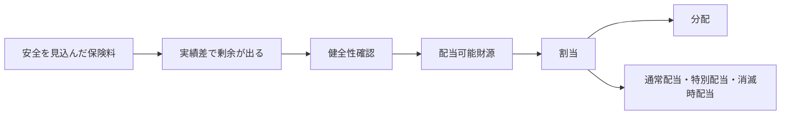

# 契約者配当

## この資料の狙い

契約者配当は、条文と数式だけ追うと、とても無機質に見える。  
でも本当は、「安全を見て取っておいたものを、誰に、どこまで、どんな基準で戻してよいか」というかなり人間くさい問題を、数理と会計で整えている章である。

この資料では、まず配当が必要になる理由から入り、そのうえで公正・衡平、配当可能財源、商品区分、アセット・シェアを一本につないで説明する。  
目標は、実務基準の条文が、ただの丸暗記ではなく「そう言うしかない理由がある」と見える状態まで持っていくことだ。

## 教科書との対応

教科書の第3章は、かなり幅が広い。  
序文のあと、

1. 生命保険会社の利益と契約者配当
2. 保険業法における契約者配当の位置付け
3. 保険計理人の実務基準
4. 契約者配当の割当と分配
5. 通常配当
6. 特別配当
7. 5年ごと配当保険
8. 団体保険
9. 団体年金保険
10. 配当金支払方法
11. わが国の契約者配当の歴史的発展
12. 金利低下期における契約者配当
13. 契約者配当のその他問題点
14. 参考として各国制度

という並びになっている。  
前回の版は、実務基準まわりと公正・衡平の説明が中心で、後半の `通常配当から先` が薄かった。今回はその不足を埋める。

## 教科書 3.1-3.14 を順に読む

第3章は、後ろへ行くほど論点が広がる。  
そのせいで、配当の種類だけを追うと、`通常配当` `特別配当` `5年ごと配当` `団体保険` が横並びに見えてしまう。けれど、教科書の流れはもっと素直で、最初に `なぜ配当が必要なのか` を置き、次に `法令と実務基準でどこまで返せるか` を見て、そのあと `どう割り当てて、どう返すか` へ進み、最後に `特殊な商品・時代・制度` を見ている。

この順番が見えると、配当章はかなり読みやすくなる。  
以下では、節ごとに `何を解決したい節か` を先に置いて読む。

### 3.1 序文

序文は短いが、かなり大事である。  
ここで教科書が言いたいのは、契約者配当は固定的な制度ではなく、会社形態、商品構成、金利環境、各国の実務によって姿を変えるということだ。

ただし、土台にある問いは変わらない。  
生命保険は長期契約で、最初に保険料を決める時点では、将来の死亡率も解約率も運用環境も完全には分からない。だから安全を見て取った保険料と、後から判明した実績との差をどう扱うかが、どの時代でも問題になる。序文は、その基本問題を先に思い出させる役目を持っている。

第I部では、ここから `なぜ生命保険会社で配当が重要論点になるのか` が問われやすい。  
答えるときは、制度の名前ではなく、`長期契約の事後調整` と `契約者間の公平性` を軸に言えると強い。

### 3.2 生命保険会社の利益と契約者配当

この節は、第3章の本体である。  
生命保険会社の利益は、一般事業会社の単年度利益と同じ感覚では読めない。なぜなら、保険料は先に受け取り、支払いはずっと後で起こり、しかもその途中で利差、死差、費差、解約差が少しずつ顔を出すからである。

ここで教科書が強調しているのは、配当が `利益が出たから還元する` という単純な話ではないことだ。  
安全性の原則に従って最初に少し厚めに取っておいたものを、実績が見えてきた後でどう返すか。しかも返す前に、将来の健全性、社内留保、株主還元、税負担との兼ね合いまで見ないといけない。だから契約者配当は高度な経営技術の課題になる。

この節はさらに、生命保険会社の利益には `真の利益` と `決算で見える利益` のずれがあることも教えている。  
契約群団の本当の収支は消滅時まで固まらないのに、決算は毎年締まる。ここに時間差があるので、配当を考えるときは単年度利益をそのまま返すわけにはいかない。第I部では、この時間差と、決算利益と配当財源の違いがそのまま問われやすい。

### 3.3 保険業法における契約者配当の位置づけ

この節は、`配当は善意のサービスではなく、法の中で位置づけられた仕組みである` ことを確認する節である。  
相互会社では社員配当として、株式会社では契約者配当として形は少し違うが、どちらでも公正・衡平、健全性確保、適切な手続という枠がかかっている。

ここでの難しさは、相互会社と株式会社で `誰に帰属する剰余か` の見え方が違うことだ。  
相互会社では契約者が社員でもあるので、剰余分配はかなり直接的に問題になる。一方、株式会社では法律上の持分は株主にある。それでも、有配当契約として契約者側に返す約束をしている以上、どの範囲を契約者配当に回してよいかを法令と約款に沿って切り分けなければならない。

第I部では、`相互会社と株式会社の違い` と `配当が法令上どのように縛られているか` が典型論点になる。  
ここは条文名だけではなく、`勝手に返してよいお金ではない` という感覚を持っておくと崩れにくい。

### 3.4 生命保険会社の保険計理人の実務基準

この節は、配当章の一番実務的な心臓部である。  
第17条から第25条までを見ると、一見ばらばらの確認項目が並んでいるように見えるが、実際にはかなりきれいな順番になっている。

最初に会社全体として翌期配当を払っても大丈夫かを見る。  
次に、全件消滅ベースで過大配当になっていないかを見る。さらに、商品区分ごとに内部補助が起きていないかを見て、最後にアセット・シェアと代表契約で個別契約レベルの公平性を確かめる。つまり、`会社全体 -> 区分 -> 契約群団 -> 代表契約` と、確認の粒度を細かくしていく仕組みになっている。

教科書がこの実務基準を重く扱うのは、配当が理想論だけでは決められないからである。  
会社全体では払えそうでも、特定の商品区分では無理をしているかもしれない。区分全体ではよく見えても、契約経過年数の違いをならしすぎているかもしれない。実務基準は、そのずれを段階的にあぶり出すための確認フレームである。

第I部では、`翌期配当所要額`、`全件消滅ベース`、`商品区分`、`アセット・シェア`、`代表契約` の意味と順番が問われやすい。  
ここは条文をばらばらに暗記するより、`粗い確認から細かい確認へ絞り込む流れ` として覚える方が強い。

### 3.5 契約者配当の割当と分配

この節は、`誰の取り分として考えるか` と `どう渡すか` を分ける節である。  
配当論点で混線しやすいのはここで、公平な割当を考える話と、現金で払うか積み立てるかという分配方法の話は本来別である。

割当の段階では、どの契約群団がどれだけ剰余に貢献したかを見る。  
そこでは利源分析やアセット・シェアが効いてくる。分配の段階では、その割り当てられた額を、積立配当、現金、保険金増額など、どの形で返すかを決める。ここでは契約者の理解、事務負荷、会社の負債管理が効いてくる。

教科書が分配原則として `弾力性` `簡明性` `契約者理解` を置いているのもそのためである。  
数理的に完全に公平でも、契約者に説明できず、実務でも回らないなら制度として続かない。第I部では、`割当と分配の違い`、`なぜ配り方の原則が要るのか` が典型的に問われる。

### 3.6 通常配当

通常配当は、毎年または比較的定例的に行う配当である。  
ただし、`定例的 = 単純` ではない。ここでは、どの利源をどう反映するか、継続契約と消滅契約をどう分けるか、2年目配当・3年目配当をどう設計するか、といったかなり細かい考え方が入る。

通常配当の難しさは、まだ契約が続いている途中で、どこまで返してよいかを決めることにある。  
早く返せば契約者の納得感は出やすいが、そのぶん将来収支を見切る前に返すことになる。遅く返せば確からしさは上がるが、還元が遠く見える。2年目配当と3年目配当の違いが論点になるのは、この時間差の設計思想が違うからである。

また、通常配当の中でも、継続中の契約への配当と、消滅時の配当とでは意味が違う。  
前者は継続中の期待管理の色が強い。後者は最終精算の色が強い。教科書が通常配当の中でわざわざ両者を分けているのは、ここを同じに扱うと公平性の議論が崩れるからである。

### 3.7 特別配当

特別配当は、通常配当の外にある剰余還元の話である。  
ここには、キャピタルゲイン、最終精算、資本政策に近い配り方など、通常配当だけでは処理しにくい要素が集まる。

難しいのは、特別配当が `臨時に余ったから配るお金` ではないことだ。  
たとえば大きな含み益の実現や、長い期間で溜まった剰余をどう精算するかは、単年度の利差・死差・費差とは性格が違う。どの契約群団にどこまで帰属させるか、どこまで内部留保とみるか、どこから政策的な配り方になるかが難しくなる。

教科書がここに一節を置いているのは、特別配当が `公平性` と `資本政策` の境目にあるからである。  
第I部では、通常配当との違いと、なぜ別建てで考える必要があるのかが問われやすい。

### 3.8 5年ごと配当保険

この節は、配当のタイミングを後ろへずらしたときに何が起こるかを考える節である。  
5年ごと配当保険は、毎年のぶれをならしやすい一方で、説明責任と最終還元の納得感を難しくする。

毎年配当なら、その年の実績との対応を比較的見せやすい。  
5年ごと配当では、複数年の収支をまとめて見てから返すので、平準化はしやすいが、`なぜ今この金額なのか` を説明するハードルが上がる。教科書がここを独立で扱うのは、配当の時間構造が商品性そのものを変えるからである。

### 3.9 団体保険

団体保険に入ると、公平性の単位が変わる。  
個人保険では契約者一人ひとり、または商品区分・契約経過年数の切り方が前に出る。団体保険では、団体全体の経験差や制度運営が前に出る。

そのため、団体保険の配当は `長期契約の剰余還元` であると同時に、`団体ごとの経験料率調整` の色が強くなる。  
個人保険の延長で見るとぼやけやすいが、団体を一つの収支単位として見ると、なぜ個人保険と違う議論になるのかが見えやすい。

### 3.10 団体年金保険

団体年金保険では、配当は制度運営の一部として現れる。  
配当率だけを見ても足りず、内部留保、運用成果、予定利率、将来掛金、解約や移換の判断までつながる。

ここで教科書が見ているのは、個人保険のような `商品としての還元` より、`制度としてどこまで返し、どこまで残すか` である。  
実績配当志向が強くなりやすい一方で、返しすぎると制度の持続性が傷む。この引っ張り合いが、団体年金保険の配当を難しくしている。

### 3.11 配当金支払方法

この節は地味に見えるが、かなり実務的である。  
現金で払うのか、積立配当にするのか、保険料と相殺するのか、保険金増額に回すのかで、契約者の受け止め方も、会社の負債の残り方も変わる。

つまり支払方法は、単なる事務処理ではない。  
配当の性格を、`今返す` のか `会社に残しつつ将来へ回す` のかという形で変える。教科書がここを独立で扱うのは、配当の中身と受け渡し方が切り離せないからである。

### 3.12 わが国の契約者配当の歴史的発展

この節は昔話ではなく、制度の癖を読む節である。  
日本の契約者配当制度がどう変わってきたかを見ると、金利環境、商品構成、相互会社観、規制の重心がどう動いたかが分かる。

歴史を細かい年表として覚える必要はない。  
むしろ、`どの時代に何が問題になって、その結果どんな制度の工夫が生まれたか` を押さえる方が大事である。そうすると、いまの制度がなぜ公正・衡平と安定性の両方を強く意識するのかが見えてくる。

### 3.13 金利低下期における契約者配当

ここは、配当章の中でも実務感覚が強く出る節である。  
金利が下がると、古い高予定利率契約と新しい低予定利率契約が同じ会社の中に並ぶ。その結果、利差配当、公平性、健全性、契約者期待が一気に引っ張り合う。

難しいのは、古い契約には過去の約束があり、新しい契約には今の環境に即した価格があることだ。  
古い契約を守ろうとしすぎると新しい契約群の公平性が崩れ、逆に機械的に絞ると契約者の納得感が崩れる。だから低金利期ほど、商品区分確認、アセット・シェア確認、配当安定性の議論が重くなる。

### 3.14 契約者配当のその他問題点

教科書後半の `その他問題点` は、制度がまだ完成形ではないことを示している。  
募集資料の記載、個人保険と団体保険のバランス、投資対象をどう考えるかなど、配当制度は今も調整課題を抱えている。

ここは細部暗記より、`配当制度は常に、健全性、公平性、分かりやすさ、商品競争力の間で揺れている` と読む方が大事である。  
その感覚があると、第II部の所見にもつながりやすい。

### 参考 各国の契約者配当制度

各国制度を置いているのは、細部比較をさせたいからではない。  
長期契約の剰余還元は世界中で難しく、日本の制度も唯一の正解ではないことを見せたいからである。

比較の軸としては、`誰の取り分として考えるか`、`どこまで平準化するか`、`どれだけ契約者理解を重視するか` を持っておくとよい。  
第I部でも、海外制度の細部ではなく、各国制度を参照する意味が問われやすい。

## まず、この章は何を解決したいのか

生命保険の保険料は、将来の不確実性に備えて、ある程度安全を見込んで設定される。  
死亡率、予定利率、事業費率などの前提は、ぴったり当たるとは限らない。むしろ長期契約だから、後から見れば、保守的すぎた部分も、逆に厳しかった部分も出てくる。

ここで問題になるのは、保守的に取っておいた結果として剰余が出たとき、それをどう扱うかである。  
全部会社に残すのか。契約者に戻すのか。戻すなら、誰に、どれだけ返すのか。ここを雑にすると、同じ会社の契約者どうしで不公平が起きる。

契約者配当は、この「事後的に生じた剰余を、公正・衡平に調整する」ための仕組みである。  
だから、この章の中心は、単に配当率を決めることではなく、

- そもそも配当してよい状態か
- 会社の健全性を傷つけていないか
- どの契約群団がどれだけ剰余に貢献したか
- その配り方が約款・法令・実務基準に照らして妥当か

を確認することにある。

### 図で先に全体像を見る

この章は、`利益が出たから返す` ではなく、`どの剰余なら返してよく、その剰余を誰にどう帰属させるか` を順に決める章である。
順番を崩さずに読むと、健全性、公正・衡平、利源分析、アセット・シェアが一本でつながる。

## 配当は「あとから気分で返すお金」ではない

ここを最初に押さえると、この章はかなり読みやすくなる。  
契約者配当は、決算で利益が出たから、その一部を気前よく返すという話ではない。生命保険では、保険料自体が将来の不確実性に備えて安全側に設計されているので、あとから振り返ると、想定より余った部分が生じうる。

その余り方には理由がある。  
たとえば、

- 死亡率が想定より低かった
- 運用利回りが予定より高かった
- 事業費が想定より抑えられた

ということが起きれば、その分だけ剰余が出る。

配当は、この事後的な剰余のうち、契約者に帰属させるべき部分を返す仕組みである。  
だから、本質的には「保険料設定の事後調整」に近い。

## 配当原資は誰のものとして考えるのか

ここは相互会社と株式会社の違いともつながるが、先に感覚だけ置いておくと読みやすい。  
生命保険の有配当契約では、保険料を決めるときにある程度安全を見込んでいるので、あとから実績が良ければ、その保守的に取っておいた余りの一部は、もともと契約者側に帰属しうる性格を持っている。

ただし、それは「利益が出たら全部契約者のもの」という意味ではない。  
会社はまず、将来の保険金や給付金を確実に払える状態を守らなければいけないし、事業継続のための内部留保も要る。だから、契約者に返せるのは、健全性確保のあとに残った部分のうち、さらにその契約群団が生んだと見られる剰余である。

相互会社では、この感覚がより直接的である。  
契約者が社員として会社の構成員でもあるので、剰余の分配は社員配当という形でかなり正面から問題になる。株式会社では、法律上の持ち主は株主なので事情は少し違うが、それでも有配当契約として剰余の帰属ルールを約束している以上、契約者側へ返すべき部分をきちんと見極める必要がある。

要するに、この章がやっているのは「会社のお金を気前よく配る話」ではない。  
安全を見込んで取った保険料から生じた剰余のうち、どこまでが会社に残すべきもので、どこからが契約者へ返すべきものかを、法令と保険数理で丁寧に切り分ける話である。

## 契約者配当を行う理由をもう少しほどく

教科書はここで、安全性の原則、経験料率の採用、保険料事後調整、競争上の手段、購買力の実質価値保全といった複数の理由を挙げている。  
これは、契約者配当が一つの思想だけでできているわけではないことを示している。

まず中心にあるのは安全性である。  
最初からぎりぎりの保険料を取るより、ある程度安全側に置いておき、あとから剰余が確認できたら返す方が、長期契約では安定しやすい。

次に、経験料率の考え方がある。  
実績が良かったなら、その成果をある程度契約者へ返す方が納得感がある。これは事後的な料率調整という意味を持つ。

そのうえで、配当は商品競争力にもなるし、インフレや金利環境の変化の中で契約者価値をどう守るかという役割も持ちうる。  
教科書が理由を複数に分けているのは、配当が単なる優しさではなく、保険商品の設計思想、経営政策、契約者保護の交点にあるからである。

## でも、決算利益をそのまま返すわけではない

ここも大事で、会社全体の決算利益と、配当に回してよい財源は同じではない。  
決算利益が出ていても、責任準備金が十分でないなら、まずそこを埋めなければいけない。健全性のために必要な内部留保が足りないなら、そこも優先である。

配当は、会社が安全に立っていることが前提になる。  
言い換えると、契約者配当は「余ったら返す」ではあるが、その「余った」の意味は、会計上の利益が出たというだけでは足りない。将来の支払いに必要な備えを確保し、そのうえでなお戻してよい部分があるか、という順番で見る。

この順番を外すと、公正・衡平の第一要件を外す。  
実務基準がまず責任準備金の適正積立や健全性維持を前提に置くのはそのためである。

## 決算利益から配当財源へ、そのままつながらないのはなぜか

教科書には、決算利益と契約者配当財源の違いがかなり丁寧に書かれている。  
ここで言いたいのは、決算利益は会社全体の一時点の成果であって、契約者へ返してよい原資そのものではない、ということだ。

決算利益には、将来の健全性確保のために残すべき部分や、株主帰属として見るべき部分、一時的な評価益・売却益のようにそのまま返還原資と見にくいものが混ざる。  
だから、配当財源を考えるときは、会社全体の利益から一段深く入って、どの契約群団のどの利源から剰余が出たのかを見る必要がある。

この切り分けがあるからこそ、契約者配当の議論は会計章や利源分析章とつながっている。

ここは数字を置くとかなり分かりやすい。  
仮に当期の決算利益が 100 あっても、その年に責任準備金の積増しが 40 必要で、健全性維持のための内部留保として 30 は残したい、さらにその利益のうち 10 は株主帰属として見るべき部分だとすると、契約者配当にそのまま回してよい顔つきの金額はもう 20 にまで縮む。  
つまり、決算利益は配当財源の出発点ではあっても、答えそのものではない。教科書がわざわざ切り分けるのは、ここを飛ばすと「利益があるなら返せるだろう」という雑な理解になってしまうからである。

### ミニ例: 決算利益 100 でも、配当財源は 20 まで縮みうる

| 項目 | 金額 | 先に見る理由 |
| --- | --- | --- |
| 当期決算利益 | 100 | 出発点にすぎない |
| 責任準備金の積増し | 40 | 将来給付の裏付けが先 |
| 健全性維持のための内部留保 | 30 | 会社を安全に立たせるため |
| 株主帰属など契約者配当と切り分ける部分 | 10 | 契約者にそのまま返す筋ではない |
| 配当財源として見える部分 | 20 | ようやくここで配当原資候補になる |

この表のポイントは、`利益がある` と `返してよい` の間に、かなり長い確認手順があることである。
契約者配当は、会社全体の黒字を気前よく配る制度ではなく、返してよい剰余だけを選び直す制度だと分かる。

## 決算利益から分配まで、何をどの順に絞り込むのか

この章は論点が多いので、途中で `いま何を決めているのか` を見失いやすい。
でも実際には、流れはかなり素直である。

この流れを言葉で切ると、次の表になる。

| 段階 | ここで答える問い | まだ決めていないこと |
| --- | --- | --- |
| 決算利益 | 会社全体でどのくらい利益が見えているか | その全部を返してよいか |
| 健全性確認 | 責任準備金や内部留保を確保したか | 誰に帰属する剰余か |
| 配当可能財源 | 配当に回しうる原資はいくらか | どの契約へどう帰属させるか |
| 会社全体確認 | 会社全体として配当水準は無理がないか | 商品区分間の横流しがないか |
| 商品区分確認 | その商品群が自分の財源で賄えているか | 個別契約レベルで公平か |
| 代表契約・アセット・シェア | 消滅時配当を含めて個別貢献度に照らし無理がないか | どういう渡し方をするか |
| 割当 | どの契約にいくら帰属させるか | 現金か積立か等の分配方法 |
| 分配 | どう渡すか | なし |

この章で混線しやすいのは、`配当財源を決める段階` と `割当・分配を決める段階` を一緒にしてしまうことである。
たとえば、決算利益 100 が見えても、そこから配当可能財源へ絞り、さらに会社全体・商品区分・代表契約と順に確認して、はじめて `誰にいくら帰属させるか` の議論へ進める。
この順番を崩さないだけで、実務基準の条文がかなり読みやすくなる。

## 相互会社と株式会社で何が違うのか

契約者配当を理解するとき、ここは避けて通れない。  
相互会社では、社員である契約者が会社の構成員であり、剰余金の分配は社員配当として行われる。かなり素朴に言えば、「会社の余りが、契約者側にもともと近い場所にある」。

一方、株式会社では、会社の持ち主は株主である。  
それでも契約者配当があるのは、保険契約や商品設計の中で、契約者にも剰余の帰属を認める構造があるからである。つまり、法律上の土台は相互会社と同じではない。

この違いはあるが、どちらでも共通して重いのは、公正・衡平でなければならないという点である。  
相互会社なら「契約者のものだから好きに返せる」、株式会社なら「会社のお金だから会社裁量でいい」という話にはならない。どちらも、法令と実務基準に沿って、契約者間の公平性と健全性を両立させなければならない。

表にすると、違いと共通点は次のように整理できる。

| 観点 | 相互会社 | 株式会社 |
| --- | --- | --- |
| 法律上の位置づけ | 社員配当として剰余金の分配 | 契約者配当として費用性を持つ支出 |
| 会社との関係 | 契約者が社員でもある | 会社の持ち主は株主 |
| 最高決定機関 | 社員総会・総代会 | 取締役会 |
| 配当の見え方 | 実費主義、保険料の割戻しの色が強い | 商品設計・約款に基づく契約者還元の色が強い |
| 共通して重い点 | 公正・衡平、健全性確保、約款・法令・保険数理への適合 | 公正・衡平、健全性確保、約款・法令・保険数理への適合 |

この表の読み方で大事なのは、`法技術上は違うが、配当を好きに決められない点は同じ` ということである。
相互会社だから何でも社員へ返せるわけでもなく、株式会社だから会社裁量で好きに配れるわけでもない。
どちらも、最終的には契約者間の公平性と会社の健全性を同時に守らなければならない。

## 公正・衡平とは何か

この言葉は抽象的に見えるが、実務基準ではかなり中身がある。  
ポイントは4つある。

### 1. まず、返してよい状態であること

責任準備金が適正に積み立てられ、会社の健全性維持のための必要額が準備されていること。  
つまり、配当は安全のあとに来る。ここを飛ばして「今年の利益が出たから返す」は許されない。

### 2. 個別契約の貢献に応じていること

ここがこの章のいちばん面白いところで、契約者配当は一律にばらまけば公平というわけではない。  
ある契約群団は大きく剰余に貢献し、別の群団はそうではないかもしれない。死亡率、予定利率、事業費、販売経路、契約経過年数などによって、貢献度は違う。

だから、公平とは「全員同じ額」ではなく、「どれだけ剰余に寄与したかに応じて割り当てること」に近い。  
ここで必要になるのが利源分析やアセット・シェアである。

### 3. 数理・会計・法令・約款に沿っていること

良さそうに見える配当でも、算定方法が保険数理として不適切だったり、約款とずれていたりすればだめである。  
公正・衡平は、気持ちの問題ではなく、技術的にも制度的にも筋が通っていることを求めている。

### 4. 契約者の期待も無視しないこと

生命保険は長期契約なので、契約者は配当の安定性や説明可能性にも強い関心を持つ。  
死亡率や市場金利の趨勢から見て、あまりに不自然な配当水準や、急な切り下げばかりが続けば、契約者の期待との関係で問題が出る。

つまり公正・衡平は、数式だけで完結しない。  
安全性、貢献度、技術的妥当性、契約者の期待をまとめて見てはじめて成り立つ。

## 実務基準第17条から第25条は何を順番に見ているのか

条文を順番に追っていると、途中で細かい確認事項の列挙に見えてしまいやすい。  
でも流れとして見ると、かなりきれいである。実務基準は、いきなり「いくら配当するか」を決めに行っていない。まず安全性を確認し、その次に財源の出どころを見て、最後に割当と分配の筋を通す、という順番でできている。

最初の段階で見ているのは、返してよい状態かどうかである。  
責任準備金が適正に積まれているか、翌期配当所要額や全件消滅ベースで見て過大配当になっていないか、健全性を壊していないか。ここが崩れていれば、その先の公平性議論へ進む前に止まらなければいけない。

次に見ているのが、どの契約群団のどの剰余を財源とみるかである。  
商品区分を分け、必要ならアセット・シェアや代表契約で契約群団ごとの貢献度を見る。ここで初めて「誰がどれだけ剰余を生んだか」という公平性の土台ができる。

最後に、その財源をどのように契約者へ帰属させ、どんな方法で分配するかを整える。  
割当方式、分配方式、契約者の理解可能性、実務面の簡明性まで見るのはこの段階である。つまり第17条から第25条は、健全性確認、財源把握、割当・分配設計という三段階のチェックリストとして読むと頭に入りやすい。

条文ごとに役割を切ると、流れはもっと見やすい。

| 条文 | 何を見ているか | 一言でいうと |
| --- | --- | --- |
| 第17条 | 公正・衡平な配当の4要件 | そもそも何を満たせば公平か |
| 第18条 | 確認フレーム全体 | 会社全体 → 商品区分 → 消滅時配当の3段確認 |
| 第19条 | 翌期配当所要額と簿価ベース財源 | 来期に払う配当の帳簿上の受け皿があるか |
| 第20条 | 会社全体の全件消滅ベース確認 | 厳しめに見ても会社全体で配りすぎていないか |
| 第21条 | 健全性維持後の配当可能性 | 配当したあとも会社は安全か |
| 第22条 | 商品区分ごとの全件消滅ベース確認 | 商品区分間の見えない内部補助がないか |
| 第23条 | 代表契約・選定単位・アセット・シェア方式 | 消滅時配当を誰で代表させて見るか |
| 第24条 | 当年度末ネット・アセット・シェア確認 | いま時点で返しすぎていないか |
| 第25条 | 将来ネット・アセット・シェア確認 | その水準を続けても将来持つか |

さらに、確認の粒度だけで並べ直すとこうなる。

| 粒度 | 見る条文 | 何を防いでいるか |
| --- | --- | --- |
| 会社全体 | 第18条、第19条、第20条、第21条 | 会社全体で無理な配当を出すこと |
| 商品区分 | 第18条、第22条 | ある群団の剰余を別群団へ横流しすること |
| 代表契約 | 第18条、第23条、第24条、第25条 | 消滅時配当で個別貢献度以上に返すこと |

なお、いまの理解としては、第21条は `健全性の基準を維持するために必要な額` を差し引く条文として読むだけでなく、現行実務ではソルベンシー指標を意識した確認だと押さえておくとずれにくい。
過去問答案は古い言い回しでも、頭の中では `配当したあとも会社は規制・経営の両面で持つか` を見ていると理解しておけばよい。

## なぜ利源分析が必要になるのか

ここは第1章とも深くつながる。  
契約者配当では、「この契約群団はどれだけ剰余に貢献したか」を見なければならない。でも決算利益だけでは、その中身が分からない。

たとえば会社全体では黒字でも、その黒字が

- 死差から出たのか
- 利差から出たのか
- 費差から出たのか

で意味が変わるし、どの契約群団がそれに寄与したかも変わる。

利源分析が要るのは、配当を説明可能な形で割り当てるためである。  
ただ利益があるから返すのではなく、「どういう理由で剰余が出て、その剰余にどの契約がどれだけ関わったのか」を見ないと、公平な割当てができない。

## 利源分析から商品区分確認までどうつながるのか

配当論点は、利源分析と商品区分確認が別の話に見えやすい。  
でも実際には、利源分析で「何が余ったか」を見て、商品区分確認で「その余りを誰のものと見るか」を決めている。前半と後半の役割分担だと思うと分かりやすい。

たとえば会社全体で利差益が出ていても、その利差益がどの契約群から生じたかは一様ではない。  
高予定利率の古い契約群では逆ざやで苦しく、新しい契約群で利差益が厚く出ているかもしれない。ここで会社全体の利差益だけ見て一律に返すと、新しい契約群の成果を古い契約群へ横流しすることになりかねない。

だから、まず利源分析で剰余の性格を見て、そのあと商品区分や代表契約で帰属先を絞る。  
この順番を踏むことで、配当は「黒字だったから返した」ではなく、「この契約群がこういう理由で剰余を生んだので、その範囲で返した」と説明できるようになる。実務基準が両方を要求するのは、その説明可能性を確保するためである。

## 生命保険会社の利益は一般事業会社の利益と何が違うのか

教科書が冒頭で一般事業会社との違いを置くのは、とても筋がいい。  
生命保険会社の利益は、商品を売った瞬間に確定する利益とは違い、長い年月の中で少しずつ姿を現す。

保険料は安全を見込んで設定されるし、責任準備金を通じて将来の支払いに備える。  
そのため、当期利益はあくまで途中経過にすぎず、長期契約の全体像の中で読まないと意味を取り違えやすい。

契約者配当の難しさは、まさにここから来る。  
一般事業会社の配当のように「今年の利益をどこまで株主へ戻すか」という見え方では足りず、「長期の保険契約から生じた剰余を、どの契約者へ、どの時点で、どの形で戻すか」という問題になる。

## 経営の技術課題は何か

教科書はこの章で、長期性、剰余の適正配分、公平性と実務負荷のバランス、商品・価格政策、多様化する収支構造などをまとめている。  
これは、契約者配当が単なる数式の問題ではなく、会社経営の技術課題だからである。

長期契約なので、ある年度のぶれをそのまま配当へ流すと不安定になる。  
でも平準化しすぎると、貢献度との対応がぼやける。商品が多様化すると、どの群団がどの剰余を生んだかも見えにくくなる。つまり、配当は理屈だけ正しければいいのではなく、運営できる形で公平性を保つ必要がある。

この視点を持っておくと、あとで出てくる `商品区分` `代表契約` `分配方式` が、全部同じ悩みの別の面だと見えてくる。

## 翌期配当所要額と全件消滅ベースをどう見るか

このあたりから条文が増えてくるが、考え方はシンプルである。  
配当の確認では、「来年度に払う分が払えるか」だけ見れば足りない。契約が将来どう消滅していくかまで考えないと、現在の配当水準が過大かどうかを見誤ることがある。

そこで、実務基準は複数の見方を置いている。  
翌期配当所要額は、近い将来に実際どれだけの配当支払いが必要かを見るためのもの。これに対して全件消滅ベースは、契約が消滅したときの精算まで含めて、今の配当水準が過大でないかを見るためのものだと捉えると理解しやすい。

2年目配当、3年目配当という言い方も、将来の配当支払いの時間構造をどう現在に引き寄せて確認するかに関係している。  
ここは式だけ追うより、「今払う通常配当だけでなく、契約消滅時の精算まで見ないと、本当に返せる範囲か分からない」という問題意識から入る方が定着する。

たとえば、翌年度に通常配当として 50 支払う見込みがあり、翌年度中に消滅しそうな契約への精算分が 8、翌年度に実際に支払う見込みの消滅時配当が 12 あるなら、翌期配当所要額はまず 70 というイメージになる。  
これに対して全件消滅ベースは、「もし翌年度に残っている契約も全部消えるとしたら、その精算配当まで含めていくら要るか」を見るので、たとえば追加で 90 必要なら 160 を見にいく。前者は近い将来の支払能力の確認、後者は今の配当水準が将来精算まで含めて行き過ぎていないかの確認である。

この3つの関係は、一枚で見るとかなり整理しやすい。

| 見方 | 何を確認するか | 典型的に対応する条文 | 何を防ぐか |
| --- | --- | --- | --- |
| 翌期配当所要額 | 翌年度に実際に出ていく配当を払えるか | 第19条 | 直近の支払不能 |
| 全件消滅ベース | 厳しめに見ても配りすぎていないか | 第20条 | 将来の精算配当の先食い |
| 商品区分ごとの確認 | その商品群が自分の財源で賄えているか | 第22条 | 商品区分間の内部補助 |

### ミニ例: 会社全体では足りても、商品区分では足りないことがある

| 確認対象 | 必要額 | 財源 | 判定 |
| --- | --- | --- | --- |
| 会社全体の翌期配当所要額 | 70 | 90 | 足りる |
| 会社全体の全件消滅ベース | 160 | 180 | 足りる |
| 商品区分 A の全件消滅ベース | 110 | 100 | 足りない |
| 商品区分 B の全件消滅ベース | 50 | 80 | 余裕がある |

このケースでは、会社全体だけ見れば `配当できそう` に見える。
でも商品区分 A では足りず、B の余裕で A を支える形になっている。
実務基準が商品区分確認を別立てで求めるのは、まさにこの見えにくい内部補助を止めるためである。

つまり、

- 第19条は `近い将来に払えるか`
- 第20条は `厳しめに見ても全社で払いすぎていないか`
- 第22条は `その商品群が自分の財布で払えているか`

を、それぞれ別の角度から見ている。
この違いが見えると、条文が似た確認の繰り返しではなく、順番に網を細かくしていることが分かる。

## 商品区分ごとの確認が必要なのはなぜか

会社全体で配当財源が足りていても、それだけでは不十分である。  
なぜなら、ある商品群の剰余を別の商品群に回してしまうと、契約者間の公平性が崩れるからである。

保険商品は、予定死亡率も予定利率も事業費構造も違う。販売経路や契約経過年数によっても収支構造は違う。  
会社全体では黒字でも、その中に「自分たちの出した剰余以上の配当を受けている群団」と「自分たちの剰余を他群団に回されている群団」が混ざることがありうる。

だから商品区分単位で財源確認をする。  
この確認は、配当を細かくしすぎるためではなく、雑すぎる内部補助を防ぐためのものと理解するとよい。

典型例は、予定利率が高い古い有配当契約群と、予定利率が低い新しい契約群が同じ箱に入っている場合である。  
会社全体では黒字でも、古い高予定利率契約群は逆ざやや追加責任準備金で苦しく、新しい契約群が相対的に余裕を持っていることがある。このとき会社全体だけで配当を決めると、新しい契約群の剰余で古い契約群の配当を支える形になりやすい。  
商品区分確認は、まさにその見えにくい内部補助を止めるための仕切りである。

## 公正と衡平は少し違う

教科書では、公正と衡平を一つの言葉として流さず、分けて考える余地が示されている。  
ざっくり言えば、公正はルールや考え方が筋が通っていること、衡平は契約者間の扱いが偏りすぎていないことに近い。

たとえば、同じルールを全員に当てていても、商品特性や契約経過年数の違いを無視していれば、衡平とは言いにくい。  
逆に、見かけ上の調整をたくさん入れても、法令や約款、保険数理の裏づけがなければ公正とは言いにくい。

この二つを分けて意識すると、公正・衡平が単なるきれいな標語ではなく、別々のチェックポイントを持っていることが分かる。

## 割当と分配は何が違うのか

教科書はここも丁寧で、契約者配当の割当と分配を分けている。  
割当は、「この契約にいくら帰属させるか」を決める段階であり、分配は「それをどんな形で渡すか」の段階である。

この区別が大事なのは、公平性の議論と支払方法の議論を混ぜないためである。  
どの契約にどれだけ帰属させるかは、利源分析、アセット・シェア、商品区分、契約経過年数などの問題である。一方、それを積立配当にするのか、現金で払うのか、保険金増額に回すのかは、受け渡しの設計の問題である。

割当が公平でも、分配方法が契約者にとって分かりにくければ不満は出る。  
逆に、分配方法が分かりやすくても、割当の考え方がずれていれば公平性は守れない。教科書が両者を分けるのはそのためである。

### ミニ例: 割当と分配を混ぜると何を見失うか

| 契約 | 割当額 | 分配方法 | ここで見ていること |
| --- | --- | --- | --- |
| A 契約 | 8 | 積立配当 | まず 8 を帰属させた理由が公平か |
| B 契約 | 3 | 現金配当 | 3 という割当と、渡し方は別問題 |

割当は、A に 8、B に 3 とした理由の妥当性を問う段階である。
そのあとで、積み立てるか現金で払うか、保険金増額に回すかを決める。ここを混ぜると、`なぜその金額なのか` と `どう渡すのか` が一緒になって、議論がぼやける。

## 分配原則に「弾力性」「実務面の簡明性」「契約者の理解」が入るのはなぜか

ここは教科書らしい良いところで、理論だけでなく運営の現実が見えている。  
公平性だけを極端に追えば、ものすごく細かい区分や複雑な式になりやすい。けれども、それを現場で回せなければ制度として持たない。

弾力性が要るのは、経済環境や利源状況が変わるからである。  
実務面の簡明性が要るのは、毎年継続的に運営する必要があるからである。契約者の理解が要るのは、長期契約では納得感がないと制度が続きにくいからである。

つまり教科書は、契約者配当を「理屈の正しさ」だけでなく「運営できる公平性」として見ている。

## 利源別配当方式、経験料率方式、アセット・シェア方式、ファンド方式は何を解こうとしているのか

教科書が分配方式をいくつも並べるのは、方式の違いそのものを覚えさせたいからというより、何を公平の単位と見るかが違うからである。  
利源別配当方式は、剰余の発生源ごとに整理して戻す考え方が前に出る。経験料率方式は、経験差に着目して事後調整する色合いが強い。アセット・シェア方式は、個々の契約の貢献度を長期で追う。ファンド方式は、より資産持分の管理に寄せた見方である。

どの方式が常に正しいというより、商品特性や会社の管理水準、求めたい公平性の粒度によって向き不向きがある。  
ここを一言でまとめると、方式とは「剰余をどう切り分けて、どの単位で返すか」の思想の違いである。

たとえば、毎年の死差・利差・費差を比較的素直に契約者へ返したい商品なら、利源別配当方式の方が考えやすい。  
一方、売却益や未実現損益のように単年度で切りにくいものや、長い期間での貢献度を見たい商品では、アセット・シェア方式の方が自然になる。方式の違いは、計算の見た目よりも、「単年度で返すのか、長い持分で返すのか」の違いとして覚えた方が実務感覚に近い。

## アセット・シェアは何を測っているのか

アセット・シェアは、最初は少し取っつきにくい。  
でも考え方はかなり素直で、「その契約がこれまで会社の資産形成にどれだけ貢献してきたか」を追いかける仕組みである。

保険料が入り、資産運用収益がつき、保険金や事業費や税金や配当で出ていく。  
その積み上がりを、代表契約ベースでたどっていくと、その契約から見てどれだけの持分が残っているかが見えてくる。それがアセット・シェアである。

そして、アセット・シェアと責任準備金との差額をネット・アセット・シェアとして見れば、「その契約にどれだけ配当余地があるか」をかなり具体的に捉えられる。  
消滅時配当や最終精算を雑にしないために、この考え方が要る。

ここも簡単な式にしてしまうと腹落ちしやすい。  
前年度末のアセット・シェアが 100、当年度に保険料 12 が入り、運用収益が 4 つき、そこから保険金 3、事業費 2、税金等 1、すでに割り当てた配当 2 が出ていったとすると、当年度末アセット・シェアはざっくり 108 になる。  
このとき対応責任準備金が 101 なら、ネット・アセット・シェアは 7 である。感覚的には、「この契約は会社の中で 108 の持分を作ってきたが、そのうち 101 は将来給付の裏付けとして必要なので、配当余地として見えるのは 7 くらい」という読み方になる。

## ネット・アセット・シェアが消滅時配当につながる理由

アセット・シェアを学んでいて途中で迷いやすいのは、「結局これを何に使うのか」である。  
ここで一番分かりやすい使い道が、消滅時配当や最終精算の妥当性確認である。

継続中の契約に対する通常配当は、ある程度平準化して返すことがありうる。  
けれども解約、満期、死亡などで契約が消えるときは、その契約について「ここまで会社にどれだけ貢献し、まだどれだけ将来給付の裏付けが必要か」をかなり真正面から見なければならない。そこで、アセット・シェアから責任準備金を差し引いたネット・アセット・シェアが効いてくる。

もしネット・アセット・シェアが大きくプラスなら、その契約は将来給付の裏付けを超える持分を作ってきたと読める。  
逆に小さい、あるいはマイナスに近いなら、その契約は見かけ上の剰余ほど配当余地を持っていない。消滅時配当が難しいのは、ここを雑にやると、残る契約者と消える契約者のあいだで不公平が出るからである。

要するに、ネット・アセット・シェアは「この契約にとっての最後の精算簿」のようなものである。  
毎年の通常配当が少し丸い判断を含んでいても、消滅時にはその契約の持分をできるだけ真っすぐ見に行く。そのための道具として置くと、アセット・シェア論点がかなり腹落ちしやすい。

## 代表契約を選ぶのはなぜか

本来なら契約ごとに全部計算できれば理想的である。  
でも実務上、それを完全にやるのは重い。そこで代表契約を置く。

代表契約は、適当に一本選ぶわけではない。  
商品区分、保険事故の種類、契約経過年度などで最低限区分し、その単位の収支を代表していると考えられる契約を選ぶ。必要があれば販売経路、危険選択手法、性別、年齢などでも細かく分ける。

ここで大事なのは、「簡便化のための代表」であって、「雑でもよい」という話ではないことだ。  
アセット・シェアは配当の公平性の確認に使うので、代表契約の選び方がずれると、その後の確認もずれる。

実務基準が最低限として `商品区分` `保険事故の種類` `契約経過年度` を切れと言っているのは、この三つを外すと収支の顔つきが変わりすぎるからである。  
たとえば同じ商品区分でも、契約初期は新契約費の影響が重く、経過が進んだ契約は利差や死差の色が前に出やすい。ここを一緒にすると、代表契約が誰のことも代表しなくなる。代表契約は簡便化の道具だが、最低限の切り方まではきちんと守らないと、簡便化ではなく粗雑化になる。

## 通常配当と特別配当はどう違うのか

通常配当は、毎年の契約維持の中で、利源差に応じて比較的継続的に返していく配当である。  
これに対して特別配当は、より大きな剰余や、通常の配当枠では説明しにくい剰余の還元をどう考えるか、という文脈で出てくる。

ここで大事なのは、特別配当は「余ったから臨時で配る」で済む話ではないことだ。  
アセット・シェアに基づく考え方を強めるのか、資本の戻しとみるのか、経営上の政策配当とみるのかで、考え方が分かれる。教科書がここに一節を割いているのは、特別配当が公平性と資本政策の境目にあるからである。

## 通常配当の中でも、どこで割り当てるかが違う

教科書は通常配当のところで、有効継続中の契約に対する割当と、消滅契約に対する割当を分けている。  
これは自然で、継続中の契約には将来の期待との関係があり、消滅契約には最終精算の性格が強いからである。

継続契約に対する配当は、契約者の継続中の満足感や将来見通しにも関わる。  
一方、消滅時配当は、その契約が会社にどれだけ貢献したかを最終的に精算する意味合いが強い。だから、同じ通常配当でも視点が少し違う。

## 2年目配当と3年目配当が論点になるのはなぜか

教科書で配当開始期が独立論点になっているのは、配当をいつ始めるかで公平性と販売性の見え方が変わるからである。  
早く返すほど契約者の受け止めは良くなりやすいが、そのぶん将来の収支を見切る前に返すことにもなる。

逆に遅らせれば、より落ち着いた剰余評価に基づけるが、契約者からは遠い還元に見えやすい。  
2年目配当と3年目配当の違いは、単なる実務慣行ではなく、「どこまで先に返すか」という設計思想の違いでもある。

かなり単純化すると、2 年目配当は「まだ収支が十分こなれていない段階から少し早めに返す」設計であり、3 年目配当は「もう少し様子を見てから返す」設計である。  
前者は販売面では分かりやすいが、後者よりも早い段階で剰余判定をするぶん、将来のぶれを吸収しにくい。だから、配当開始時期は見た目のサービス差ではなく、どの時点の確からしさで還元を始めるかという問題だと見ると理解しやすい。

## 利源別配当の中の危険配当・死差配当・費差配当は何を見ているのか

教科書は通常配当の中で、危険配当、費差配当、調整配当などを分けている。  
ここで見ているのは、「どの理由で余ったのか」を契約者にどう返すかである。

死亡率が想定より良かったことから出た剰余と、事業費が抑えられたことから出た剰余では、発生原因も継続性も違う。  
その違いを無視して一つに溶かすと、配当の説明力が落ちる。教科書が利源別に分けているのは、割当の透明性を高めるためでもある。

## 5年ごと配当保険は何を難しくするのか

5年ごと配当保険は、毎年配当と比べて、配当のタイミングが後ろへ寄る。  
すると、契約者にとっては受取時点の納得感が問題になるし、会社にとっては、責任準備金、予定利率、事業準備、分配タイミングをどう整えるかが問題になる。

毎年配当なら、その年ごとの剰余との対応を比較的つけやすい。  
一方で 5 年ごと配当では、複数年の収支をならして見る必要があるので、説明責任も設計上の工夫も重くなる。教科書がこの商品を独立で扱うのは、その違いが大きいからである。

たとえば 5 年の間に 1 年目と 2 年目は利差が薄く、3 年目と 4 年目は良く、5 年目に市場が荒れたとする。  
毎年配当なら年ごとのぶれとして配当率へ反映しやすいが、5 年ごと配当ではこの凸凹をまとめて見て、5 年目時点でどこまで返すかを決めることになる。そのぶん平準化はしやすいが、「なぜ今年この水準なのか」を説明する難しさは上がる。

## 無配当保険は、何を捨てて何を取りに行く商品か

教科書は無配当保険にも節を割いている。  
これは、契約者配当が当然に付くものではないことを確認するためである。

無配当保険は、事後的な剰余還元を行わない代わりに、最初から保険料水準や商品設計を分かりやすくする方向へ寄せた商品と見ることができる。  
契約者から見れば、配当の上振れはないが、かわりに商品性が明快になる面がある。

つまり無配当保険は、配当を否定する商品というより、「事後調整を薄くして、最初の価格へ寄せる」タイプの商品である。  
配当商品の特徴を理解するためにも、対照として見ておく価値がある。

## 団体保険と団体年金保険は、個人保険と何が違うのか

団体保険では、被保険者集団の性質、配当の基礎、契約維持のされ方が個人保険と違う。  
団体年金保険では、さらに配当体系や割当方式が年金制度運営とつながるので、個人保険の延長だけでは整理しきれない。

教科書がここを別節にしているのは、配当の公平性を考える単位が違うからである。  
個人保険では契約経過年数や保険種類が重いが、団体では団体単位の収支や制度運営が前に出る。つまり、同じ「配当」でも、何を公平と見るかの軸が少し変わる。

もう少し具体的に言うと、個人保険では「その契約がどれだけ剰余に貢献したか」を見るとき、契約経過年数、保険種類、予定利率、販売経路などが細かく効いてくる。  
ところが団体保険では、契約者は団体であり、被保険者はその構成員であることが多い。すると、公平性を考える単位が個人一件ごとというより、団体全体の経験や制度運営の成績に寄ってくる。

ここで重くなるのが、経験料率や団体固有の収支である。  
ある団体では死亡率や発生率が想定より安定していて剰余が出るかもしれないし、別の団体ではそうではないかもしれない。個人保険のように広い群団へ強くならすだけでは、その差をうまく拾えない。だから団体保険では、配当は「長期契約の事後調整」であると同時に、「団体ごとの経験差の調整」という顔つきも強くなる。

つまり団体保険で問われている公平性は、「一人ひとりに同じだけ返すか」ではない。  
団体ごとの経験差や付加保険料体系の違いを踏まえて、その団体が生んだ剰余をどう返すか、という意味での公平性である。ここが個人保険といちばん違うところである。

## 団体年金で「配当率」より「制度運営」が前に出るのはなぜか

団体年金保険では、配当は単なる還元ではなく、年金制度全体の運営と結びつく。  
だから、配当率だけを個人保険のように単独で見ると不十分で、どのような配当体系を置き、どう設定し、どんな説明が必要かが重くなる。

教科書が 1995 年頃までと 1996 年頃からを分けているのも、制度環境や運営実務の変化が大きかったからである。  
つまり団体年金の配当は、商品配当というより、制度運営の一部として理解した方が近い。

個人保険との違いがはっきり出るのは、契約者が「配当を受け取る一人の顧客」ではなく、「制度を運営する主体」に近い点である。  
団体年金では、企業年金制度の運営者にとって、配当はその年の上振れを受け取るおまけではない。積立状況、予定利率、将来の掛金水準、解約や移換の判断まで含めた制度全体の意思決定に関わる。

剰余の源泉も、個人保険とは少し違う顔つきになる。  
団体年金の一般勘定では、利差益や価格変動損益の比重が大きくなりやすく、これらは年度ごとの市場環境でぶれやすい。すると、「今年たまたま出た剰余をどこまで早く返すか」と「制度としてどこまで内部留保を持つか」の引っ張り合いが強くなる。

しかも団体年金では、契約者側の期待も個人保険と少し違う。  
個人保険では、配当の安定性を重く見る契約者が多い。これに対して団体年金では、実績配当志向がより強く、運用成果が出たなら比較的早く還元してほしいという期待が出やすい。その一方で、配当を早く返しすぎると、市場環境が悪化したときに制度運営が苦しくなる。

さらに、予定利率の見直しや解約控除の有無が絡むと、単純な一律配当では済みにくい。  
市中金利の動き、解約時の市場価格調整、予定利率の差をどう配当率へ反映するかで、群団間の公平性も競争力も変わってくる。だから団体年金の配当は、`配当率をいくつにするか` という一点より、`制度としてどこまで返し、どこまで残し、どう説明するか` の問題として読む方が自然である。

## 配当金の支払方法はなぜ論点になるのか

現金で払うのか、次回保険料と相殺するのか、一時払保険金増額に回すのか、積立配当にするのか。  
この違いは、受け渡し方法の違いに見えて、実は契約者の受け止め方や、会社の負債管理の仕方に影響する。

たとえば積立配当は、契約者から見るとすぐに受け取らず会社に残す形になるので、将来の給付や運用とも関係が深くなる。  
つまり支払方法は末端の事務処理ではなく、配当の性格そのものに少し関わっている。

## 歴史と金利低下局面を学ぶ意味

教科書の後半に歴史や金利低下期の議論が置かれているのは、配当のルールが真空の中でできたものではないからである。  
実務は、過去の制度変更や低金利環境の中で、「公平に返したい」「でも健全性は守りたい」という引っ張り合いを繰り返しながら今の形になってきた。

だから歴史を読む意味は、昔話を覚えることではない。  
どの局面で何が問題になり、どんな考え方が採られたのかを知ることで、いまの配当ルールの重心が分かる。金利低下期の論点が重いのも、利差配当や予定利率との関係が一気に難しくなるからである。

## 低金利期に何がいちばん難しくなるのか

低金利になると、単に利差益が減るだけでは終わらない。  
いちばん難しくなるのは、「過去に約束したもの」と「今できること」の距離が開くことである。

高予定利率で売った古い契約は、契約者から見れば、当時の条件で長く続く価値を買っている。  
だから会社としても、その契約の期待を簡単には裏切れない。一方で、今の運用環境ではその予定利率どおりの収益を上げにくい。ここで無理に配当を維持すると健全性が傷み、逆に急に絞ると契約者の納得感が崩れる。

しかも、そのしわ寄せが新しい契約群へ流れやすい。  
低予定利率の新契約群が相対的に余裕を持っていても、その余裕を古い契約群の配当に回してしまえば、世代間の公平性が崩れる。だから低金利期は、会社全体で配当を考えるのではなく、商品区分確認やアセット・シェア確認の重要性が一段上がる。

低金利期の難しさは、配当を減らすか増やすかの二択ではない。  
古い約束をどこまで守り、今の健全性をどこまで守り、新しい契約者との公平性をどう保つか。この三つを同時に満たしにいくところに本当の難しさがある。

## 金利低下期に配当が難しくなるのはなぜか

金利が下がると、予定利率と実際の運用成果の関係が崩れやすくなる。  
すると、利差配当の考え方、配当率の平準化、契約者間の公平性、健全性確保のバランスが一気に難しくなる。

高予定利率の古い契約と、新しい低予定利率契約が同じ会社に並ぶと、どの契約群団にどこまで配当余地があるかも見えにくくなる。  
だから低金利局面では、配当は単なる還元策ではなく、経営の耐久力と契約者間の納得感を同時に守る調整装置になる。

## 各国制度を参考にするのはなぜか

米国、英国、イタリア、フランスの制度が参考で載っているのも意味がある。  
契約者配当は、どの国でも「長期契約の剰余をどう返すか」という難しさを抱えるが、その解き方は一つではない。

他国を見ると、日本の制度が当たり前ではないことが分かる。  
その分、日本のルールが何を重く見ているのかも逆に見えやすくなる。試験で細かい海外制度暗記が中心になるわけではないが、考え方の幅を持つためには有益である。

## 教科書後半の「その他問題点」はどう読むべきか

募集資料記載、個人保険と団体保険のバランス、契約者間公平性、投資対象を考慮した制度など、教科書後半には少し細かい論点が並ぶ。  
ここは全部を同じ重さで暗記するより、「配当制度は完成品ではなく、今も調整課題を抱える」と読む方がよい。

つまりこの章の締めくくりは、制度の説明で終わるのではなく、制度運営の難しさを残している。  
この感覚があると、第II部の所見問題にもつながりやすい。

## 配当の安定性と公平性はときどき引っ張り合う

実務では、ここがかなり悩ましい。  
理屈だけでいえば、その年度の貢献度に合わせて鋭く配当を変える方が公平に見える。けれども、生命保険は長期契約なので、毎年配当が大きく乱高下すると契約者の期待を裏切りやすい。

反対に、安定性ばかり重視すると、今度は群団間の公平性が薄くなる。  
だから実務では、貢献度をまったく無視しないが、短期のぶれをそのまま配当へ流し込まない工夫が要る。

この引っ張り合いがあるから、公正・衡平は単純な数式では終わらない。  
第II部の所見問題でこの章が強いのも、そのバランスを言葉で説明させやすいからである。

## 第I部でどう問われるか

契約者配当は、大きく次の4種類で出やすい。

### 1. 意義と理由

なぜ配当を行うのか、公正・衡平とは何か、無配当保険との違いは何か、という基本論点である。  
ここは「安全を見て取った保険料の事後調整」という一本筋を通して覚えると崩れにくい。

### 2. 実務基準の条文

第17条から第25条が中心になる。  
ここは文章暗記が強いが、条文の役割を「何を確認する条文なのか」で整理しておくと混線が減る。

### 3. 全件消滅ベースと配当可能財源

式の丸暗記で終わると危ない。  
何を現在価値的に確認しようとしているのか、なぜ翌期配当所要額だけでは足りないのかを押さえておくと、少し聞き方が変わっても対応しやすい。

### 4. アセット・シェア

代表契約、選定単位、ネット・アセット・シェア、当年度末アセット・シェアの計算思想などが出やすい。  
ここは「最終精算の公平性をどう確認するか」の文脈に戻して覚えるのがよい。

## この章の勉強のしかた

順番としては、

1. 配当を行う理由
2. 相互会社と株式会社の違い
3. 公正・衡平の4要件
4. 翌期配当所要額と全件消滅ベース
5. 商品区分ごとの財源確認
6. アセット・シェアと代表契約
7. 特別配当、2年目配当、3年目配当

の流れが入りやすい。

最初の山は、「配当は剰余の単なる山分けではなく、保険料設定の事後調整であり、安全性と公平性を同時に見ている」というところである。  
ここが見えると、その後の条文が一気に読みやすくなる。

## 参考にしたもの

手元資料

- `note/教科書/hoken2-seiho_03.pdf`
- `note/単元別マークダウン/02-03 契約者配当.md`
- `note/所見対策/03.契約者配当.txt`
- `study/first_part/02-03_契約者配当.md`
- `study/first_part/90_生命保険会社の保険計理人の職務_配当関連.md`

Web資料

- [2025年度 試験要領 別紙(1)](https://www.actuaries.jp/examin/2025exam/2025-B1.html)
- [生命保険会社の保険計理人の実務基準（2026年3月19日）](https://www.actuaries.jp/info/pdf/20260319.pdf)
- [実務基準の改正について（日本アクチュアリー会）](https://www.actuaries.jp/info/20260319.html)
