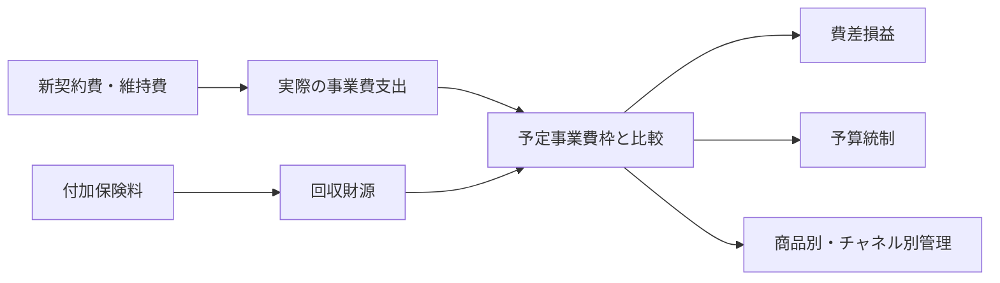

# 事業費

## この資料の狙い

- `事業費の管理・分析` を、単なる経費節減の章ではなく、`新契約費が先に出て、付加保険料は後から回収される` という生保特有のずれを扱う章として読み直す
- 教科書第5章の節立てを落とさずに、各節が `何に困っていて` `その困りごとをどう解こうとしているのか` を前から追えるようにする
- 第I部で頻出の `予定事業費枠` `蔵銀枠・利源枠・純保枠` `限度超過修正` `費差損益` `原価管理` `事業費モニタリング` を、丸暗記しやすい因果で整理する

## 教科書との対応

教科書 `保険2（生命保険）第5章 事業費の管理・分析` は、次の順番で話を進めている。

1. `5.1 アクチュアリーと事業費管理`
2. `5.2 事業費`
3. `5.3 予算制度と事業費`
4. `5.4 予定事業費枠と事業費分析`
5. `5.5 収益管理と原価管理`
6. `5.6 事業費と生命保険会社の経営`

この章は、最初に `そもそも事業費とは何か` を整え、その次に `時間のずれをどう管理するか` へ進み、最後に `その分析結果をどう経営へ返すか` へつなげている。  
単元別マークダウンは過去問単位で並んでいるので、この資料では教科書の流れを軸にしつつ、試験で切られやすい論点を重ねて読めるようにしている。

## 教科書 5.1-5.6 を順に読む

第5章は、経費節減の章ではない。  
この章が相手にしているのは、`費用が先に出て、回収は後から来る` という生命保険会社特有の時間差である。

だから、教科書も最初に定義と役割を整え、そのあとで `どう管理するか`、最後に `その結果を経営へどう返すか` という順番で進んでいる。  
ここでは、その流れが見えるように、節ごとに「何を解こうとしている節か」を先に置いて読んでいく。

### 5.1 アクチュアリーと事業費管理

冒頭でアクチュアリーが出てくるのは、少し意外に見える。  
でも教科書がここで言いたいのは、事業費は単なる総務や経理の話ではなく、保険料設定と将来収支に直結するので、数理の視点なしではまともに管理できないということである。

生命保険会社では、新契約を取るための費用が最初に大きく出る。  
その一方で、その契約から回収する付加保険料は長い時間をかけて少しずつ入ってくる。すると、「今年いくら使ったか」だけでは足りず、「その支出は将来どの契約群から、どのくらいの確からしさで回収される見込みか」まで見ないと、本当に妥当な事業費か判断できない。  
ここに、継続率、予定事業費、利源分析、商品別採算といった数理の要素が入ってくる。

つまり、アクチュアリーが関わる理由は、事業費が単なる経費ではなく、保険料の十分性、契約者負担の妥当性、長期収益性の前提そのものだからである。  
第I部では、`なぜアクチュアリーと事業費管理が結びつくのか` をこの因果で言えると強い。

### 5.2 事業費

この節は、第5章の土台をつくる節である。  
ここで教科書は、まず「何を事業費と呼ぶのか」をそろえ、そのうえで会計上どう計上し、管理分析ではどこまで広げて見るかを整理している。

ここを軽く流すと、後ろの予定事業費枠や費差損益で、そもそも何を比べているのかがぼやける。  
損益計算書上の `事業費` は一つの出発点だが、商品採算やチャネル採算を考える場面では、それだけでは実態が見えにくい。契約関係税金、減価償却費、退職給付費用のように、契約獲得や維持のために実質的に必要なコストも含めて見た方が自然なことがあるからである。

会計原則がここで出てくるのも、単なる暗記ポイントではない。  
発生主義や収益費用対応の原則がないと、保険料が後から入り、費用が先に出る業態では、損益が簡単に歪む。  
つまりこの節は、「費用の名前を覚える節」というより、「あとで採算を読むために、どこまでを費用として見るかの土俵を決める節」と読むと腹に落ちやすい。

第I部では、`事業費とは何か`、`会計原則を挙げよ`、`広義の事業費を示せ` といった形でそのまま問われやすい。

### 5.3 予算制度と事業費

この節で教科書がやりたいのは、事業費管理を `使いすぎたかどうかの事後点検` から、`どう使うべきかを事前に決める管理` へ進めることである。  
生命保険会社では、支出と回収の時期がずれるので、単年度の予算統制だけではよい管理にならない。

たとえば、新しい販売チャネルに投資する場合、今年の費用だけ見れば重い支出に見える。  
でも、その投資が翌年以降の新契約や維持率改善につながるなら、短期で切り捨てるのは早すぎる。逆に、毎年似たような費用をかけているのに継続率も収益性も改善しないなら、その支出は見直すべきかもしれない。  
予算制度は、その見分けをするための道具である。

教科書がここで予算制度を置くのは、事業費管理が `あとで分析するだけの話` ではなく、経営計画、販売政策、資源配分の話だからである。  
第I部では、`予算管理の一般的意義` と `生命保険会社で予算制度が重くなる理由` を分けて説明できるようにしておきたい。

### 5.4 予定事業費枠と事業費分析

ここが第5章の中心である。  
この節が解きたいのは、実際に使った事業費を、どんな物差しで評価すればよいのかという問題である。

生命保険会社は、保険料の中に予定事業費を織り込んでいる。  
だから、実績事業費を評価するときも、単に「100使った、90使った」で終わらず、「その契約群から本来どれだけの事業費財源を見込んでいたか」と比べなければ意味がない。これを管理可能な形にしたものが予定事業費枠である。

蔵銀枠、利源枠、純保枠が並ぶのは、ややこしい比較表を覚えさせたいからではない。  
本質はただ一つで、`新契約費をどのくらい前に寄せて見るか` の違いである。  
蔵銀枠は初年度費用をかなり前へ寄せて見る。利源枠はその中間で、解約控除なども含めて実態に比較的寄せやすい。純保枠は平準的で比較しやすいが、初年度費用の重さはやや見えにくい。  
つまり三つの枠は、正解が三つあるというより、「支出実態への近さ」と「比較のしやすさ」のバランスの取り方が違うのである。

限度超過修正も、名前ほど難しい話ではない。  
前へ寄せて見たい予定事業費が、その年度の保険料では賄いきれないなら、前取りしすぎの分を後ろへ回そう、という調整である。これは、事業費枠を過大に置いて見かけ上の採算を都合よく作ることを防ぐ役割を持つ。  
費差損益や解約損益も、結局はこの枠との比較で読み解く。だからこの節は、第5章の計算論点であると同時に、時間差をどう見るかの思想の節でもある。

第I部では、`予定事業費枠の意義`、`三つの枠の比較`、`限度超過修正`、`費差損益と解約損益` がそのまま頻出になりやすい。

### 5.5 収益管理と原価管理

ここまで来ると、教科書は全社平均の話から一段降りて、商品別・チャネル別にどこで儲かり、どこで傷んでいるかを見る話へ入る。  
これが原価管理の節である。

会社全体で見ると悪くなくても、ある商品だけ新契約費が重く、継続率も低く、想定より費用回収が進んでいないということは起こりうる。  
逆に、特定チャネルは件数こそ多いが、手数料や維持コストまで入れると見かけほど採算が良くないこともある。  
そこで、共通費を含めてどの単位へどう配賦し、どの単位で効率や採算を見るかが問題になる。

ここで大事なのは、配賦が完璧に客観的な真実を与えるわけではないということだ。  
どの基準で配賦するかには判断が入るし、目的に応じて見たい単位も変わる。それでも原価管理が必要なのは、全社平均だけでは経営判断に使えないからである。  
商品改定、販売方針、チャネル政策、事務効率化の優先順位を決めるには、どこでコストが発生し、どこで回収されているかをある程度切り分けて見る必要がある。

第I部では、`原価管理の目的`、`商品別原価管理の意義`、`商品別原価計算の手順と留意点` が出しやすい。

### 5.6 事業費と生命保険会社の経営

最後の節で教科書は、事業費を再び経営全体へ戻している。  
ここで言いたいのは、事業費は単なるコストではなく、競争力、サービス品質、契約者利益、長期収益性を左右する経営変数だということである。

短期的には、費差益を良く見せるために支出を絞ることはできる。  
でも、その結果として営業体制が弱り、システム投資が遅れ、契約維持サービスが悪化すれば、数年後には新契約も維持率も傷む。  
つまり、良い事業費管理とは `できるだけ削ること` ではなく、`将来の収益力や契約者価値に照らして、使うべきところに使い、抑えるべきところを抑えること` である。

金融庁の事業費モニタリングも、単に高いか低いかを見るためにあるのではない。  
事業費構造が販売政策や健全性にどうつながっているか、無理なコスト削減や逆に放漫な支出がないかを見るためにある。  
第I部では、`事業費管理が経営上なぜ重要か`、`モニタリングの意義` という聞かれ方が自然である。

## まず、この章は何を解決したいのか

この章を読むとき、最初に一本だけ太い線を引いておくと整理しやすい。  
それは、`新契約費は先に出るのに、回収する付加保険料は後から入る` という時間のずれである。

たとえば、ある契約を1件取るのに、初年度に10万円の募集費や手数料がかかるとする。  
ところが、その契約から事業費財源として回収できる付加保険料は、毎年1万円ずつ10年かけて入る、というようなことが普通に起きる。そうすると、契約をたくさん取った年ほど、会社としては前向きな動きをしているのに、単年度の費差損益だけ見ると悪く見えることがある。

逆に、新契約が鈍っていても、昔取った契約からの付加保険料はまだ入る。  
その結果、表面上の費差益は良く見えるのに、会社の将来の競争力は落ちている、ということも起きうる。

この章が本当に解きたいのは、そこにあるずれをどう扱うかである。  
つまり、

- 今年出た支出は、何年かけて回収する前提なのか
- その支出は、保険料に織り込んだ予定事業費の範囲に照らして妥当か
- 商品別、チャネル別に見たときに、どこで採算が崩れているのか
- 今の支出は、将来の収益力や契約者利益につながる投資なのか

を見分けたい。

ここまで見えると、第5章は `経費を減らしましょう` という章ではなく、`長い契約の中で、いつ出る費用を、どの収入で、どう回収し、どう管理するか` の章だと分かる。  
この見え方に変わると、予定事業費枠も原価管理も急に自然に読めるようになる。

### 図で先に全体像を見る

この章は、`いくら使ったか` を見る章ではなく、`その支出をどの財源で、どの期間で回収する前提なのか` を見る章である。
予定事業費枠も費差損益も、その時間差を見失わないための道具だと押さえると読みやすい。

## 事業費を「削るほどよい」と読むと危ない

事業費の章で一番ありがちな読み違いは、`事業費は少ないほど優秀` と短く理解してしまうことだと思う。  
もちろん、無駄な経費は減らした方がよい。ただ、生保会社の事業費は、無駄な出費だけではない。新契約を取るための募集費、代理店手数料、営業職員教育、医務査定、システム投資、契約維持のための事務やコールセンターなど、将来の収入やサービスを支えるための支出もかなり含まれる。

だから、短期の費差益だけを良く見せようとして必要な投資まで切ると、後で困る。  
新契約が細る、維持率が落ちる、事務効率が改善しない、サービス品質が下がる。こうなると、数年後にはかえって会社全体の採算が悪くなることもある。

この章で本当に見たいのは、`いくら使ったか` だけではない。  
`何に使ったか`、`どの契約群がその費用を支えるのか`、`将来の回収が見込めるか`、`契約者負担との関係で妥当か` まで見て初めて、良い事業費管理になる。

## アクチュアリーと事業費管理が結びつくのはなぜか

第5章の冒頭でアクチュアリーが出てくるのは、最初は少し唐突に見える。  
でも、事業費を本当に管理しようとすると、どうしても保険数理の視点が要る。

たとえば、新契約を取るのに初年度で大きな費用をかけたとして、その回収はいつまでに終わる見込みなのか。  
それは、契約がどれだけ継続するか、予定事業費をどう織り込んでいるか、解約控除でどこまで補えるか、利源分析上どこへ現れるか、といった数理的な前提抜きには判断できない。

商品別の採算を見るときも同じである。  
共通費をどう配賦するのか、どの分母で効率を見るのか、販売チャネルごとの差をどう読むのか。これは単純な経理処理ではなく、管理会計と保険数理をつないで考える仕事になる。

つまりアクチュアリーが関わるのは、事業費が単なる支出ではなく、`保険料設定` `将来収支` `契約者負担の妥当性` `健全経営` の前提そのものだからである。

## 事業費とは何か

教科書はここで、まず言葉をそろえている。  
生命保険会社にいう `事業費` とは、会社の事業運営に必要な諸経費であり、損益計算書の様式でも使われる名称である。

ただ、この定義をそのまま覚えるだけでは足りない。  
実務では、損益計算書に出てくる狭い意味の `事業費` だけでは、商品やチャネルの採算を十分に読めない。契約関係税金、減価償却費、退職給付引当金繰入額のように、管理分析では含めて見た方が自然な費用もあるからである。

ここで押さえたいのは、`会計の事業費` と `管理分析で見る事業費` がぴったり重なるとは限らない、という一点である。  
第5章の後半で費差損益や原価管理が出てくるのは、このズレを意識しているからだと思うとよい。

## 事業費計上で会計原則が重い理由

発生主義、実現主義、収益費用対応の原則は、ここでは会計学の暗唱ではない。  
生命保険会社では、収入と支出のタイミングがずれるので、現金の動きだけ見ていると損益が簡単にゆがむ。そのずれをならすための土台として、この三つが置かれている。

新契約費は、契約を取った時点でかなりまとまって出る。  
一方で、それに対応する付加保険料は、契約が続く間に少しずつ入る。もし現金ベースだけで処理すると、新契約を頑張った年ほど損益が悪く見え、逆に新契約が鈍った年ほど良く見えることすらある。

だから会計原則が要る。  
ただし、それでもなお生命保険特有の時間差は残る。そこで第5章は、会計原則を足場にしつつ、予定事業費枠や費差損益の話へ進んでいく。

## 広義の事業費まで含めて見るのはなぜか

契約関係税金、減価償却費、退職給付引当金繰入額が `広義の事業費` として問われるのは、付加保険料で支えるべきコストを実態に近い形で見たいからである。  
損益計算書の `事業費` だけを見ていると、商品別やチャネル別の採算が実態より良く見えることがある。

たとえば、営業用不動産やシステム資産の減価償却費は、契約獲得や契約維持を支えるためのコストである。  
契約関係税金も、契約を持っているからこそ出てくる。これらを外したまま `事業費効率` を比べても、会社が本当に負担しているコストは見えてこない。

だから広義の事業費は、`付加保険料で何を賄うつもりなのか` を問い直すための概念だと考えると腹に落ちやすい。

## 予算制度は、支出制限ではなく経営管理の道具である

予算制度と聞くと、どうしても `この範囲で使ってください` という支出制限のイメージが先に立つ。  
でも生保会社の事業費予算は、それだけでは役に立たない。今日使う費用が、何年かけて回収されるのかを見ないと、本当に妥当な支出か判断できないからである。

たとえば、ある販売チャネルに今年だけ大きく投資したとしても、その投資が翌年以降の新契約や維持率改善につながるなら、単年度の費差損だけで切るのは早すぎる。  
逆に、毎年同じように費用をかけているのに、継続率も収益性も改善していないなら、そこは見直すべきかもしれない。

予算制度は、その見分けをするための道具である。  
過去実績をなぞるだけではなく、販売計画、収入見込み、継続率見込み、将来利益見込みまで踏まえて、会社全体の目標を各部門の行動へ落とし込む。その意味で、予算制度は第5章のかなり前寄りに置かれているが、実際には経営管理の入口にある。

## 予定事業費枠の意義と役割

予定事業費枠は、保険料の中にあらかじめ織り込んだ事業費財源を、管理の物差しへ置き換えたものだと理解すると分かりやすい。  
会社が実際に使った事業費を評価するとき、支出額だけ見ても意味は薄い。問題は、その契約群が本来どれだけの事業費財源を持っているかとの関係だからである。

この枠が大事なのは、役割が一つではないからだ。  
第一に、事業費予算統制の許容限度になる。第二に、事業費率の分母になる。第三に、利源分析の中間項目になり、費差損益や配当財源の議論へつながる。

ここでの感覚は、`100万円使った` だけでは足りず、`予定していた枠120万円に対して100万円使った` のか、`枠80万円に対して100万円使った` のかで意味が変わる、ということである。  
第5章の後半の論点は、ほぼ全部この感覚にぶら下がっている。

### ミニ例: 同じ 120 万円支出でも、枠が違うと意味が変わる

| 区分 | 予定事業費枠 | 実際事業費 | 読み方 |
| --- | --- | --- | --- |
| 商品 A | 140 | 120 | 枠内で回っている |
| 商品 B | 90 | 120 | 30 超過しており、費差悪化の疑いが強い |

支出額だけ見れば、どちらも 120 万円で同じである。
でも、予定していた財源との関係で見ると意味はまったく違う。予定事業費枠が必要なのは、支出額を `回収可能性つきの数字` に変えるためである。

## 蔵銀枠・利源枠・純保枠は、何が違うのか

この三つの枠は、結局のところ `新契約費をどれだけ前に寄せて見るか` の違いである。  
だから、定義を三本別々に覚えるより、時間軸の違いとして整理した方がずっと強い。

蔵銀枠は、初年度に予定新契約費を全部使ったものとして見て、そこから長く償却していく発想である。  
実際の支出形態には比較的近いが、初年度の販売実績に振れやすく、枠を厚く取りすぎる感じが残る。

利源枠は、その真ん中にある。  
初年度に一定割合だけ取り、残りをチルメル期間で償却する。解約控除まで含めて見ると、財源対応としてはかなり実態に近い。ただ、チルメル期間内外で見え方が変わるので、形が少し不自然になる。

純保枠は、付加保険料を平準的に見る。  
安定していて比較しやすい半面、実際の新契約費支出の偏りは拾いにくい。そのため、販売好調な年ほど事業費率や費差損益が悪く見えることがある。

三つの枠は、どれが絶対に正しいという話ではない。  
`支出実態に近づけたいのか` `業界共通尺度として使いたいのか` `財務会計上の安定性を重く見るのか` の違いとして押さえると混ざりにくい。

### 表で整理するとこうなる

| 枠 | 何を基準に、どこまで認めるか | 強み | 弱み |
| --- | --- | --- | --- |
| 蔵銀枠 | 初年度に予定新契約費を全部費消したものとして見て、全期間で償却する | 初年度に費用が集中する実際の支出形態に近い | 保険料収入を超える枠を見やすく、販売実績にも振れやすい |
| 利源枠 | 初年度に一定割合だけ取り、残りをチルメル期間で償却する。限度超過修正で保険料限度も意識する | 解約控除まで含めた財源対応に比較的近く、業界共通尺度として使いやすい | チルメル期間内外で見え方が変わり、2年目以降の姿に癖がある |
| 純保枠 | 付加保険料を平準的に見て、毎年同じように回収する発想を取る | 安定的で比較しやすく、財務会計上の平準性と相性がよい | 初年度の新契約費集中を拾いにくく、販売好調年に悪く見えやすい |

短く言い換えると、
`蔵銀枠は支出実態寄り`、`利源枠は財源対応寄り`、`純保枠は平準比較寄り` である。
この三つを一行で言い分けられると、論述でも小問でもかなり崩れにくい。

## 限度超過修正は何を防いでいるのか

限度超過修正は、名前が少し怖いが、やっていることはかなり素直である。  
`初年度に取りたい予定事業費枠が大きすぎて、その年に入る保険料の中では賄えないなら、はみ出した分は後ろへ回そう` という修正である。

新契約費は初年度に集中するので、利源枠のような発想ではどうしても前へ寄せたくなる。  
でも、貯蓄保険料を全部使っても賄えないのに、なお初年度で全部費消したことにすると、前取りしすぎになる。そこで、残りは次年度以降費消するものとして扱う。

ここで守っているのは、`保険料収入の限度内で枠を見る` という感覚である。  
支出実態に寄せたい気持ちと、保守的に見たい気持ちの折り合いをつけている、と理解すると覚えやすい。

### ミニ例: 限度超過修正が必要になる場面

| 項目 | 金額 |
| --- | --- |
| 初年度保険料のうち費用回収に充てられる部分 | 8 |
| 初年度に取りたい予定事業費枠 | 12 |
| 初年度では回収しきれない部分 | 4 |

このまま 12 全部を初年度に置くと、保険料収入で支えきれない枠を前倒しで使ったことになる。
そこで、はみ出した 4 は次年度以降に回す。限度超過修正は、`初年度費用を前に寄せたい気持ち` に歯止めをかける仕組みだと見ると分かりやすい。

### 修正前後を一枚で見る

| 見方 | 初年度に認める枠 | 次年度以降へ回す枠 | 何を防いでいるか |
| --- | --- | --- | --- |
| 修正前 | 12 | 0 | 保険料収入を超えて前取りしてしまう |
| 限度超過修正後 | 8 | 4 | `まだ回収していない費用を、回収済みのように扱うこと` を防ぐ |

## 初年度定期式対応枠は何をしているのか

初年度定期式に対応する予定事業費枠は、初年度をかなり思い切って扱う。  
初年度の貯蓄保険料を置かず、その枠内で新契約費を最大限に取る。言い換えると、初年度を1年定期保険のように見て、限度超過を出さずに初期費用の集中を受け止めようとしている。

細かい技術論に見えるが、ここでも本質は同じで、`初年度に先に出る費用をどう置くか` という話である。  
第5章の中では、予定事業費枠論点のバリエーションとして読むと位置づけやすい。

### 限度超過修正との違い

| 論点 | 何をしたいか | 処理の考え方 |
| --- | --- | --- |
| 限度超過修正 | 利源枠で前に寄せたい額が保険料限度を超えたときに、はみ出しを後ろへ回す | `前に寄せすぎた分を修正する` |
| 初年度定期式対応枠 | そもそも初年度を特別な年度として見て、保険料の枠内で新契約費を最大限取る | `初年度の置き方そのものを変える` |

両者は対立する話ではなく、どちらも `初年度に先に出る新契約費をどう無理なく受け止めるか` への答えである。
違いは、限度超過修正が `前寄せしすぎを後で直す発想` なのに対し、初年度定期式対応枠は `初年度のルールを最初から割り切って作る発想` だという点にある。

## 費差損益と解約損益は何を見ているのか

費差損益は、予定事業費枠という `予定していた財源` と、実際の事業費支出を比べている。  
だから、経費節減努力の影響を受ける一方で、枠の置き方や経過年数にも強く左右される。

解約損益は、解約や失効が起きたときに、責任準備金や解約返戻金がどう動くかを見る。  
ここには、新契約費をどこまで回収できたかという話も含まれる。解約控除期間の中では解約益が出やすいが、その期間を過ぎるとだんだん小さくなる。

継続率の影響が難しいのは、この二つへ逆向きに効きやすいからである。  
継続率が高いと、早期の新契約費を長く回収できるので、累積の費差損益は改善しやすい。一方、解約が減るので、解約損益は悪化しやすい。短期だけ見るか、累積で見るかでも印象が変わる。

ここは第I部でも引っかけやすい。  
`継続率が高いと常に良い` と一本で覚えず、`何の損益を、どの期間で見ているか` を分けて考える必要がある。

### 三つの見方の役割分担

| 見る指標 | 何を見ているか | 典型的な使いどころ |
| --- | --- | --- |
| 費差損益 | 予定事業費枠に対して、実際の事業費がどうだったか | 経費統制、予算管理、費用効率の点検 |
| 解約損益 | 解約や失効が起きたときに、新契約費回収や解約控除がどう効いたか | 継続率悪化の影響、初期費用回収の確認 |
| 保険種類別の事業費効率 | 商品・チャネルごとに、付加保険料や解約控除を含めてセルフサポートできているか | 料率見直し、手数料見直し、経営資源配分 |

この三つは別物ではない。
`費差損益` は単年度の費用管理を見せ、`解約損益` は継続率や回収構造の影響を見せ、`保険種類別効率` はその両方を経営判断へ返すための横断ビューになる。

### ミニ例: 費差が良くても、商品効率まで良いとは限らない

| 商品 | 費差損益 | 解約損益 | どう読むか |
| --- | --- | --- | --- |
| 商品 A | 良い | 悪い | 継続率が高く、解約益は取りにくいが、長期回収は進んでいる可能性がある |
| 商品 B | 良い | 良い | 短期ではきれいに見えるが、解約控除頼みで収益を作っていないか確認が要る |
| 商品 C | 悪い | 良い | 解約で初期費用を取り戻しているだけで、継続前提の採算は弱いかもしれない |

このため、保険種類別の事業費効率を見るときは、`費差損益だけ` でも `解約損益だけ` でも足りない。
両方を見て、`その商品は継続しても自分で支えられるのか` を確かめる必要がある。

## 保険種類別の事業費効率をみる意味

会社全体の平均事業費率だけでは、どの商品やチャネルが本当に効率的かは見えにくい。  
個人保険、団体保険、第三分野、販売チャネル別で、事業費の出方も付加保険料の取り方も違うからである。

保険種類別に見る目的は、まず契約者負担の妥当性と公平性を確認することにある。  
特定の商品だけ極端に事業費がかかっているなら、その商品が本当にセルフサポートしているのか、ほかの商品に支えてもらっていないかを確認しないといけない。

もう一つは、経営資源の配分である。  
どの商品に販促費を厚く入れるべきか、どのチャネルを見直すべきか、どこで事務効率改善を優先するかを決めるために、種類別の効率が要る。

難しいのは、共通費の配賦である。  
だから、この分析は絶対値をぴたりと当てることより、同じ基準で見続けて変化や偏りを捉えることに意味がある。

## 原価管理と商品別原価計算は何のためにやるのか

原価管理は、`費用を細かく配ること` が目的ではない。  
本当にやりたいのは、商品別、チャネル別、部門別の収益性を見て、価格政策、販売政策、事務改善へつなげることである。

商品別原価計算では、まず費差損益対象経費を費目別に分ける。  
次に、それをどの商品へどの基準で配賦するかを決める。最後にコスト分母で割ってコスト係数を出す。ここまでやって初めて、将来収支シミュレーションや料率見直しへ使える。

ここでの悩みは、費用がきれいに商品へひもづくとは限らないことだ。  
だから、消費主義で行くのか、負担能力主義も混ぜるのか、どこまで精緻にやるのかを考えないといけない。細かく作りすぎると、今度は現場で回らなくなる。

## 新契約費の会計的意味

第5章で新契約費が何度も出てくるのは、これが生保会社のコスト構造をいちばん分かりやすく見せるからである。  
一般の会社なら、販売費をかけてから売上が立つまでの距離は比較的短いことが多い。ところが生命保険では、新契約費は契約初期に大きく出る一方で、回収は長い契約継続の中で少しずつ進む。

だから新契約費は、単に `今年の経費` として見て終わりにはできない。  
どういう予定事業費枠で見ているのか、何年で回収する想定か、解約時にはどれだけ回収できるのかまで合わせて考える必要がある。

この論点は、第5章全体の縮図である。  
予定事業費枠も、費差損益も、解約損益も、原価管理も、全部 `先に出る費用を、後から入る収入でどう見るか` から始まっている。

## 金融庁モニタリングは何を見たいのか

金融庁による事業費モニタリングは、事前に細かく縛る代わりに、事後的に `本当に合理的な事業費管理になっているか` を見にいく仕組みとして理解すると分かりやすい。  
商品審査を少し弾力化するなら、その分、各社が実際にどんな事業費構造で動いているかを継続的に把握する必要がある。

そこで、イニシャルコストとランニングコストを分け、販売経路・保険種類区分ごとに報告させる。  
初期費用がどの程度の予定事業費現価で支えられているか、何年で回収見込みか、維持費は保有契約からの予定事業費で足りているか。生命保険会社の急所を、そのまま様式化している。

第I部では `5-5 から 5-9` の資料名や定義がそのまま問われやすい。  
ただ、それだけだと忘れやすい。`なぜこんな報告を取るのか` を一緒に見ておくと、資料名も定着しやすい。

### 5-5 から 5-9 は、何を見ている資料か

| 資料 | 何を見るか | 実質的に確かめたいこと |
| --- | --- | --- |
| 5-5 `予定事業費等の設定状況` | 予定事業費や解約控除をどう置いているか | そもそもの価格設定・回収設計が妥当か |
| 5-6 `総合的な充足状況` | イニシャルコストとランニングコストの全体像 | 会社全体として無理な費用構造になっていないか |
| 5-7 `イニシャルコストの充足状況` | 新契約費が予定事業費現価に対してどの程度重いか | 商品別・販売経路別に、新契約費が割に合っているか |
| 5-8 `イニシャルコストの回収状況` | 解約控除も含めて、新契約費を何年で回収できるか | 新契約費の回収可能性に無理がないか |
| 5-9 `ランニングコストの充足状況` | 維持・管理費が保有契約からの予定事業費で賄えているか | 保有契約ベースの維持費が赤字構造になっていないか |

つまり金融庁は、単に `事業費が高いか低いか` を見たいのではない。
`どの商品が` `どの販売経路で` `どのコストを` `何年で回収する設計なのか`、そしてその設計どおりに本当に回っているのかを見にきている。ここまで見えると、5-7 と 5-8 の違いもかなり覚えやすい。

## 事業費と生命保険会社の経営

第5章の最後は、事業費が契約者利益にも会社の競争力にも効いてくることをまとめている。  
事業費が予定事業費収入の範囲内に収まり、費差益が厚くなれば、配当財源も増えやすいし、新契約の価格競争力も出しやすい。

ただ、短期の費差益だけを追うと危ない。  
システム投資やチャネル整備、サービス改善は、その年だけ見れば事業費を押し上げるが、長期では募集効率や維持効率を上げることがある。生命保険会社は長期契約の会社なので、`短期でどれだけ削れたか` より、`長期でどれだけ健全に回るか` の方が重い場面が多い。

この章の締めくくりは、そこにある。  
事業費管理は、節約の技術ではなく、長期的な契約者利益と会社の持続力を両立させる経営技術である。

## 第I部でどう問われるか

事業費の第I部は、大きく次の五つで整理すると見通しがよい。

### 1. 定義と会計原則

`事業費とは何か` `広義の事業費とは何か` `発生主義・実現主義・収益費用対応` が中心になる。  
ここは文章暗記が効くが、なぜ第5章に会計原則が出てくるのかまで見えていると崩れにくい。

### 2. 予定事業費枠

`意義` `役割` `蔵銀枠・利源枠・純保枠` `限度超過修正` `初年度定期式` が中心になる。  
第5章で最頻出の塊であり、`新契約費の時間差をどう読むか` を軸に覚えるのがいちばん強い。

### 3. 利源分析との接続

`費差損益` `解約損益` `継続率の影響` が出やすい。  
ここは、単年度の見え方と累積の見え方がずれることを言えるかがポイントである。

### 4. 商品別・チャネル別管理

`保険種類別の事業費効率` `商品別原価計算` `原価管理の目的` が中心になる。  
配賦基準やコスト分母の話は出るが、それを何の経営判断に使うのかまで一緒に押さえたい。

### 5. 金融庁モニタリング

`イニシャルコスト` `ランニングコスト` `5-5 から 5-9` `導入背景` が中心になる。  
これは文章再現型で取りにいきたいが、背景理解があるとかなり定着しやすい。

## この章の勉強のしかた

順番としては、

1. `事業費とは何か`
2. `会計原則と広義の事業費`
3. `予定事業費枠の意義と役割`
4. `蔵銀枠・利源枠・純保枠`
5. `限度超過修正と初年度定期式`
6. `費差損益・解約損益・継続率`
7. `保険種類別効率と原価管理`
8. `金融庁モニタリング`

の順で入れるとつながりやすい。

最初の山は、`新契約費は先に出る。回収は後から来る` という一点である。  
ここが見えると、予定事業費枠も費差損益も原価管理も全部一本につながる。

二つ目の山は、`事業費は削るだけの話ではない` ということだ。  
長期の競争力や契約者利益に効く支出まで含めて読むと、第5章はかなり立体的になる。第II部の所見にもつながりやすいのは、まさにそこである。

## 参考にしたもの

手元資料

- `note/教科書/hoken2-seiho_05.pdf`
- `note/単元別マークダウン/02-05 事業費の管理・分析.md`
- `note/過去問/2021H.pdf`
- `note/過去問/2022H.pdf`
- `note/過去問/2023H.pdf`
- `note/過去問/2024H.pdf`
- `note/第一部分析/第一部分析.md`

教科書付属資料

- `資料1 監督指針別紙1445号「資料の提出について」（抜粋）`
- `資料2 生命保険会社における経理要領（抜粋）`
- `資料3 金融庁モニタリング記入要領（生命保険）（抜粋）`
