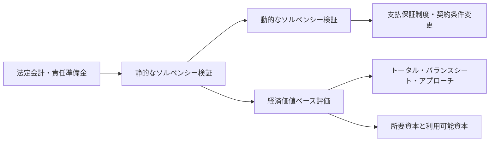

# ソルベンシー

## この資料の狙い

- 教科書第6章の全体像を落とさずに、`ソルベンシーとは何を守るための話か` を前から理解できるようにする
- 静的ソルベンシー、動的ソルベンシー、支払保証制度、契約条件変更、経済価値ベース規制を、別々の制度論ではなく一つの流れとしてつなぐ
- とくに教科書だけだと行間が空きやすい `なぜ経済価値なのか` `経済価値の世界では何をリスクとみるのか` `経済価値BSと会計BSは何が違うのか` を、根本からていねいに埋める
- 2026年4月5日時点の現行の一次資料を踏まえ、教科書より後に進んだ日本の経済価値ベース規制の状況も反映する

## 教科書との対応

教科書 `保険2（生命保険）第6章 ソルベンシー` は、次の流れでできている。

1. `6.1 生命保険会社のリスクとソルベンシーの確保`
2. `6.2 静的なソルベンシーの検証`
3. `6.3 動的なソルベンシーの検証`
4. `6.4 支払保証制度`
5. `6.5 契約条件の変更`
6. `6.6 経済価値ベースのソルベンシー規制の基本的な考え方`

この章は、一見すると

- 早期是正措置
- キャッシュ・フロー・テスト
- 破綻処理
- 経済価値規制

が横に並んでいるだけに見えやすい。  
でも本当は、ずっと同じ問いを追っている。

その問いは、

- 保険会社は、長いあいだ約束を守れるのか
- それを、いつ、どの物差しで、どうやって確かめるのか
- 危なくなったとき、どの段階で手を打つのか
- それでも持ち直せないとき、契約者をどう守るのか

である。

この資料では、教科書の節立てをそのまま残しつつ、各節がこの問いにどう答えているのかを見える形にする。  
とくに `6.6 経済価値ベースのソルベンシー規制` は、2024年2月作成の教科書だけでは今の制度の動きが足りないので、金融庁の一次資料で補っている。

## まず、この章は何を解決したいのか

生命保険会社の本業は、いま商品を売って、ずっと先に約束を果たす仕事である。  
保険料は先に受け取る。保険金や給付金は、何年も、何十年も後に払うことがある。

ここで一番こわいのは、`今日の数字が一見よく見えても、それが本当に将来の支払いを支えられる状態なのかは、別に確かめないと分からない` という点である。

たとえば、こんなことが起こる。

- 資産は帳簿上しっかり見えるが、いま売ると想定より安いかもしれない
- 負債は契約時の前提で評価しているが、実際には金利や死亡率や解約率が変わっているかもしれない
- 金利が大きく動くと、資産より負債の方が大きく動いて、差額が急に縮むかもしれない
- 一時点では持っていそうに見えても、数年先のキャッシュフローまで追うと持たないかもしれない

つまり、ソルベンシーの問題は、`いま資産があるか` だけでは終わらない。  
`その資産が、将来の負債の動き方と合っているか`、`悪い局面でも契約を守りきれるか`、`危なくなったときに早めに手を打てるか` まで見ないといけない。

この章がやっていることを一本で言うと、次の流れである。

1. まず、保険会社の健全性とは何かを定義する
2. つぎに、一時点での健全性をみる静的な物差しを置く
3. それだけでは足りないので、将来シミュレーションでみる動的な物差しを置く
4. それでも持ち直せないときの契約者保護を考える
5. 最後に、資産と負債をもっと同じ物差しで見ようとして、経済価値ベースの考え方に進む

だからこの章は、単なる監督規制の暗記章ではない。  
`保険会社の約束をどう守るか` を、会計、監督、リスク管理、破綻処理まで含めて一本につないだ章だと理解すると、かなり読みやすくなる。

### 図で先に全体像を見る

この章は、`今この瞬間の健全性をみる`、`将来の経路で確かめる`、`それでも危ないときの保護を考える`、`さらに経済価値で見直す` という順番で進んでいる。
流れを持って読むと、SMR、キャッシュ・フロー・テスト、支払保証制度、TBA が別々の制度に見えにくくなる。

## 教科書本文の節ごとの読み方と第I部想定問題

ここでは、教科書第6章の節立てに沿って、`この節は何を言いたいのか` と `第I部でどう問われやすいか` を先に置いておく。  
地図を持ってから本文を読むと、制度の部品が散らばりにくい。

### 6.1 生命保険会社のリスクとソルベンシーの確保

この節の出発点は、昔ながらの保守的な会計や責任準備金だけで、本当に健全性を語り切れるのか、という疑問である。  
資産を原価っぽく見て、負債を契約時前提で見ていた時代には、それでもなんとか回っていた。しかし、金利、株価、為替、解約動向が大きく動く世界では、それだけでは危うい。そこで、`資産と負債を切り離さずに見る必要がある` という話が始まる。

- 第I部想定問題: ソルベンシー評価の意義を説明せよ。
- 第I部想定問題: 生命保険会社の財政状態が健全であるとはどういう状態か述べよ。
- 第I部想定問題: 生命保険会社を取り巻くリスクの変化を説明せよ。
- 第I部想定問題: レディントンのイミュナイゼーションの考え方を述べよ。

### 6.2 静的なソルベンシーの検証

この節は、`いまこの時点で、最低限どのくらい余力があるか` を共通のルールで測る節である。  
早期是正措置、ソルベンシー・マージン比率、実質資産負債差額、広義の自己資本といった話はここに入る。監督当局が全社を同じ物差しで見て、早めに介入するための仕組みだとつかむとよい。

- 第I部想定問題: 静的なソルベンシーの検証の意義と長短を述べよ。
- 第I部想定問題: 生命保険会社の自己資本が持つ機能を列挙せよ。
- 第I部想定問題: 早期是正措置制度の概要を説明せよ。
- 第I部想定問題: ソルベンシー・マージン比率規制の特徴と限界を述べよ。

### 6.3 動的なソルベンシーの検証

この節は、`今日大丈夫そうでも、将来の経路まで追うと危ないことがある` ので、それを補う節である。  
キャッシュ・フロー・テスト、将来収支分析、保険計理人の役割、ストレステストの発想はここにつながる。静的評価の弱点を埋めるために、未来に向かって数字を流す。

- 第I部想定問題: 静的なソルベンシー・チェックの限界を述べよ。
- 第I部想定問題: 動的なソルベンシー検証の意義と問題点を説明せよ。
- 第I部想定問題: キャッシュ・フロー・テスト導入の背景を述べよ。
- 第I部想定問題: 責任準備金評価における保険計理人の役割を説明せよ。

### 6.4 支払保証制度

この節は、`それでも本当に危なくなったら契約者をどう守るのか` を扱う。  
生命保険会社は普通の会社のように、資金繰りで一日で終わるとは限らない。だからこそ、破綻の判定も、契約継続を前提にした保護も、独特の設計になる。

- 第I部想定問題: 支払保証制度の必要性を説明せよ。
- 第I部想定問題: 生命保険会社の破綻の判定が一般企業と異なる理由を述べよ。
- 第I部想定問題: 支払保証制度のメリット・デメリットを挙げよ。

### 6.5 契約条件の変更

この節は、`破綻してから守る` だけでなく、`破綻する前に契約条件の見直しで持ちこたえられないか` を考える節である。  
かなり重い制度で、契約者利益、私的契約の尊重、相互会社の社員自治など、法的にも価値判断がぶつかる。

- 第I部想定問題: 契約条件変更制度の趣旨を説明せよ。
- 第I部想定問題: 契約条件変更をめぐる主な論点を述べよ。

### 6.6 経済価値ベースのソルベンシー規制の基本的な考え方

ここが今の試験でいちばん重要で、しかも教科書の行間が空きやすい部分である。  
話の中心は、`資産と負債を別々の古い物差しで見るのではなく、いまの経済条件で両方を見て、その差額がどのくらい傷むかを測ろう` ということだ。

- 第I部想定問題: トータル・バランスシート・アプローチとは何か説明せよ。
- 第I部想定問題: 経済価値ベースの保険負債評価の概要を説明せよ。
- 第I部想定問題: 市場整合的評価、リスク・マージン、割引率の考え方を述べよ。
- 第I部想定問題: 経済価値ベースのソルベンシー規制におけるリスクの計測を説明せよ。
- 第I部想定問題: 三つの柱の考え方を説明せよ。
- 第I部想定問題: 現行SMR規制と経済価値ベース規制の違いを述べよ。

## ソルベンシーとは、そもそも何を守る話なのか

ソルベンシーを一番やわらかく言うと、`会社が約束を守りきるための体力` である。  
生命保険会社の約束とは、保険事故が起きたときに保険金や給付金を払い、解約時には約款どおりの返戻金を払い、年金なら長期にわたって支払い続けることである。

この体力は、単に `純資産がプラスかどうか` だけでは足りない。  
なぜなら、生命保険会社の約束は長いし、負債の動き方が複雑だからである。

本当に見たいのは、

- 将来の負債を払い切れるだけの資産があるか
- その資産は、必要なタイミングで現金化できるか
- 金利や市場環境が変わったとき、資産と負債の差額が急に壊れないか
- 想定外の事態が起きたときに、追加の耐久力があるか

である。

つまりソルベンシーは、`残高の大きさ` の話であると同時に、`時間構造` と `耐久力` の話でもある。  
ここを押さえると、なぜ静的評価だけで終わらず、動的評価やALMや経済価値評価まで話が広がるのかが自然に見える。

## なぜ昔ながらの会計だけでは足りなくなったのか

教科書の6.1が言いたいことはここである。  
昔の生命保険会社は、資産をかなり保守的に見て、負債も保険料計算基礎率で積んでおけば、ひとまず健全性を語りやすかった。

その見方がある程度回った背景には、暗黙の前提があった。

- 金利はそんなに激しく動かない
- 市場価格は大きく崩れにくい
- 顧客行動も急には変わらない
- 新契約も保険料収入も順調に入ってくる

こういう世界なら、資産を取得原価ベースで置き、負債を契約時前提で置いても、大きなズレは表面化しにくい。

でも、いまの世界はそうではない。  
金利は大きく動く。株価や為替も動く。顧客は比較して乗り換える。低金利が長引けば、昔高めに約束した予定利率が重くなる。外貨建商品や変額商品、最低保証も増える。

すると何が起こるか。  
`昔の物差しで置いた資産・負債の数字` と `いま実際に会社が抱えている経済的な痛みや余力` が、だんだんズレていく。

このズレをそのままにすると、会社は一見大丈夫そうに見えるのに、実は金利や市場環境が少し動いただけで急に弱くなる、ということが起こりうる。  
第6章は、そのズレをどう見つけ、どう測り、どう埋めるかの章である。

## 健全性とは、具体的にはどういう状態なのか

教科書はここをかなり大事に書いている。  
健全性とは、ざっくり言うと `将来にわたる保険契約上の債務を、相当程度の確度で履行できる状態` である。

この中身を二つに分けると分かりやすい。

一つ目は、`資産の価値が負債の価値を上回っていること` である。  
要するに、長い目で見て債務超過になっていないことだ。

二つ目は、`必要なときに必要な現金が出せること` である。  
こちらは流動性の話で、資産の総額が足りていても、すぐ現金化できなければ支払不能は起こりうる。

つまり、健全性は

- 価値の面の健全性
- 資金繰りの面の健全性

の両方を含む。

ここで大事なのは、保険会社は `長期の約束を持つ会社` なので、片方だけ良くても足りないということだ。  
資産が長期では十分でも、短期の資金繰りが詰まれば困る。逆に、短期の資金繰りが回っていても、時価ベースで見れば負債の方が膨らんでいるなら長期では危うい。ソルベンシーは、この二つを同時に見ようとする。

## 静的なソルベンシー検証は、何をしているのか

静的なソルベンシー検証は、`決算時点などの一時点で、会社にどれだけ余力があるかを、共通の式で測る` ためのものである。  
日本で長く中心だったのは、ソルベンシー・マージン比率と実質資産負債差額である。

ここでの発想は比較的はっきりしている。

- 通常の予測の範囲内のリスクには責任準備金で備える
- それを超えるぶれには、広義の自己資本で備える
- その広義の自己資本が、想定するリスク量に対して十分かを見る

監督当局がこれを重く使うのは、全社を同じ物差しで比べ、早期介入のトリガーに使いやすいからである。  
個社ごとの複雑なモデルをいちいち読まなくても、一定の客観性と実行可能性がある。

ただし、ここには限界もある。  
一時点の姿しか見ないので、将来のキャッシュフローの崩れ方までは十分に見えない。個社固有のALMや商品構成や契約者行動も粗くしか反映できない。

だから、静的検証は `いらない` のではなく、`必要だけれど、それだけでは足りない` のである。

## 引当金は、何でも負債にしてよいわけではない

ここは会計の一般論に見えるが、責任準備金や各種準備金を読む土台になる。
将来不安だから何でも引当金にできるわけではなく、負債計上には条件がある。

答案では、次の4つをそのまま切れるようにしておきたい。

- 将来の特定の費用又は損失であること
- その発生が当期以前の事象に起因していること
- 当該事象の発生の可能性が高いこと
- その金額を合理的に見積もることができること

たとえば、「将来どこかで経営環境が悪くなるかもしれない」というだけでは引当金にはならない。
でも、すでに締結した契約に基づき、将来の支払いが高い確度で発生し、その額も数理的に見積もれるなら、負債計上の議論に乗ってくる。
この線引きがあるから、会計上の比較可能性が保たれる。

## 早期是正措置は、何を早めに直させる制度か

生命保険会社は長期契約を抱えるので、本当に破綻してから手を打っても遅い。
そこで、支払能力が傷み始めた段階で経営改善を促すのが早期是正措置である。

制度の骨格は次のように押さえるとよい。

| 区分 | 目安 | 監督上の動き |
| --- | --- | --- |
| 非対象区分 | SMR が 200%以上 | 通常監督 |
| 第1区分 | SMR が 100%以上 200%未満 | 改善計画の提出・実行命令 |
| 第2区分 | SMR が 0%以上 100%未満 | 配当抑制、保険料計算方法見直し、事業費抑制などを命令 |
| 第3区分 | SMR が 0%未満 | 期限を付した業務停止命令 |

ただし、ここは比率だけで機械的に切る話ではない。
実質資産負債差額の状況によって、第2区分や第3区分の扱いが修正されることがある。
つまり監督当局が見ているのは、`比率が悪いか` だけでなく、`実態としてどこまで傷んでいるか` である。

ミニ例で言えば、SMR が 90% に落ちた会社には、「まず経営改善計画を出し、配当や費用を抑え、健全性回復へ動け」という圧力がかかる。
一方で、SMR だけでなく実質資産負債差額も悪化しているなら、より強い措置へ進みやすい。
早期是正措置は、破綻処理ではなく `まだ直せる段階で直させる制度` と理解するのが芯である。

## 広義の自己資本は、なぜそんなに大事なのか

自己資本というと、つい貸借対照表の純資産の部だけを思い浮かべやすい。  
でも生命保険会社で本当に見たいのは、`どの損失を誰がどう吸収できるのか` である。

そのため、生命保険会社では、基金や資本金のような純資産項目だけでなく、

- 危険準備金
- 価格変動準備金
- 配当準備金の未割当部分
- 一部の含み損益

のように、損失吸収や支払能力の下支えに使えるものも含めて `広義の自己資本` と見る。

教科書や過去問で自己資本の機能が問われるのは、ここが単なる会計分類ではないからである。  
自己資本は、

- 想定外損失の緩衝材
- 契約者や市場への信認の土台
- 固定資産取得など経営基盤の元手
- 収益機会を取るための無コスト資金

といった役割を持つ。

ただし、何でも同じ強さで損失吸収できるわけではない。  
たとえば劣後債には元本返済や利払いの条件があるし、危険準備金や価格変動準備金には使途制約がある。だから `自己資本の量` だけでなく `質` も見ないといけない。経済価値ベース規制で資本の質が重くなるのは、そのためである。

答案で4機能を問われたときは、次の表の形で頭に置くと切りやすい。

| 自己資本の機能 | 何をしているか | 生命保険会社での見え方 |
| --- | --- | --- |
| 想定外損失の緩衝 | 通常予測を超える損失を吸収する | 株価下落、逆ざや、解約急増の衝撃を受け止める |
| 信頼性の確保 | 契約者・市場・監督からの信認を支える | `この会社は払える` という土台になる |
| 固定資産等の取得資金 | 経営基盤を作る元手になる | システム投資や営業基盤整備を支える |
| 無コスト資金としての収益性向上 | 利払い不要の資金として運用に使える | 収益機会を取る余地を広げる |

ここで `無コスト資金` という言い方が出るのは、自己資本には通常、負債のような約定利払いがないからである。
ただし、資本が厚ければ何でもよいわけではない。
株式会社なら資本効率も問われるし、相互会社でも契約者還元とのバランスがある。だから自己資本は `厚ければ安心` と `厚すぎると効率が悪い` の両面を持つ。

## 動的なソルベンシー検証は、静的評価の何を補っているのか

静的評価の弱点は、`この先どう崩れるか` が見えにくいことである。  
いま余力が十分でも、

- 高予定利率契約が重い
- 資産と負債のデュレーションが大きくずれている
- 解約が増えると資金繰りが急に悪くなる
- 新契約政策や配当政策を続けると数年後に厳しくなる

といった問題は、一時点の比率だけだと見えにくい。

そこで動的なソルベンシー検証が要る。  
これは、将来のキャッシュフローをシナリオのもとで流し、何年後にどんな姿になるかを見る方法である。

ここで見ているのは、単なる未来予想ではない。  
`今の経営方針を続けると、将来の支払能力はどうなるか` を確認する作業である。だから、

- 商品政策
- 投資政策
- ALM
- 契約者配当
- 株主配当
- 再保険

まで反映させることに意味がある。

この動的評価が大事なのは、生命保険会社の問題が `ゆっくり悪くなる` 形で現れやすいからでもある。  
一日で破綻するより、数年かけて含み損や逆ざややミスマッチが積み上がる方が典型なので、将来経路を追う必要がある。

### ミニ例: 今年の比率は高くても、5 年後に苦しくなる会社

| 見る時点 | 見え方 |
| --- | --- |
| 今年の静的検証 | ソルベンシー・マージン比率は高く、表面上は余力がある |
| 1 年後 | 低金利が続き、予定利率の高い既契約で逆ざやが広がる |
| 3 年後 | 運用収益が追いつかず、内部留保が削られる |
| 5 年後 | 解約増加や資金流出が重なると、将来収支が厳しくなる |

この会社は、`今日の一枚の写真` だけ見れば大丈夫そうに見える。
でも、将来の経路を流すと、同じ経営方針を続けた先で息切れする。動的なソルベンシー検証は、まさにこの `ゆっくり悪くなる危うさ` を捕まえるためにある。

## 静的な検証と動的な検証を、一枚で比べるとどう違うか

ここは総合問題でも短問でも出しやすい。
文章でだらだら書くより、まず対比で押さえた方が崩れにくい。

| 観点 | 静的なソルベンシー検証 | 動的なソルベンシー検証 |
| --- | --- | --- |
| 何を見るか | 一時点の余力 | 将来経路の中での耐久力 |
| 主な方法 | ソルベンシー・マージン比率、実質資産負債差額 | 将来収支分析、キャッシュ・フロー・テスト、ストレステスト |
| 強み | 客観性、比較可能性、実行可能性が高い | 個社固有のリスクや将来の崩れ方を見やすい |
| 弱み | 将来の壊れ方を見にくい | 実務負荷が重く、前提やシナリオの恣意性が入りやすい |
| 向いている場面 | 監督上の最低線の把握、横比較 | 経営計画、ALM、配当・商品政策の検証 |

ミニ例でいえば、`いま SMR が高いか` を見るのは静的検証である。
`この販売政策と運用政策を 5 年続けたとき、逆ざやや解約増でどうなるか` を見るのは動的検証である。
両者は競合するものではなく、`一枚の写真` と `将来の動画` の関係だと覚えるとよい。

## キャッシュ・フロー・テストは、どんな発想の制度なのか

キャッシュ・フロー・テストは、名前のとおり、将来の現金の流れを見にいく。  
ここでの核心は、`責任準備金が法定の最低ラインを満たしていても、それだけで将来の支払いが安全とは限らない` ということだ。

たとえば、超低金利が続き、予定利率の高い既契約が重いとする。  
帳簿上は責任準備金が積まれていても、実際の運用収益が追いつかず、将来収支で赤字が続くかもしれない。こういうとき、いまの一時点の数字だけ見て安心するわけにはいかない。

キャッシュ・フロー・テストは、その `将来の息切れ` を早めに見つけるための仕組みだと考えるとよい。  
保険計理人の役割がここで重くなるのも自然で、数理前提、シナリオ、責任準備金の十分性を、将来の収支まで含めて点検する必要があるからである。

## 生命保険会社の破綻は、なぜ普通の会社と少し違うのか

教科書6.4の大事なところはここである。  
一般企業なら、手形不渡りや資金繰り不能のように、`この日から持たない` という破綻時点が比較的はっきり現れやすい。

生命保険会社は、少し様子が違う。  
個人保険では、保険金支払いが一日に集中することは通常は考えにくい。契約者も年齢や健康状態の関係で一斉に他社へ乗り換えるとは限らない。だから、一時的に債務超過っぽく見えても、その瞬間に直ちに保険金支払いが止まるとは限らない。

そのため生命保険会社の破綻判断は、`いますぐ現金が足りない` より、`事業継続を断念せざるをえないか` という形で現れやすい。  
ここが一般企業との大きな違いである。

だから破綻処理でも、生命保険では `契約をいかに継続させるか` が非常に重い。  
契約者は同条件で入り直せないことが多いので、ただ清算して終わりでは契約者保護にならない。支払保証制度や契約移転や更生手続が整備されるのは、そのためである。

## 支払保証制度は、何のために必要なのか

支払保証制度は、もちろん契約者保護のために必要である。  
でも、教科書や過去問で問われるときは、そこからもう一歩進んで考えたい。

この制度があることには、保険契約者保護以外にも意味がある。

- 業界全体への信頼を保ちやすい
- 監督当局が「絶対に潰さない」方針に縛られにくくなる
- 競争を完全に殺さずに済む

一方で、デメリットもある。

- いざとなれば守られるという期待が、会社・契約者・監督当局のモラルハザードを生みやすい
- 健全な会社にも拠出負担が及ぶ
- 過度な保護は市場規律を弱めうる

つまり支払保証制度は、`守ればそれで終わり` の制度ではない。  
契約者保護と市場規律のバランスをどう取るか、という難しい制度である。

## 契約条件変更は、なぜこんなに重い論点なのか

契約条件変更は、保険会社の破綻を未然に防ぐために、既契約の条件まで見直しうる制度である。  
だから当然、重い。

なぜ重いかというと、保険契約は私的契約だからである。  
契約者は、約款どおりの給付を期待して保険料を払っている。その条件を後から変えるのは、契約者保護の観点から簡単には正当化できない。

それでも議論されるのは、`何も変えないまま本当に破綻する` より、`一定の条件変更で契約継続を守る` 方が、結果的に契約者保護にかなう場面がありうるからである。  
だからこの論点は、法技術の話というより、`どの水準の契約者保護を目指すか` という価値判断の話でもある。

## 最低保証リスクは、なぜ別立てで問われるのか

最低保証リスクは、変額保険や変額年金のように、特別勘定の運用結果が悪くても会社が一定額を保証する商品で問題になる。
市場が下がったとき、契約者の損失を会社が肩代わりする構造なので、通常の死亡率リスクや単純な価格変動リスクとは別に切り出して考えたくなる。

標準的方式の発想は、かなり素朴に言えば、`資産価格が下落した後に必要となる最低保証責任準備金が、いま積んでいる額をどれだけ上回るか` を測ることである。
つまり、悪化時に会社がどれだけ追加で負担するかを見ている。

一方、代替的方式は、一定の基準を満たす会社がより自社実態に即したモデルを使える考え方である。
ここで大事なのは細かな条文暗記より、`最低保証リスクは市場変動と商品保証が直結するので独立管理が要る` と理解することだ。

たとえば、変額年金で運用資産が大きく下落すると、特別勘定の価額は減るのに、契約者への最低保証額は下がらない。
その差額を埋めるのは会社なので、景気悪化局面ほど会社負担が重くなる。
これが、最低保証リスクが古典論点として独立で問われ続ける理由である。

## 静的ソルベンシーの小問は、何を箱で覚えると崩れにくいか

H9、H10、H13 まわりの小問は、細かい数字や条文が多く、丸暗記だと崩れやすい。
でも、何を問う箱なのかで分けるとかなり持ちやすい。

| 箱 | 典型的に問われるもの | 見るポイント |
| --- | --- | --- |
| 準備金・剰余金 | 社員配当準備金、危険準備金、損失てん補準備金、基金償却準備金 | 何のために積むか、どこに計上されるか |
| リスク係数・相関 | 価格変動等リスク、予定利率リスク、子会社等リスク、保険リスク相関 | 何に対する係数か、どちらが相対的に高いか |
| 税効果・余剰部分 | 税効果相当額、保険料積立金等余剰部分 | 分子に何を入れているか |
| 資産評価 | 満期保有目的債券、その他有価証券、含み損益 | どの評価差額をどこで拾うか |

この整理の意味は、制度の細目を `暗記カードの断片` にせず、`何を測ろうとしている箱か` で持てるようにすることにある。
たとえば、その他有価証券や満期保有目的債券の扱いは、単に会計分類の問題ではなく、`価格変動をどこまでソルベンシーへ反映させるか` の問題として見ると覚えやすい。
短問で問われたら、まずどの箱の話かを見抜いて、その箱の代表論点を切るのがコツである。

## ここからが本題: なぜ経済価値なのか

ここが第6章のいちばん大事な山場である。  
しかも、この論点は、少し前提を飛ばすと急に読みにくくなる。

教科書では `経済価値` `市場整合的評価` `TBA` `リスク・マージン` と言葉が続くが、読む側としてはまず、

- そもそも「価値」をどう測るのか
- なぜ保険負債を会計とは別の物差しで見たくなるのか
- なぜ資産だけでなく負債まで時点更新して見る必要があるのか

を順番に押さえた方が、あとで崩れない。

結論から先に言うと、経済価値で見たい理由は、`会計上の見え方ではなく、会社がいま本当にどのくらい約束を守れる位置にいるかを知りたいから` である。  
生命保険会社は、今日の売上より、何十年も先の支払いの方が本体なので、ここを見誤るとかなり危ない。

### まず、価値とは何か

投資理論の言葉でいえば、価値とは `将来受け取る、または支払うキャッシュフローを、今日の値段へ引き直したもの` である。  
一番単純な式は、

`PV = Σ CF_t / (1 + r_t)^t`

である。

ここで、

- `CF_t` は t 年後のキャッシュフロー
- `r_t` はその年限に対応する割引率
- `PV` は今日時点の価値

である。

これは別に保険だけの話ではない。  
債券でも、株でも、不動産でも、将来のお金を今の値段に直す、という発想が価値評価の土台にある。

たとえば、1年後に確実に100円受け取れるとする。  
1年の安全な金利が2%なら、今日の価値はざっくり `100 / 1.02 = 98.0円` くらいになる。逆に言えば、今日98円を安全に2%で運用できるなら、1年後に100円に戻る。

この `将来のお金を今へ引き戻す` という発想を、保険負債にも持ち込もうとしたのが経済価値の入口である。

### なぜ保険会社でこれが難しいのか

ここで保険会社特有の難しさが出る。  
債券なら、クーポンと償還額がだいたい決まっている。ところが保険負債はそう単純ではない。

将来の支払いは、

- 何人亡くなるか
- 何人長生きするか
- どのくらい解約するか
- どれだけ事業費がかかるか
- 最低保証や配当がどう動くか

で変わる。

つまり、保険負債は `将来キャッシュフローが不確実な長期債務` である。  
しかも、その不確実性は、金利、株価、為替のような金融市場の変動と、死亡・長寿・解約・費用のような保険固有の変動が混ざっている。

だから、保険負債をきちんと見たいなら、

1. 将来キャッシュフローを見積もる
2. それを適切な割引率で現在価値へ戻す
3. なお残る不確実性をどう扱うか考える

という三段階が必要になる。

### 会計BSだけだと、なぜ足りないのか

ここでようやく、会計BSとの違いが見えてくる。  
会計BSは、会計基準に従って作る財務諸表であり、契約者保護、期間損益、比較可能性、実務可能性といった目的が強く入っている。

そのため、負債側では契約時に設定した基礎率を引きずるロックイン評価が強く残る一方で、資産側は保有目的区分によって時価変動が前に出ることがある。  
すると、金利が動いたときに、

- 資産はかなり動く
- 負債は会計上あまり動かないように見える
- でも経済実態では、負債の現在価値も大きく動いている

というズレが起こる。

このズレがあると、ALM をかなりしていても会計上の純資産だけが大きく揺れることがあるし、逆に会計上は穏やかに見えても、経済実態ではかなり傷んでいることもある。  
だから、`長い負債を抱える会社の本当の耐久力を見るには、会計BSだけでは足りない` という結論になる。

言い換えると、経済価値規制は `時価っぽい数字を出したいから` 導入されるのではない。  
`長い負債を抱える会社の実質的な支払余力を、資産と負債を同じ時点・同じ市場条件で測り直したいから` 導入されるのである。

ここで参考資料が強調していたのは、これは単なる計算ルールの変更ではなく、`会社の見方そのものを変える話` だという点である。  
従来のロックイン色の強い見方では、過去に決めた予定利率や保守性の中に、いまどのくらいのリスクが潜っているかが見えにくい。経済価値ベースへ移ると、金利や市場の変化が負債価値へどう効くかを前向きに見にいくことになる。つまり、`過去に決めた安全率に頼る経営` から、`今の環境で負債がどう動くかを見ながら経営する` 方向へ重心が移る。

この意味で、経済価値ベース規制は、単に厳しい規制へ変わるというより、`保険会社の経営をフォワードルッキングに切り替えるためのレジーム転換` と見た方が実態に近い。

## 経済価値の世界では、何をリスクとみるのか

ここでいうリスクは、単に `価格が動くこと` ではない。  
もっと正確に言うと、`経済価値BSの純資産、つまり資産と負債の差額を悪化させる要因` がリスクである。

式で書くと、まず経済価値ベースのサープラスを

`S = A - L`

とおく。  
ここで、

- `A` は経済価値ベースの資産
- `L` は経済価値ベースの負債
- `S` はその差額、つまり利用可能資本の基礎になる部分

である。

このときリスクとは、ショックの後に `S` がどれだけ減るかで見る。  
つまり、資産の価格変動だけを切り出すのではなく、`資産と負債を合わせた差額がどれだけ傷むか` を見る。

### 金利リスクを例にすると何が起きるか

ここはデュレーションの概念を使うと、かなり腹に落ちる。  
債券価格の金利感応度は、修正デュレーション `D_mod` を使うと、

`ΔP / P ≒ - D_mod × Δy`

と一次近似できる。  
金利変化が大きいときは、さらにコンベクシティ `C` を入れて、

`ΔP / P ≒ - D_mod × Δy + (1/2) × C × (Δy)^2`

で近似する。

意味はシンプルで、`デュレーションが長いほど、金利が動いたときの価格変化が大きい` ということである。

たとえば、

- 資産の修正デュレーションが 7
- 負債の修正デュレーションが 15

とする。  
金利が 1% 低下すると、一次近似では、

- 資産価値はだいたい 7% 増える
- 負債価値はだいたい 15% 増える

方向に動く。

このとき、会社が見たいのは `債券が上がった` という事実そのものではない。  
`負債の方がもっと大きく膨らんだので、差額 S が縮んだ` という事実である。経済価値の世界でのリスクとは、これである。

### 何がリスク項目になるのか

金融庁や教科書で典型的に並ぶのは、

- 金利
- 株価
- 為替
- 信用スプレッド
- 死亡
- 長寿
- 罹患・障害
- 解約・失効
- 経費
- 巨大災害
- オペレーショナル・リスク

といった項目である。

ただ、名前だけを暗記してもあまり意味がない。  
全部に共通しているのは、`そのショックが経済価値BSの差額をどれだけ削るか` を見ている、ということだ。

さらに重要なのは、`自社が作ったミスマッチもリスクとして認識する` ことである。  
保険ポートフォリオそのものに内在するリスクだけでなく、資産運用やALMの取り方によって会社が自ら生んだミスマッチも、所要資本で見るべきだというのが経済価値規制の発想である。

## 経済価値BSと会計BSは、何が違うのか

ここは試験でも実務でもかなり大事で、できるだけ直感で押さえたい。

まず会計BSは、`会計基準に従って作る財務諸表` である。  
資産も負債も、会計上のルールに沿って計上される。契約者保護、期間損益、比較可能性、実務可能性といった目的が強く入っている。

これに対して経済価値BSは、`いまこの環境で会社の資産と負債を置き直したら、差額はいくらか` を見るためのBSである。  
目的は、実態としての支払余力や耐久力を、より直接的に捉えることにある。

違いを順に見ると、こうなる。

### 1. 負債の見方が違う

会計BSの法定責任準備金は、契約時に設定した基礎率を引きずるロックイン色が強い。  
経済価値BSの保険負債は、評価時点の最良推定や市場前提で将来キャッシュフローを見積もる。

つまり会計BSは `契約時の安全な土台` を重く見る。  
経済価値BSは `いま時点での履行コスト` を重く見る。

### 2. 資産と負債を同じ物差しで見ようとする

会計BSでは、資産は時価に近いものもあれば原価のものもある。負債はまた別のルールで置かれる。  
経済価値BSでは、できるだけ市場整合的に、同じ時点の市場条件で両方を見る。

### 3. オプションと保証を重く見る

会計BSでは、最低保証や解約オプションの価値が、そのまま前に見えないことがある。  
経済価値BSでは、そうしたオプションや保証の時間価値を、負債評価に織り込む方向へ行く。

### 4. 差額の変動を、そのままリスク管理につなげやすい

会計BSは財務報告の役割が大きい。  
経済価値BSは、`どのリスク要因が差額をどれだけ動かすか` をそのまま資本管理やALMに返しやすい。

数字でかなり単純化すると、こういうイメージである。

- 会計BS: 資産 110、負債 100、純資産 10
- 金利低下後、会計上は資産 105、負債 100、純資産 5 と見えるかもしれない
- でも経済価値BSでは、資産 115、負債 120、純資産 -5 と見えるかもしれない

ここで伝えたいのは、どちらが `正しい` かの単純な勝負ではない。  
会計BSは会計BSの役目がある。経済価値BSは、`本当の耐久力を見る補助線` として強い。この二つを混同しないことが大事である。

### 5. だから ALM の効き方も違って見える

ここが実務上かなり重要である。  
会計BSでは、資産の時価変動が前に見える一方で、負債はロックイン色が強い。すると、資産と負債のデュレーションをそれなりに合わせていても、会計上は純資産がかなり振れて見えることがある。

経済価値BSでは、資産も負債も金利で動かして見るので、ALM が効いていれば `差額が守られていること` が見えやすい。  
逆に、会計上の利益や純資産が安定していても、経済価値BSで差額が大きく振れるなら、実はミスマッチが残っていることが分かる。

だから経済価値BSは、会計BSの代用品ではなく、`ALM が本当に効いているかを見るための別の窓` でもある。

## トータル・バランスシート・アプローチとは、何をしているのか

トータル・バランスシート・アプローチ、略してTBAは、名前だけだと少し遠い。  
やっていることは、`資産・負債・所要資本・利用可能資本を別々に見るのではなく、つながった一枚のBSとして見る` ことである。

これはなぜ必要か。  
リスクが起きると、会社のどこか一か所だけが動くわけではないからである。

金利低下なら、

- 資産価値が動く
- 負債価値も動く
- 保証の価値も動く
- 必要資本も動く
- 結果として利用可能資本との関係も動く

というふうに、全部がつながって動く。

TBA が言いたいのは、`資産だけ見ても、負債だけ見ても、資本だけ見ても足りない` ということだ。  
保険会社の健全性は、BS全体の相互依存関係の上に乗っている。だから、リスクを本気で見るなら、一枚で見なければならない。

この発想は、ALMとかなり相性がよい。  
ALM はもともと、資産だけ良ければよいのではなく、負債との組み合わせで会社の差額を守ろうとする考え方だからである。経済価値規制がALMと親和的なのは、ここに理由がある。

別の言い方をすると、TBA は `リスク管理版の連結思考` に近い。  
会計や実務では、資産運用部門、商品部門、数理部門、経理部門で数字の見え方が分かれやすい。TBA は、その分断をいったん外し、`結局、会社全体の差額はどうなるのか` に戻す考え方である。

## 保険負債の経済価値は、どう作るのか

教科書では `技術的準備金` という言葉も出てくる。  
経済価値規制の文脈では、保険負債の経済価値をこういう形で考える。

- 最良推定
- リスク・マージン

の和である。

最良推定は、将来キャッシュフローの `偏りのない今時点の見積もり` を現在価値へ割り戻したものだと考えるとよい。  
ここでは、

- 死亡率
- 長寿
- 発生率
- 解約率
- 事業費
- 配当
- 保証
- 契約者行動

などを、評価時点の情報で見直して入れる。

ここで会計と大きく違うのは、`契約時に決めた古い前提を、そのまま引きずらない` ことである。  
今の情報で見直すから、評価額は毎期かなり動きうる。

式でかなり単純化すると、

`BEL = Σ E[CF_t] × DF(0,t)`

と書ける。  
ここで、

- `BEL` は最良推定負債
- `E[CF_t]` は t 時点キャッシュフローの現在時点での見積もり
- `DF(0,t)` は 0 時点から t 時点への割引係数

である。

もちろん、実務ではこれほど単純ではない。  
配当、解約オプション、最低保証のように非線形の要素があると、単純な平均キャッシュフローの割引だけでは足りない。そこでは確率論的シナリオやオプション評価の考え方が必要になる。

### 最良推定は「楽観値」ではない

ここも誤解しやすい。  
最良推定と言うと、甘い見積もりのように聞こえるが、そうではない。

最良推定は、`安全率を余分に足さない代わりに、いま時点で最も妥当だと考える前提を偏りなく置く` という意味である。  
ここでの安全率は別枠でリスク・マージンへ回す。だから、最良推定の段階で保守性もリスク対価も全部混ぜるのではなく、役割ごとに分けるのである。

## 市場整合的評価とは、どういう意味か

市場整合的評価は、`市場価格があるものは市場価格と整合するように、ないものも市場で考えたらどのくらいの価値になるかに寄せて評価する` という考え方である。

保険契約そのものは普通、株や国債のように市場で日々売買されているわけではない。  
だから、値札をそのまま取ってくることはできない。

そこで考え方が二つに分かれる。

一つは、金融商品でキャッシュフローを複製できる部分は、その市場価格から評価する考え方である。  
たとえば、金利連動の部分やデリバティブでヘッジ可能な保証部分は、市場商品との整合で見に行きやすい。

もう一つは、完全に複製できない部分については、最良推定だけでは足りないので、追加のリスク・マージンを乗せる考え方である。  
ここで言いたいのは、`市場でヘッジできない不確実性は無料ではない` ということだ。

だから市場整合的評価は、単なる時価評価ではない。  
`市場で値がつく部分` と `市場では値がつかないが、引き受け手なら嫌がる不確実性の部分` を分けて考え、後者にも対価を乗せる発想である。

### 無裁定と複製をどう理解すればよいか

ここで、投資理論とデリバティブの考え方が出てくる。  
もしある将来キャッシュフロー `X` を、市場で売買できる金融商品の組合せ `Π` で完全に複製できるなら、`X` の価値は `Π` の今日の価格と一致しなければならない。

なぜなら、一致しないなら裁定が取れてしまうからである。

- `X` の値段が複製ポートフォリオより高いなら、`X` を売って `Π` を買えばノーリスクで儲かる
- 逆なら、`Π` を売って `X` を買えばノーリスクで儲かる

市場でこういう機会が放置されるとは考えにくい。  
だから、`複製できるものの価値は、複製コストに等しい` というのが無裁定価格付けの基本になる。

デリバティブ理論で言えば、これは `リスク中立価格付け` と同じ話である。  
複製可能なキャッシュフローは、リスク中立確率の下で期待値を取り、リスクフリー金利で割り引いた値と一致する。ここでリスク中立確率を使うのは、「現実の平均収益率」を当てたいからではなく、「ヘッジ付きでノーアービトラージな価格」を求めたいからである。

保険負債にそのまま当てはめると、

- 金融市場で複製できる部分は、市場整合的に価格を付ける
- それでも残る、死亡や解約や費用の不確実性は、複製できない残差として別に扱う

という形になる。

### 最低保証を例にすると、なぜデリバティブの発想が要るのか

ここは、変額年金や変額保険の最低保証を思い浮かべると分かりやすい。  
たとえば、満期時に特別勘定の時価 `S_T` がどうなっていても、契約者には少なくとも `K` を払う保証が付いているとする。会社の支払額は

`max(S_T, K)`

である。

この式は、そのまま読むより、分解した方が意味が見える。

`max(S_T, K) = S_T + max(K - S_T, 0)`

である。  
右側の第二項 `max(K - S_T, 0)` は、満期時点のプット・オプションのペイオフそのものである。

つまり、この保証は

- もともとの特別勘定資産 `S_T`
- それに上乗せされた最低保証プット

の和として見られる。

ここで大事なのは、保証部分の価値が `平均的にいくら損しそうか` だけでは決まらないことである。  
オプションの価値は、

- 株価水準
- ボラティリティ
- 金利
- 満期までの時間

で動く。

なぜか。  
保証は、`悪いときだけ会社が追加で払う` 非線形な約束だからである。株価が少し下がるだけなら影響は小さくても、保証ラインに近づくと一気に負担感が増える。ボラティリティが上がると、上にも下にも振れやすくなるが、会社にとって痛いのは下側である。だから、平均値が同じでも、ばらつきが大きいほど保証コストは上がりやすい。

この感覚は、線形商品である普通の債券とかなり違う。  
債券は、金利が1だけ動いたときに価格がどのくらい動くかを、まずデュレーションやコンベクシティで近似できる。ところが最低保証は、株価が下がるほど感応度そのものが変わる。だから、`一つの平均キャッシュフローを置いて割り引けばよい` では済まない。

実務では、ここで確率論的シナリオやオプション価格付けが要る。  
たとえば、将来の株価パスを多数発生させ、

- どのパスで保証がイン・ザ・マネーになるか
- そのとき会社の追加支払額がいくらか
- その価値が今日いくらか

を見に行く。  
これが、教科書や規制文書で `オプションと保証を負債へ織り込む` と言っていることの中身である。

### ヘッジ可能部分と、どうしても残る部分

もう一歩踏み込むと、保証付き商品の評価で見たいのは、`理論上いくらか` だけではなく、`どこまで市場で消せて、どこから先が残るか` である。

たとえば最低保証のうち、株価や金利に反応する部分は、デリバティブや債券でかなりヘッジしやすい。  
この部分は、複製の考え方に近づけて市場整合的に評価しやすい。

一方で、

- 契約者が途中でどう行動するか
- どのタイミングで解約や年金選択をするか
- 会社固有の事務・費用やオペレーションがどう効くか

のような部分は、きれいには複製できない。  
ここは、最良推定やリスク・マージンで受け止める領域になる。

だから経済価値評価は、`全部をブラックボックスで一つの率で割り引く作業` ではない。  
むしろ逆で、`市場で値が付く部分` `モデルで見積もる部分` `なお不確実性が残る部分` を切り分けていく作業である。ここが分かると、経済価値規制が会計の延長ではなく、かなり投資理論と保険数理の接点にあることが見えてくる。

### なぜ「市場整合的」であって「会社固有の期待利回り」ではないのか

ここも大事である。  
会社が「うちは株で高い期待リターンを取れる」と考えているからといって、その期待リターンで負債を安く見積もってよいことにはならない。

それを認めると、リスクを多く取る会社ほど負債を小さく見せられるからである。  
でもそれは健全性評価として筋が悪い。会社が危ない運用をしているのに、帳簿上は負債が軽く見えることになってしまう。

だから市場整合的評価では、`その会社がどう儲けたいか` と `保険負債そのものの価値` を切り分ける。  
この切り分けが、経済価値規制の中では非常に重要である。

## リスク・マージンは、なぜ必要なのか

最良推定だけで負債を置くと、`平均的にはこのくらい払うだろう` という値にはなる。  
でも、引き受ける側からすると、それでは足りない。

なぜなら、保険負債には不確実性が残るからである。

- 将来キャッシュフローのタイミングはずれるかもしれない
- 金額もずれるかもしれない
- しかもその不確実性は長年にわたって残る

もし他社がそのポートフォリオを引き継ぐなら、`平均的にはこのくらい` だけでは引き受けたくない。  
不確実性を抱えるぶんの上乗せが欲しい。これがリスク・マージンの感覚である。

教科書が強調しているのは、ここで守ろうとしているのは `清算価値` より `移転可能価値` に近いという点である。  
つまり、単に潰したときいくら回収できるかより、`契約を他社へ移して履行させるにはどれだけ必要か` の発想が強い。

この違いはかなり大きい。  
生命保険では契約継続が重いので、経済価値規制もその発想に寄る。リスク・マージンが必要になるのは、そのぶん `引き受け手が嫌がる不確実性` まで負債に入れたいからである。

### リスク・マージンの計算思想

教科書にあるとおり、代表的な考え方は二つある。

- 資本コスト法
- パーセンタイル法

資本コスト法は、`この負債を引き受けるには、残存期間にわたってどれだけ資本を積む必要があり、その資本コストはいくらか` という発想である。  
かなり自然で、引受けの経済的意味に近い。

パーセンタイル法は、`ある信頼水準の負債価値と平均的な負債価値の差` をマージンとみる発想である。  
計算は比較的扱いやすいが、信頼水準の意味づけや負債デュレーション差の反映などで議論が残りやすい。

どちらが優れているかを一言で決めるのは難しいが、少なくとも押さえたいのは、リスク・マージンは `安全率の寄せ集め` ではなく、`引受けに必要な不確実性コストの値付け` だということだ。

## なぜ割引率はリスクフリー金利なのか

ここも行間が空きやすい。  
実務感覚では、保険会社は必ずしもリスクフリー資産だけで運用していない。社債も持つし、株も持つし、ALM の取り方も各社で違う。なのに、なぜ負債評価ではリスクフリー金利を使うのか。

答えは、`保険負債そのものの価値` と `その会社がどう運用しているか` を分けたいからである。

負債評価で見たいのは、いま保有している保険ポートフォリオが、どのくらいの履行コストを持つかである。  
ここに会社固有の運用戦略まで混ぜると、負債の値段が会社ごとに変わりすぎてしまう。

たとえば、A社は負債よりかなり短い資産で運用し、B社はしっかり長めの資産で運用しているとする。  
もし負債の割引率に各社の運用戦略を入れてしまうと、同じ保険契約なのに負債価値が大きく変わる。すると、それはもう `負債そのものの価値` ではなく、`会社の運用方針込みの値段` になってしまう。

経済価値規制は、そこを分ける。  
保険負債は、保険債務の性質と市場一般で妥当なリスクフリー金利に基づいて置く。会社が自分で作ったALMのミスマッチやリスクテイクは、負債ではなく所要資本側で拾う。

これはかなり筋がよい。  
`負債の値段` と `会社がどれだけ余計なリスクを乗せたか` を分けるからである。だから割引率にリスクフリー金利を使うのは、厳しすぎるからではなく、評価対象を混ぜないためである。

もう少し踏み込むと、リスクフリー金利で割り引くのは、`複製可能部分の価格付け` とも整合的である。  
複製できるキャッシュフローの価値は、ノーアービトラージの下ではリスクフリー割引に落ちる。複製できない部分は、割引率を勝手に上げ下げして調整するのではなく、リスク・マージンや所要資本で扱う。  
この整理をしないと、割引率の中に

- 市場の時間価値
- 信用リスク
- 会社固有の運用戦略
- 不確実性への上乗せ

が全部混ざってしまい、何を評価しているのか分からなくなる。

### ただし、実務で使う曲線には癖がある

ここで一つ注意がいる。  
規制実務では、いつも観測市場金利だけを、そのまま最後まで使えるわけではない。超長期年限では市場データが薄くなるので、UFR（終局金利）や LOT（最終流動点）、調整後スプレッドのような仕組みが入る。

この仕組みは、長い負債を評価可能にするためには必要である。  
ただし同時に、`負債評価に使う割引曲線` と `実際に資産市場で見えている金利感覚` の間にズレを持ち込みうる。参考資料が強く注意していたのもここである。

たとえば、ALM で本当に見たいのは、`市場が動いたときに、資産と負債がどう一緒に動くか` である。  
ところが、LOT 以降の金利の動きが、規制上の補外ルールによって人為的になだらかにされると、負債側の感応度が市場感覚より抑えられて見えることがある。すると、

- 会社が本当に制御したい負債の変動
- 規制上の曲線で見える負債の変動

が、少しずれてしまう。

ここで言いたいのは、UFR や LOT がだめだということではない。  
そうではなく、`規制上の割引曲線は、実務上必要な約束事を含んだ曲線であって、純粋な市場価格そのものとは限らない` と理解しておく必要がある、ということだ。

この点を踏まえないと、ALM の議論が危うくなる。  
経済価値ベースの目的は本来、資産と負債の整合的な感応度管理をしやすくすることにある。だから、規制数値を鵜呑みにするのではなく、`その数値がどういう曲線仮定の上に立っているか` まで見ないと、本当の金利リスク管理にはつながりにくい。

### 経済価値の世界では、「利回りが高い資産」が偉いわけではない

参考資料の中で、とても大事だと感じたのがこの視点である。  
経済価値ベースへ入ると、資産運用を `利回りが高いか低いか` だけで語るのはかなり危うくなる。

なぜか。  
生命保険会社が見たいのは、資産単体の表面利回りではなく、`その資産を持つことで会社全体の差額がどう動くか` だからである。

極端に言えば、同じ100万円でも、

- 国債100万円
- 株式100万円

は、今日の価格としては同じ100万円である。  
でも、その後の差額への効き方はまったく違う。株式の方が期待リターンは高いかもしれないが、そのぶん純資産の振れも大きくなる。経済価値の世界では、そこを見ている。

だから、`利回りが高いからよい資産` という発想ではなく、`負債の特性に照らして、差額の変動をどう変える資産か` で見る必要がある。  
これは、従来の予定利率との比較で運用を語る感覚とはかなり違う。経済価値ベースで重要なのは、達成したい利回りそのものより、`どのリスクをどれだけ取った結果として、その差額変動を引き受けているのか` である。

## 経済価値の世界では、どこまでが負債で、どこからが資本なのか

ここで一つ大事なのは、経済価値ベースでは `最良推定 + リスク・マージン` までをまず保険負債として置き、その上で `悪いシナリオでもなお必要な追加のバッファー` を所要資本として見ることである。

つまり、

- 平均的に履行するのに必要な額
- その履行にはつきものの不確実性への上乗せ
- さらに、悪い局面で会社を持たせるための追加資本

を段階的に分けている。

この切り分けがあるから、どのリスクを `負債評価` で見ているのか、どのリスクを `資本規制` で見ているのかがはっきりする。  
経済価値規制が整理しやすいのは、このレイヤー分けが比較的明示的だからでもある。

## 所要資本は、何を測っているのか

所要資本は、経済価値BSの差額が悪いシナリオでどれだけ傷むかを見て、その傷みに耐えるためにどれだけの資本が必要かを測っている。

ここでのポイントは、`リスク = 価格のぶれ` ではなく、`リスク = 純資産を減らすショック` と見ることだ。  
だから、市場リスクも、保険引受リスクも、信用リスクも、最終的には `経済価値BSの差額をどれだけ削るか` で一つの土俵に乗る。

また、教科書が `ショック期間` と `エフェクト期間` を分けているのも重要である。

- ショック期間: その年にどんなショックが起きるか
- エフェクト期間: そのショックが、その後どれだけ長く効き続けるか

たとえば金利ショックは一年で起きても、その影響は負債の長いキャッシュフロー全体に残る。  
ある法的判断も、一度出ればその後の支払いに長く効くかもしれない。

この整理をすると、`一瞬の損失` と `長く効く傷` を混ぜずに考えやすい。  
生命保険会社では後者が大きいので、この区別はかなり大事である。

教科書と金融庁資料を合わせてみると、ここで典型的に見にいくのは、

- 金利
- 株価
- 為替
- 信用スプレッド
- 死亡
- 長寿
- 罹患・障害
- 解約・失効
- 経費
- 巨大災害
- オペレーショナル・リスク

のようなリスクである。  
名前だけ見るとただの一覧に見えるが、本質は全部同じで、`そのショックが経済価値BSの差額をどれだけ削るか` を測っている。

### なぜ1年ショックで、長い影響を見るのか

ここも一見すると不思議である。  
なぜ `1年` のショックで測るのに、その後の長いキャッシュフローまで見るのか。

理由は、生命保険会社の傷は一瞬で終わらないからである。  
たとえば金利が1年で大きく下がったとき、その影響はその年の損益だけで終わらず、何十年分もの負債の現在価値に乗る。ある法的判断も、一年で出ても、その後ずっと支払いに効くかもしれない。

だから、`ショックは1年で入れるが、傷の残り方は長く見る` という構造になる。  
この考え方を押さえると、教科書の `ショック期間` と `エフェクト期間` の意味がかなりはっきりする。

## 三つの柱は、なぜ必要なのか

経済価値ベース規制で `三つの柱` が強調されるのは、第一の柱だけではどうしても限界があるからである。

### 第1の柱

第1の柱は、定量的資本要件である。  
標準モデルや内部モデルを使って、所要資本と利用可能資本を比較し、一定の共通基準を置く。監督介入のトリガーもここに置く。

これは必要である。  
共通の最低線がないと、契約者保護のバックストップにならないからだ。

ただし、第1の柱はどうしても `最大公約数` になりやすい。  
参考資料が繰り返し強調していたのもここで、標準モデルは全社共通で使えるように作る以上、個社のリスク特性を完全には映せない。言い換えると、第1の柱は `共通の物差し` ではあっても、`各社の実態を最後まで語り切る物差し` ではない。

ここを取り違えると、`規制上の標準モデルで見えているもの = 自社の本当のリスク` だと錯覚してしまう。  
でも本当は逆で、標準モデルはまず土台を揃えるためのものであり、その上で個社の事情をどう読むかは第2の柱へ回ってくる。

### 第2の柱

でも、第1の柱だけだと、画一的になりやすい。  
標準モデルで取り切れないリスク、会社固有の内部管理、政策的措置でならされた部分は、別途見ないといけない。

だから第2の柱では、

- 内部管理
- ORSA
- ストレステスト
- ガバナンス
- モデルの妥当性

のような、`会社が本当に自分のリスクを理解しているか` を見る。

ここは、単に ORSA やストレステストという名前を覚えるだけでは足りない。  
第2の柱の核心は、`第1の柱の数字に会社が合わせに行く` のではなく、`会社が自分の経営実態から見て本当に重要なリスクを自分で見に行く` ことにある。

たとえば参考資料で問題視されていたのは、大量解約リスクのように、標準モデル上の前提がかなり強い影響を持つ論点である。  
こういうところで、社内管理まで第1の柱へ全面的に寄せてしまうと、本当は見たいリスク管理が、規制数字に引っ張られて歪む可能性がある。だから第2の柱では、`本当にそれでよいのか` を経営やリスク管理部門が自分の言葉で問い直す必要がある。

### 第3の柱

さらに、外から見えるようにしないと市場規律が働きにくい。  
そこで第3の柱として開示を置く。投資家、契約者、格付機関、アナリストとの対話を通じて、会社に規律を働かせる。

要するに三つの柱は、

- 数字の最低線
- 会社自身の内部管理
- 外からの規律

の三方向で支える仕組みである。  
第1の柱だけで全部やろうとすると硬直化し、第2の柱だけだと客観性が弱く、第3の柱だけだとバックストップが弱い。だから三つ必要なのである。

## 日本では、経済価値ベース規制はいまどうなっているのか

ここは日付が動くので、2026年4月5日時点ではっきり書く。

金融庁は、経済価値ベースのソルベンシー規制を `三つの柱` に基づく制度として整備している。  
2025年7月23日に主要なパブリックコメント結果と法令等を公表し、その後、2026年3月23日の告示改正等を経て、`2026年3月31日から施行・適用` とされている。

第1の柱の標準モデルでは、各リスクカテゴリーごとの所要資本を、原則として `99.5%` の信頼水準に基づく方法で計算し、それらを分散効果を反映して統合する、という考え方が置かれている。  
ここでの狙いは、どのリスクをどれだけ抱えているかを共通の物差しで見つつ、保険会社全体としての分散効果もある程度反映することにある。

また、金融庁の概要資料では、第1の柱の早期是正措置は経済価値ベースのソルベンシー比率に応じて、

- 非対象区分: 100%以上
- 第一区分: 100%未満70%以上
- 第二区分: 70%未満35%以上
- 第三区分: 35%未満

という整理になっている。  
これは現行SMRの `200% / 100% / 0%` の感覚と単純には一致しないので、比較するときは注意がいる。

ここで大事なのは、`経済価値ベースの規制が、もう将来の抽象論ではなく、現に制度として動き始めている` ということだ。  
第I部では細かな数式より先に、

- 何を目的にしているのか
- どの三本柱で支えているのか
- なぜ会計BSとは別に経済価値BSを見に行くのか

をきちんと押さえる必要がある。

## 経済価値ベース規制のメリットは何か

教科書と過去問をまとめると、メリットは次のように整理できる。

まず、資産と負債を同じ物差しで見るので、`本当の差額の揺れ` が見えやすい。  
ALM の効き方、保証の重さ、隠れた損失や剰余が、現行SMRより見えやすくなる。

つぎに、個社の実態を反映しやすい。  
市場リスクと保険リスクと信用リスクがどのくらい重いかは、会社ごとにかなり違う。経済価値ベースの枠組みは、その違いを現行の単純な比率より拾いやすい。

さらに、静的評価と動的評価の橋渡しもしやすい。  
将来キャッシュフロー、ALM、保証の価値、ストレス下でのサープラス変動を、同じ考え方の延長で見やすい。

最後に、内部管理ともつながりやすい。  
エコノミック・キャピタル、リスクアペタイト、資本配賦、ALM、商品戦略へ数字を返しやすい。

## 経済価値ベース規制の難しさは何か

もちろん、良いことばかりではない。

一つ目は、前提やモデルへの依存が大きいことである。  
死亡率、解約率、費用、保証、相関、補外、リスク・マージンの置き方で数字がかなり動く。すると、客観性や比較可能性の確保が簡単ではない。

二つ目は、数字が大きく動きやすいことである。  
経済環境の変化がそのまま反映されやすいので、前年比の差だけを見て一喜一憂すると危ない。変動要因分析や感応度分析が必須になる。

三つ目は、計算と説明が重いことである。  
モデル構築、データ整備、検証態勢、経営陣への説明、外部開示まで、かなりの実務負荷がかかる。

四つ目は、標準モデルと内部管理のずれである。  
標準モデルは規制の共通物差しとして必要だが、会社固有のリスクを完全には拾えない。だから第2の柱で補う必要がある。

五つ目は、`規制上の前提が、経営行動を思わぬ方向へ引っ張る副作用` がありうることである。  
参考資料が例に出していた大量解約リスクは、その典型である。大量解約率を一律の強いストレスで置くと、金利上昇局面で解約返戻金と経済価値負債の差が広がり、リスク量が大きく見えやすくなる。すると、本来は負債金利リスクを抑えたい局面なのに、ESR 水準だけを気にすると、逆に純資産の金利感応度を許容したくなるような、変なインセンティブが生まれうる。

六つ目は、商品設計そのものへ波及することである。  
解約オプションや最低保証を経済価値で正面から評価するようになると、その価値は負債へ入り、保険料や収益性評価にも響く。これは不合理ではないが、従来見えにくかったコストが見えるようになるぶん、商品戦略や販売戦略にまで影響が及ぶ。

逆に言えば、ここから MVA（市場価格調整）のような設計を考える余地も見えてくる。  
解約時にその時点の経済価値に沿った返戻額へ調整するなら、契約者が持つ解約オプションの価値は小さくなり、そのぶん負債価値も抑えられる。つまり、経済価値規制は単なる測定の話ではなく、商品設計の話にも戻ってくる。

このように、経済価値ベース規制は `より実態に近い` 代わりに、`より難しい`。  
だからこそ、三つの柱で支える必要があるし、説明責任も重くなる。

## 教科書 6.1-6.6 を順に読む

ここからは、教科書の節順に沿って、`この節は何を解決したいのか` から読み直す。  
今までの本文でとくに `6.6` は先にかなり詳しく見てきたが、章全体としては `6.1 から 6.6 までが一つの流れ` になっている。順番に読むと、ソルベンシー章が急に整理しやすくなる。

### 6.1 生命保険会社のリスクとソルベンシーの確保

この節が最初にやっているのは、`そもそも生命保険会社の健全性とは何か` を定義することだ。  
ここを飛ばすと、後ろの静的評価も動的評価も、支払保証制度も、ただの制度名の暗記になりやすい。

教科書が言いたい健全性は、かなり噛み砕くと、`約束した保険金や給付金を、将来にわたってきちんと払える状態が、客観的に見ても保たれていること` である。  
ここで大事なのは、`払えるつもり` では足りないことだ。会社の中の感覚ではなく、外から見ても `この会社は相当程度の確度で債務を履行できる` と言える状態でなければならない。

この健全性には、少なくとも二つの面がある。

- `価値の面`
  - 資産の価値が負債の価値を上回っていて、債務超過に陥っていないこと
- `流動性の面`
  - たとえ長い目で見れば資産超過でも、今日・来月・来年の支払い期日に現金が足りなければ困るので、必要なタイミングで現金化できること

ここがかなり大事で、健全性は `B/S 上で差額がプラスなら終わり` ではない。  
生命保険会社は長い負債を持つので、`価値が足りるか` と `現金が間に合うか` を両方見ないと、本当の意味での健全性にはならない。

教科書はここで、昔ながらの評価の前提にも触れている。  
要するに、昔の世界では、

- 資産価格は大きく崩れにくい
- 負債の見積りも急には悪化しにくい
- 新契約も一定程度入り続ける

という前提の下で、過去の経験に基づく保守的な責任準備金と、原価ベースの資産評価でも、ある程度やっていけた。  
でも、金利や市場価格が大きく動き、顧客行動も変わり、解約や資金移動も起こるようになると、この前提が崩れる。そこで `いまの環境で、資産と負債がどう動くか` を見ないと健全性を語れなくなった。

6.1.2 の `生命保険会社を取り巻くリスクの変化` は、そのことを説明している。  
昔は、資産側では信用リスク、負債側では大数の法則でならせる保険リスクが中心だった。ところが金融の自由化・国際化で、

- 金利リスク
- 市場価格リスク
- 為替リスク
- 解約や資金流出入のリスク

が前へ出てきた。  
しかもこれらは、`大量の契約があれば自然に安定する` 類いのものではない。ここが生命表や大数の法則だけでは片づかない難しさである。

6.1.3 の `資産と負債のマッチング` は、この変化への答えである。  
固定的な予定利率を一本置いて負債を見積もるだけでは、金利変動の中で本当の健全性が見えにくい。だから、資産と負債を別々に眺めるのではなく、`負債が要求するキャッシュフローに、資産がどう応えるか` を一体で考える必要が出てくる。

ここで ALM やイミュナイゼーションの発想が出てくる。  
言ってしまえば、`資産だけうまく運用できればよい` ではなく、`負債の動きと支払時期に対して、資産がどれだけ整合しているか` が健全性の中身になる、ということだ。

第I部では、この節から次のように問われやすい。

- ソルベンシーの意義を述べよ
- 健全性とは何を意味するか
- 資産超過だけでは足りず、流動性確保も必要な理由を述べよ
- 生命保険会社を取り巻くリスクの変化を述べよ
- 資産と負債のマッチングが必要な理由を述べよ

### 6.2 静的なソルベンシーの検証

この節は、`全社共通の物差しで、今この時点の健全性をどう点検するか` の話である。  
ここでいう `静的` とは、将来シミュレーションをしないという意味であって、今の B/S や一定の定義済みリスク量に基づいて、その時点の支払余力を測るやり方だと思えばよい。

この方式の良さは明確である。  
監督当局としては、すべての会社を同じ土俵で見ないといけない。個社ごとに好きなモデル、好きな前提、好きなシナリオで「うちは大丈夫です」と言われても、監督や比較ができない。そこで、フォーミュラ方式で、

- 何を自己資本とみなすか
- どのリスクにどの係数を掛けるか
- どの水準なら監督上問題があるとみるか

を共通化しておく必要がある。

だから静的評価の強みは、

- 客観性
- 統一性
- 実行可能性
- 比較可能性

にある。  
教科書が強調しているのもこの点で、監督行政で使うには、まず共通のものさしが必要だということだ。

ただし、ここには限界もある。  
教科書が挙げている限界を言い換えると、

- 固定的な係数は `平均的な会社` にしか合わない
- 個社特有のリスクを全部は拾えない
- 仮定の中には、どうしても政策的・便宜的な部分が入る
- 決算時点の一枚しか見ない
- 会社の業務政策、投資戦略、ALM、新契約、配当方針まで織り込みにくい

ということになる。

この節で出てくる `自己資本` も、ただの会計論ではない。  
ここで見たい自己資本は、`損失が出たときにどこまで緩衝材になれるか` という意味の自己資本である。だから生命保険会社では、純資産の部だけでなく、危険準備金や価格変動準備金のような広義の自己資本が問題になる。

つまり 6.2 は、`静的評価は粗いが、粗いからこそ全社共通で使える` という節である。  
ここを雑に `古い規制` と片づけない方がよい。静的評価は、いまでも最低限のバックストップとして意味がある。ただ、それだけでは足りないので 6.3 へ進む。

第I部では、この節から次のように問われやすい。

- 静的なソルベンシー検証の意義を述べよ
- 静的評価のメリット・デメリットを述べよ
- ソルベンシー・マージンの意味を説明せよ
- 自己資本の機能を列挙せよ
- なぜフォーミュラ方式だけでは足りないのかを述べよ

### 6.3 動的なソルベンシーの検証

この節は、`静的評価では見えない将来経路をどう補うか` の話である。  
教科書はここで、静的評価の限界を丁寧に並べたうえで、だからキャッシュ・フロー分析が必要になると話を進めている。

動的評価で見たいのは、今の一枚の B/S ではなく、`この会社が今後どう動くか` である。  
生命保険会社では、

- 新契約をどれだけ取るか
- 解約がどれだけ出るか
- 資産運用をどうするか
- 金利や市場がどう動くか
- 配当をどうするか

で将来の姿がかなり変わる。  
だから、今だけ見て大丈夫でも、将来のシナリオを流すと危うい、ということが起こりうる。

ここで出てくるキャッシュ・フロー・テストは、かなり本質的には `将来の資産と負債の関係をシナリオ下で点検する ALM ベースの健全性テスト` である。  
責任準備金が足りるかどうかを、単に法定評価で見るのではなく、金利や解約や投資政策を含んだ将来収支の流れで見にいく。ここが静的評価との決定的な違いである。

そして、この節で保険計理人の役割が重くなる。  
なぜなら、ここでは単純な係数計算ではなく、

- どのシナリオが妥当か
- どの前提が妥当か
- 結果をどう解釈するか
- 必要なら追加責任準備金や対策が必要か

という、専門的な判断が入るからである。  
つまり 6.3 は、`アクチュアリーが将来収支と責任準備金の十分性について、自分の言葉で責任を持つ節` でもある。

もちろん動的評価にも弱点はある。  
前提やシナリオの置き方に依存し、実務が重く、結果の説明も簡単ではない。だから 6.2 を置き換えるのではなく、6.2 を補完するものとして使う。ここが大事である。

第I部では、この節から次のように問われやすい。

- 静的評価の限界を述べよ
- 動的なソルベンシー検証の意義を述べよ
- キャッシュ・フロー・テスト導入の理由を述べよ
- 動的評価のメリット・デメリットを述べよ
- 責任準備金評価における保険計理人の役割を述べよ

### 6.4 支払保証制度

この節は、`それでも破綻するときに、契約者をどう守るか` の話である。  
ここは制度の説明に見えるが、出発点はもっと素朴で、`生命保険会社は、いつ破綻したと判断されるのか` という問いである。

一般の会社なら、資金繰りがつかず、支払手形が落ちず、決済不能になる、というように、破綻の瞬間が比較的見えやすい。  
でも生命保険会社は少し違う。保険金支払は通常そこまで一気に集中しないし、個人保険の契約者は簡単に他社へ乗り換えられない。だから、一時的な債務超過が直ちに `明日から支払不能` へつながるとは限らない。

その結果、生命保険会社の破綻は、`事業継続を断念する状態に至ったか` という形で見えることが多い。  
つまり、単なる会計上の赤字や一時的な含み損ではなく、`この会社単独では、もう長期の約束を支えられない` と判断されることが問題になる。

だから支払保証制度の狙いは、単に破綻後の穴埋めではない。  
長期契約を途中で切らさず、他社への移転や保護機構を通じて、契約者の利益をできるだけ守りながら継続させるところに意味がある。

ここで重要なのは、`保護 = 100%元どおり` ではないことだ。  
制度は、契約者保護、会社間の公平、モラルハザード防止、公的負担の抑制を同時に考えないといけない。だから、どこまで守るか、どういう順で負担させるか、どの手続で処理するかが問題になる。

教科書が行政手続と更生手続を分けているのは、そのためである。  
つまり 6.4 は、`破綻はあるかもしれない。そのとき、長期契約ビジネスとして、どう壊れ方を制御するか` を考える節だと思うと読みやすい。

第I部では、この節から次のように問われやすい。

- 生命保険会社の破綻判定が難しい理由を述べよ
- 支払保証制度の必要性を述べよ
- 保護機構や破綻処理の基本的な枠組みを説明せよ
- 行政手続と更生手続の違いを説明せよ

### 6.5 契約条件の変更

この節は、ソルベンシー章の中でも法的・制度的にかなり重い。  
考えていることは単純で、`会社が危ないからといって、約束した条件をあとから変えてよいのか` という問いである。

ここで難しいのは、生命保険契約が長期契約だという点だ。  
契約者は、予定利率、保険料、解約返戻金、配当見通しなどを前提に人生設計を組んでいる。そこへあとから `やはり条件を変えます` と入るのは、私的契約の安定を大きく揺らす。

一方で、極端な低金利や逆ざやが長く続き、このままでは会社全体がもたないなら、早めに条件調整した方が、破綻して大きな痛みを受けるよりましではないか、という議論も出てくる。  
6.5 は、まさにこの衝突を扱っている。

ここで押さえたいのは、論点が一つではないことだ。

- 契約自由・既契約尊重の原則をどこまで守るか
- 契約者間の公平をどう見るか
- 破綻前に変更するのと、破綻処理の中で変更するのは同じか
- 会社の失敗を契約者へどこまで転嫁してよいか

といった論点が重なっている。

教科書が旧業法から現行法への流れや、逆ざや問題、更生特例法との関係を丁寧に書いているのは、`契約条件の変更` が単なる技術条文ではなく、保険契約の性質そのものに触れる論点だからである。

だから第I部では、条文番号だけ覚えるより、`なぜこんなに議論が重いのか` を言葉で言える方が強い。  
要するに、6.5 は `契約者保護のために何でも変えてよいわけではないし、契約自由のために何も変えられないわけでもない。その間で、どこに線を引くか` を考える節である。

第I部では、この節から次のように問われやすい。

- 契約条件変更をめぐる論点を述べよ
- 逆ざや問題との関係を説明せよ
- なぜ契約条件変更が法的・実務的に難しいのかを述べよ
- 破綻処理における契約条件変更の位置づけを説明せよ

### 6.6 経済価値ベースのソルベンシー規制の基本的な考え方

この節は、第6章の到達点である。  
ここまでで見てきた、

- 健全性とは何か
- 静的評価の強みと限界
- 動的評価の必要性
- 破綻時の契約者保護

を、`現時点の経済価値ベースで、一枚の枠組みにまとめ直す` のが 6.6 である。

この節の核心は、`保険会社の健全性を、会計上の見え方ではなく、資産と負債の経済価値の差額として捉え直す` ことにある。  
そのために、

- TBA
- 経済価値
- 最良推定
- リスク・マージン
- 所要資本
- 三つの柱

が出てくる。

ただ、6.6 は用語を並べるだけだと本当に分かりにくい。  
読み筋としては、`長い負債を抱える会社の本当の耐久力を見るには、資産だけでなく負債も時価発想で見ないといけない`、そして `その差額を傷めるショックをリスクとして見て、必要資本を測る` と押さえると崩れにくい。

この節の詳細は、このファイル前半でかなり厚く書いたとおりだが、教科書との対応で言えば、

- 6.6.1 TBA
  - 資産、負債、所要資本、利用可能資本を別々にではなく、一枚の B/S として見る
- 6.6.2 経済価値
  - 保険負債を最良推定とリスク・マージンで評価し、必要なら市場整合的評価や複製の考え方を使う
- 6.6.3 リスクの計測
  - 差額をどれだけ削るショックかを測り、ショック期間とエフェクト期間を意識する
- 6.6.4 三つの柱
  - 第1の柱だけに頼らず、第2・第3の柱で内部管理と市場規律を効かせる

という読み方になる。

そして、この節は規制論で終わらない。  
参考資料が強く言っていたように、経済価値ベース規制は `単なる資本規制の切替` というより、`フォワードルッキングに経営するための見方への転換` に近い。だから 6.6 は、規制の最後の節であると同時に、リスク管理章や資本政策論点への入口でもある。

第I部では、この節から次のように問われやすい。

- TBA の意義を述べよ
- 経済価値とは何かを説明せよ
- リスク・マージンが必要な理由を述べよ
- 割引率にリスクフリー金利を使う理由を述べよ
- 所要資本の考え方を述べよ
- 三つの柱が必要な理由を述べよ

## この章の勉強のしかた

順番としては、次の流れが一番入りやすい。

1. `ソルベンシーとは何か`
2. `健全性の中身は、価値と流動性の二つ`
3. `静的なソルベンシー検証`
4. `動的なソルベンシー検証`
5. `破綻処理と支払保証制度`
6. `契約条件変更`
7. `なぜ経済価値なのか`
8. `経済価値BSと会計BSの違い`
9. `TBA、最良推定、リスク・マージン、割引率`
10. `三つの柱と現行制度`

最初の山は、`静的評価だけでは足りない` と腹落ちすることである。  
ここが見えると、動的評価も、ALMも、経済価値規制も、一つの線でつながる。

二つ目の山は、`なぜ経済価値なのか` を言葉で話せるようにすることである。  
式や制度名より先に、

- 資産と負債を同じ物差しで見たい
- 本当の差額の揺れを見たい
- 自社が作ったミスマッチもリスクとして見たい

と言えるようになると、一気に強くなる。

## 参考にしたもの

手元資料

- `note/教科書/hoken2-seiho_06.pdf`
- `note/単元別マークダウン/02-06 ソルベンシー.md`
- `note/単元別マークダウン/02-04 リスク管理.md`
- `note/所見対策/06.収益・リスク管理.txt`
- `note/所見対策/07.資本政策.txt`
- `note/所見対策/09.ALM.txt`
- `note/所見対策/10.ストレステスト.txt`
- `note/第一部分析/単元別/03_リスク管理.md`
- `note/参考資料/■寄稿・経済価値ベースのソルベンシー規制.pdf`
- `note/参考資料/■特別寄稿 新規制導入前夜に改めて「経済価値」と「3つの柱」の意義を問う＜森本　祐司＞ .pdf`

Web資料

- [金融庁 経済価値ベースのソルベンシー規制等について](https://www.fsa.go.jp/policy/economic_value-based_solvency/index.html)
- [金融庁 経済価値ベースのソルベンシー規制の概要](https://www.fsa.go.jp/news/r6/hoken/20250131-2/00.pdf)
- [金融庁 2025年7月23日 パブリックコメント結果等](https://www.fsa.go.jp/news/r7/hoken/20250723/20250723.html)
- [金融庁 2026年3月23日 告示改正結果等](https://www.fsa.go.jp/news/r7/hoken/20260323/20260323.html)
- [金融庁 経済価値ベースのソルベンシー規制等に関する基準の最終化に向けた検討状況について](https://www.fsa.go.jp/policy/economic_value-based_solvency/05_1.pdf)
- [金融庁 「経済価値ベースのソルベンシー規制等に関する有識者会議」報告書](https://www.fsa.go.jp/news/r1/sonota/20200626_hoken/01.pdf)
