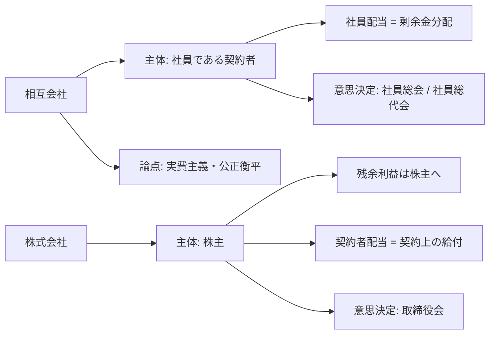
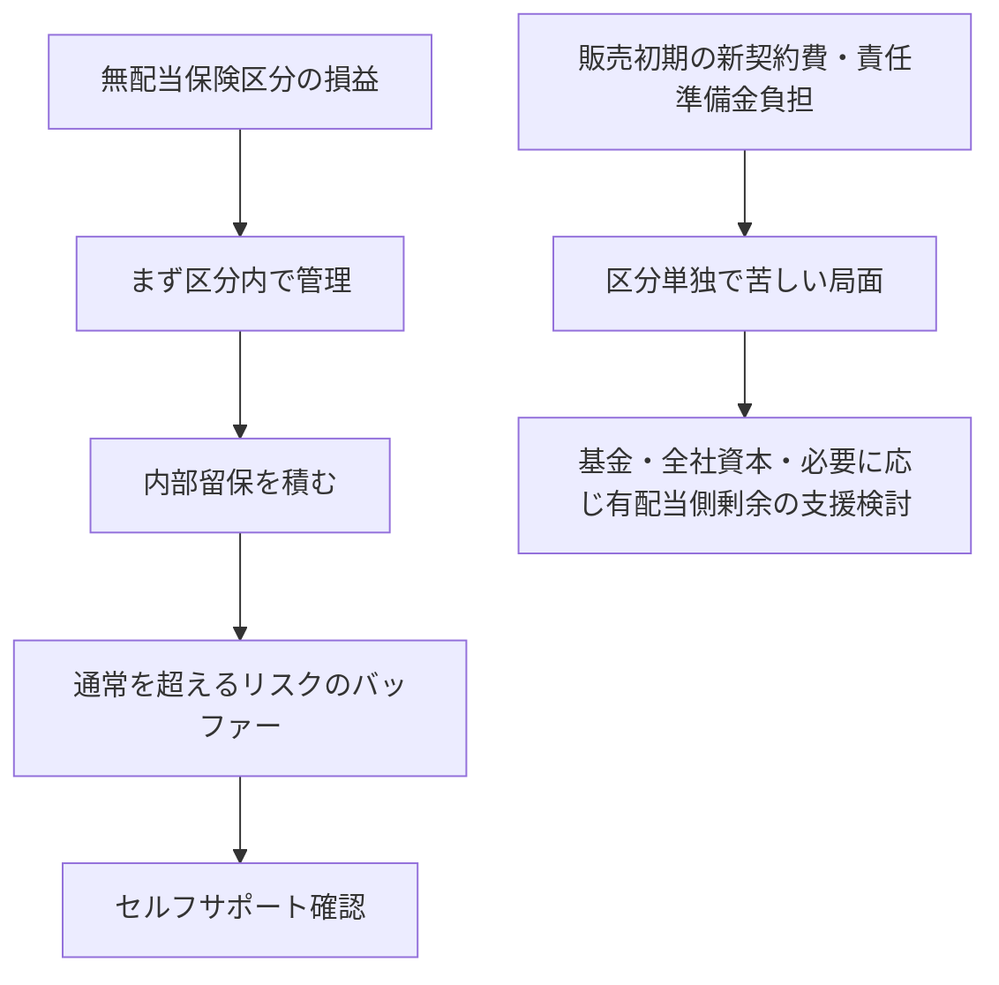

# 相互会社と株式会社

## この資料の狙い

- 第8章を、`誰が会社の主体か` `誰に剰余が帰属するか` という根本から読み直せる形にする
- `契約者配当` `会計処理` `非社員契約` `有配当保険と無配当保険の併売` を、ばらばらではなく一つの流れでつなぐ
- 第I部で混ざりやすい `相互会社の社員配当` `株式会社の契約者配当` `非社員契約の20%制限` `セルフサポートと内部留保` を崩れにくく整理する
- 無配当保険併売の論点を、`公正・衡平` だけでなく `収益性` `健全性` `資本圧迫` まで含めて押さえる

## 教科書との対応

教科書第8章は、大きく見ると次の順で進む。

1. 相互会社と株式会社で、会社の主体がどう違うか
2. その違いが、契約者配当の法的位置づけと意思決定機関にどう表れるか
3. 会計上、配当準備金や純資産勘定の見え方がどう違うか
4. 相互会社が無配当保険を扱うとき、非社員契約をどう整理するか
5. 有配当保険と無配当保険を併売するとき、公正・衡平と健全性をどう守るか

この章は、単なる会社形態比較ではない。  
契約者配当、会計、区分経理、内部留保、ソルベンシーが一つの論点に集まる章である。

## 教科書 8.1-8.4 を順に読む

### 8.1 相互会社と株式会社の配当の違い

ここで一番大事なのは、同じ `配当` でも意味が同じではないことだ。  
相互会社では社員配当は剰余金分配であり、株式会社では契約者配当は契約内容の一部として扱われる。

- 第I部想定問題: 保険相互会社と保険株式会社の契約者配当に関して説明せよ。
- 第I部想定問題: 相互会社の社員配当と株式会社の契約者配当の法的位置づけの違いを述べよ。

### 8.2 会計上の違い

ここは、設立理念の違いが会計処理にどう出るかを見る節である。  
契約者配当準備金繰入額の扱い、基金と資本金の対応関係、利益準備金や損失てん補準備金の位置づけが中心になる。

- 第I部想定問題: 保険株式会社と保険相互会社の会計上の相違点を述べよ。
- 第I部想定問題: 配当準備金繰入額の扱いの違いを中心に説明せよ。

### 8.3 非社員契約

ここは、相互会社が無配当保険を扱うときの実務整理である。  
対象契約、定款、20%制限、区分経理、告知、収支報告まで、法令上のルールがまとまっている。

- 第I部想定問題: 相互会社の非社員契約について説明せよ。
- 第I部想定問題: 非社員契約に関する法令規制を述べよ。

### 8.4 有配当保険と無配当保険の併売

ここは第8章の山場である。  
無配当保険のメリットだけでなく、非社員契約と社員契約の関係、公正・衡平、セルフサポート、内部留保、資本圧迫まで一体で見る必要がある。

- 第I部想定問題: 相互会社が有配当保険と無配当保険を併売する場合の留意点を述べよ。
- 第I部想定問題: 公正・衡平な取扱いの観点から説明せよ。
- 第I部想定問題: 収益性・健全性の観点から説明せよ。

## まず、この章は何を解決したいのか

第8章の出発点は、`同じ保険会社でも、誰が会社の主体かで設計思想が変わる` という一点である。  
ここが見えないと、配当も会計も非社員契約も、全部ばらばらの知識になる。

相互会社では、社員である契約者が会社の主体であり、剰余金分配は実費主義の帰結として理解される。  
株式会社では、株主が残余請求権者であり、契約者配当は契約内容の一部として扱われる。

この違いが、そのまま次の論点に波及する。

- 配当の意味
- 意思決定機関
- 会計処理
- 非社員契約の必要性
- 無配当保険併売時の公平性
- 内部留保と健全性の考え方

だからこの章は、制度の列挙ではなく、`残余利益の帰属主体の違いが実務へどう波及するか` を読む章である。

### 図で先に全体像を見る

この図で押さえたいのは、`会社の主体が違うと、配当の意味も、会計処理も、無配当契約の扱いも連動して変わる` という点である。
第8章は、制度を横に並べて覚える章ではなく、上の一本線をたどる章だと思った方が理解しやすい。

## 誰が会社の主体かで、何が変わるのか

この章で最初に置くべき軸は、`誰が会社の残余請求権者か` である。

- 相互会社: 社員である契約者が会社の主体
- 株式会社: 株主が会社の主体

この一行から、かなり多くのことが説明できる。  
相互会社では、剰余は社員である契約者に帰属するから、社員配当は剰余金分配になる。  
株式会社では、残余利益の帰属先は株主であり、契約者配当は契約上の給付として整理される。

ここが分かると、`なぜ配当準備金の会計処理が違うのか` も `なぜ無配当契約者をそのまま社員にしにくいのか` も説明しやすくなる。

## 契約者配当の意味はどう変わるのか

相互会社の社員配当は、実費主義を実現するための保険料の割戻であり、剰余金分配として理解される。  
したがって、社員相互の利益や損失を踏まえた公正かつ衡平な分配が求められる。

一方で株式会社の契約者配当は、契約内容の一部である。  
保険契約者にどう還元するかという実務上の設計の話であり、会社の設立理念から直接出てくるわけではない。

同じ `契約者配当` という言葉でも、

- 相互会社では剰余金分配
- 株式会社では費用処理される契約上の還元

という違いがある。  
ここを言い間違えると、その後の会計論点も崩れやすい。

## 実費主義とは、ここで何を意味しているのか

相互会社の説明で出てくる `実費主義` は、単に安く売るという意味ではない。  
契約者が社員として会社の主体でもある以上、必要以上に取りすぎた部分は、あとで社員へ返すという考え方である。

だから相互会社では、社員配当はサービスで配るおまけではなく、実費主義の延長にある。  
この感覚があるからこそ、相互会社では社員配当が剰余金分配として正面から論点になるし、公正・衡平も重く問われる。

一方で、実費主義といっても、`取った分をそのまま全部返す` ではない。  
将来の支払いのための備え、内部留保、健全性確保を先に満たさなければならない。ここを落とすと、実費主義をかなり雑に理解したことになる。

## 意思決定機関の違いは、なぜ出てくるのか

配当の位置づけが違えば、誰が決めるかも変わる。  
相互会社では社員自治が基本だから、社員配当の分配方法の最高意思決定機関は社員総会または社員総代会になる。  
株式会社では、契約者配当は契約内容の一部として実務的に扱われ、実質的な最高決定機関は取締役会になる。

ここは単独で問われることは多くないが、配当の法的位置づけの説明に添えると答案が締まりやすい。

## 会計上の違いは、何を反映しているのか

会計方式そのものがまるごと違うわけではない。  
違いが出るのは、主に `配当準備金勘定` と `純資産勘定` の扱いである。

中心は次の二つである。

- 株式会社では契約者配当準備金繰入額は費用処理
- 相互会社では社員配当準備金繰入額は剰余金処分

この違いは、`契約者への還元を何として見るか` の違いそのものである。  
また、株式会社の資本金、資本準備金、利益準備金に対して、相互会社では基金、基金償却積立金、損失てん補準備金が対応する。

第I部では、ここを形式比較で終わらせず、`残余利益の帰属先が違うから会計上の位置づけも違う` と一言添えたい。

## 株式会社の準備金積立ルールは何を意味しているのか

株式会社では、剰余金配当を行うとき、資本準備金と利益準備金の合計額が資本金に達するまでは、配当で減少する剰余金の額に 1/5 を乗じた額を資本準備金または利益準備金として積み立てる必要がある。  
この条文は細かい知識に見えるが、`株主会社では配当と資本維持をどう両立させるか` を示している。

相互会社側の基金や損失てん補準備金と並べて見ると、どちらも資本維持の仕組みを持ちながら、設計思想は同じではないことが見えてくる。  
第I部で聞かれたら、数字だけでなく `資本維持の考え方の差` まで言えると強い。

## 基金、基金償却積立金、損失てん補準備金はどう見ればよいか

相互会社の勘定科目は、株式会社の勘定科目に一対一で置き換えるだけだと少し弱い。  
大事なのは、相互会社も資本維持や損失吸収の仕組みを持っているが、それが株式資本とは同じではないということである。

基金は、相互会社における資本的な性格を持つ調達手段である。  
基金償却積立金は、その基金を償却するための受け皿としての意味を持つ。損失てん補準備金は、その名のとおり損失補填のための備えとして位置づけられる。

ここを相互会社固有の制度として見ておくと、`相互会社には株主がいないから資本維持の問題が薄い` という誤解を避けやすい。  
第8章は、主体の違いがあっても、健全性維持の工夫は当然に必要だということも同時に教えている。

## 非社員契約は何を守る仕組みか

非社員契約は、無配当だから切り離す制度ではない。  
相互会社の中で、無配当契約を整合的に扱うための制度である。

剰余金分配請求権を持たない無配当保険の契約者に、有配当保険の契約者と同じ社員権を広く認めると、

- 剰余金分配の議決に影響する
- 実費主義の整理が崩れる
- 有配当契約者との公平性が曖昧になる

という問題が出る。  
そこで、剰余金分配のない保険契約については、定款で社員としないことができる、という整理が置かれている。

## なぜ無配当保険をそのまま社員契約にするとまずいのか

ここは、制度趣旨を自分の言葉で説明できるかが大事である。  
無配当保険の契約者は、事後的な剰余金分配を受けない前提で契約している。にもかかわらず、その契約者に有配当保険の契約者と同じ社員権を広く認めると、剰余金分配に関する意思決定へ影響できてしまう。

すると、

- 剰余金分配請求権を持たない人が分配ルールへ影響する
- 有配当契約者の実費主義と整合しにくい
- 有配当契約者から見た公平性が揺らぐ

というゆがみが出る。  
非社員契約は、このゆがみを避けるための整理であって、無配当保険を嫌っている制度ではない。

### ミニ例: A さんと B さんを同じ社員として扱うと何が起きるか

| 契約者 | 契約 | 剰余金分配請求権 | 社員として広い議決権を持たせた場合の問題 |
| --- | --- | --- | --- |
| A さん | 有配当終身保険 | ある | 自分の配当に関する意思決定へ参加するのは自然 |
| B さん | 無配当定期保険 | ない | 自分は配当を受けないのに、A さん側の分配ルールへ影響できてしまう |

たとえば、A さんは `保険料を少し高めに取り、あとで剰余が出たら社員配当で返す` という仕組みの中にいる。
一方で B さんは、`最初から配当なしの前提で、より固定的な保険料設計` の中にいる。

この二人に同じ社員権をそのまま与えると、B さんは自分に直接は返ってこない剰余金分配のルールに参加できる。
それでは、`誰が剰余の負担をし、誰が剰余の分配を受けるのか` がずれてしまう。非社員契約は、そのずれを防ぐための仕切りだと捉えると分かりやすい。

## 非社員契約の法令規制はどう押さえるか

ここは第I部で取りやすいので、短く再生できるようにしたい。

### 対象契約

剰余金の分配のない保険契約である。

### 定款

相互会社は、非社員契約を引き受けるなら、その旨を定款で定める必要がある。

### 量的制限

非社員契約からの保険料収入の割合は、おおむね 20% 以下である。  
実際には受再保険契約と出再保険契約の調整が入るが、第I部ではまず `20%制限` を確実に押さえる。

### 経理の区分

非社員契約に係る経理は、社員契約に係る経理と区分しなければならない。

### 告知と報告

非社員であることの告知と、事業年度終了後 4 か月以内の収支報告が必要である。

数字だけ覚えるより、`社員権と剰余金分配の整合性を守る制度` と理解しておく方が忘れにくい。

## 収支報告義務は何のために置かれているのか

非社員契約について収支報告義務があるのは、単なる事務手続ではない。  
相互会社の中で非社員契約を認める以上、その区分がどういう収支構造で動いているかを外部からも確認できるようにしておく必要があるからである。

これは、非社員契約が社員契約にどの程度影響しているか、区分経理が本当に機能しているか、公平性や健全性に問題がないかを見るための窓口でもある。  
20%制限、区分経理、収支報告は、別々のルールではなく、非社員契約を相互会社の中で無理なく扱うための一組の仕組みと考えると理解しやすい。

## 20%制限は何を防いでいるのか

20% という数字だけを覚えると、かなり忘れやすい。  
ここで防ごうとしているのは、相互会社の中で非社員契約が大きくなりすぎ、会社の主体と実際の契約構成とのねじれが大きくなることである。

非社員契約が増えすぎると、

- 相互会社であるにもかかわらず、社員でない契約者が多数を占める
- 社員自治や実費主義の土台が薄くなる
- 公平性確認や区分経理の負担が重くなる

という問題が出やすい。  
20%制限は、そのねじれが過大にならないようにする安全弁と見ると理解しやすい。

## 無配当保険併売で、公正・衡平が難しくなるのはなぜか

無配当保険は、事後精算をしない前提で、より現実の期待値に近い基礎率を使いやすい。  
そのため、見かけ上は安価な保険料を実現しやすい。

しかし、そこからすぐに `無配当保険の方がよい` とはならない。  
有配当保険が社員配当で事後精算を行う以上、次の二つを整理する必要があるからである。

1. 非社員契約と社員契約との関係をどう扱うか
2. 無配当区分から生じた利益や損失を、最終的に有配当契約者へどう帰属させるか

したがって、公正・衡平の論点は、`安い保険料を出せるか` ではなく、`誰の負担でその安さが成立しているか` を問うている。

## 無配当保険併売で区分経理が重くなるのはなぜか

有配当保険と無配当保険を併売するときに区分経理が必要になるのは、表示のためではない。  
どの損益がどちらの契約群団から生まれたのかを切り分けないと、公正・衡平もセルフサポートも確認できないからである。

特に、無配当保険の利益や損失が有配当保険側に見えない形で混ざってしまうと、

- 安い保険料の背後で誰が負担しているかが分からない
- 有配当契約者への配当財源の見え方がゆがむ
- 無配当区分が本当に自立しているか確認できない

という問題が出る。  
第8章で区分経理が重くなるのは、相互会社の論点が配当論だけではなく、管理会計や健全性確認の論点でもあるからである。

## 安価な保険料を実現できることが、そのまま善ではないのはなぜか

無配当保険は、事後精算をしない前提で、より現実の期待値に近い基礎率を置きやすい。  
このため、見かけ上は有配当保険より保険料を低くしやすい。ここだけ見ると、無配当保険の方が合理的に見える。

ただし、教科書がそこで止まらないのは、安さの裏側に `誰がリスクを持つか` の問題があるからである。  
十分な内部留保を積まずに安さを出していれば、後で他区分や会社全体の資本に依存することになるかもしれない。それでは、公正・衡平の観点でも、健全性の観点でも筋が悪い。

だから第8章で見るべきなのは、無配当保険が `安い` かどうかではなく、`安い設計が誰の負担で支えられているか` である。  
ここを言えると、公正・衡平の答案がかなり深くなる。

### ミニ例: 安い保険料の裏で資本を使っているケース

| 項目 | 無配当保険区分の想定 | 実際に悪化した場合 |
| --- | --- | --- |
| 想定保険金等 | 90 | 97 |
| 事業費 | 8 | 10 |
| 保険料 | 102 | 102 |
| 当初見込んだ余裕 | 4 | 0 どころか不足に転じる |

無配当保険は、配当であとから調整する仕組みが弱いので、見込みが外れたときの受け皿を先に持っておく必要がある。
もし内部留保が薄いまま `安い保険料` を前面に出して販売していると、悪化時には区分内で吸収しきれず、全社資本や他区分の支えに頼ることになる。

すると、その安さは `経営努力で実現した安さ` ではなく、`あとで別の誰かが負担するかもしれない安さ` になる。
教科書が安価な保険料の話をしても、そこで拍手して終わらないのはこのためである。

## 収益性・健全性の論点は、なぜ別に立つのか

無配当保険は、配当というバッファーを持たない。  
だから、公正・衡平とは別に、収益性・健全性の観点が立つ。

特に重要なのは次の点である。

- 無配当保険区分ではセルフサポートが基本になる
- 利益をむやみに有配当契約へ流用せず、区分内に内部留保を確保する必要がある
- 販売初期は新契約費負担や標準責任準備金の積増しで損失が先行しやすい
- 必要ソルベンシーを確保するため、自己資本の割当てやバッファー財源の検討が要る

つまり、無配当保険は `配当がないから単純` なのではない。  
むしろ、配当バッファーがない分だけ、健全性管理は繊細になる。

## 販売初期に資本圧迫が起きやすいのはなぜか

無配当保険の販売初期は、見た目より苦しい。  
新契約費が先に出る一方で、利益はまだ安定的に出ないからである。さらに、基礎率の設定次第では標準責任準備金への積増し負担も重なる。

すると、無配当保険区分からの利益だけでは、必要なソルベンシーを十分に支えられない場面が出る。  
ここで問題になるのが、自己資本のうち、どれだけ無配当保険へ割り振れるか、また販売拡大が全社の資本政策に無理をかけていないか、である。

つまり、無配当保険は `安価だから売りやすい商品` であると同時に、`立ち上がりで資本を食いやすい商品` でもある。  
第8章で収益性・健全性を独立で問うのは、そのためである。

## 有配当保険側の剰余や出資は、どういう位置づけになるのか

無配当保険区分が販売初期に十分な内部留保を持てないとき、会社全体の資本や有配当保険側の剰余から支える余地が論点になる。  
ただし、これは `困ったら他区分から持ってくればよい` という話ではない。

有配当保険側の剰余や出資を使うということは、結局は社員である有配当契約者の側が一定のリスクを負うことを意味する。  
だから、その必要性、金額、回収可能性、将来の内部留保積み上げとの関係を慎重に見なければならない。

この論点を軽く扱うと、公正・衡平と収益性・健全性が分断されてしまう。  
実際には、資本支援の議論はその両方の交点にある。

## セルフサポートと内部留保はどうつながるのか

ここは第8章の核心であり、第II部にも直結する。  
非社員契約の無配当保険勘定でセルフサポートが要求される以上、剰余をむやみに他区分へ流せない。まず区分内に十分な内部留保を持つ必要がある。

その理由は単純である。

- 無配当保険は配当による調整余地が小さい
- 販売初期は利益が安定しない
- 通常の危険を超えるリスクに備えるバッファーが要る

したがって、収益性・健全性の答案では、`セルフサポート` `内部留保` `資本圧迫` `バッファー財源` をセットで出せると強い。

## バッファー財源はどこから来るのか

無配当保険区分に通常の危険を超えるリスクが出たとき、どこで吸収するかは重要な論点である。  
教科書や過去問で押さえておきたいのは、次の三つである。

- 基金のうち、無配当保険契約に割り振られたと想定される部分
- 無配当保険区分内の内部留保や危険準備金
- 必要に応じて有配当保険側の剰余や出資

ここで大事なのは、`最初から他区分に頼る` のではなく、まず無配当保険区分内でどこまでセルフサポートできるかを見ることである。  
そのうえで、販売初期など区分単独では持ちにくい局面に、どこまで会社全体の資本を振り向けるかが問題になる。

### 図で見る: 無配当保険区分の利益と資本支援の順番

順番が大事で、最初から `利益は全部どこかへ流してよい` でも、`不足したらすぐ他区分に穴埋めしてもらえばよい` でもない。
まず区分内で内部留保を積み、セルフサポートを確認し、それでも持ちにくい局面で初めて全社的な資本支援が論点になる。

## 非社員契約の利益は、最終的に誰に帰属するのか

ここは少しややこしいが、かなり大事である。  
非社員契約である無配当保険から得られた利益や損失は、区分経理上はまず無配当保険区分で管理される。けれども、相互会社全体で見れば、最終的には社員である有配当契約者との関係を避けて通れない。

だからこそ、教科書は `むやみに流用しない` ことを重く見ている。  
無配当保険区分でセルフサポートを徹底し、まずその区分内で内部留保を確保する。それでもなお余力や不足が出るなら、はじめて全社的な資本や有配当契約との関係を整理する、という順番になる。

ここを飛ばすと、`非社員契約の利益は全部有配当契約者のもの` という乱暴な理解になりやすい。  
実際には、区分経理、セルフサポート、内部留保を経て初めて帰属の議論が意味を持つ。そこが第8章の難しいところであり、面白いところでもある。

## この章が区分経理やソルベンシーの章とつながるのはなぜか

第8章だけ独立して覚えると、会社形態の比較問題で終わってしまう。  
でも実際には、この章は第3章、第6章、第7章とかなり深くつながっている。

契約者配当の公平性を見るには区分経理が要る。  
無配当保険区分のセルフサポートを見るには、内部管理会計や将来収支の見方が要る。  
販売初期の資本圧迫やバッファー財源を見るには、ソルベンシーや広義の自己資本の考え方が要る。

つまり第8章は、会社形態の制度論ではなく、`誰のために剰余を使い、誰がリスクを負い、どう健全性を守るか` の章である。  
ここまで見えると、第I部の説明問題も、第II部の所見問題もかなり書きやすくなる。

## この章で混ざりやすい論点

### 相互会社の社員配当と株式会社の契約者配当

- 相互会社: 剰余金分配
- 株式会社: 契約内容の一部として費用処理
- 同じ `配当` でも、法的位置づけが違う

### 非社員契約と無配当保険

- 無配当保険を扱うことと、どういう法的整理をするかは分けて読む
- 実務上は非社員契約として扱う考え方が中心になる
- 本質は、社員権と剰余金分配の整合性にある

### 公正・衡平と収益性・健全性

- 公正・衡平は、誰の負担で誰に還元するかの話
- 収益性・健全性は、区分内でどれだけ持ちこたえられるかの話
- 併売論点では、両方を書かないと浅くなりやすい

## 第I部でどう問われるか

第8章の第I部は、大きく次の四つで整理すると見通しがよい。

### 1. 配当の法的位置づけ

相互会社の社員配当と株式会社の契約者配当の違いを問う問題である。  
ここは `誰が会社の主体か` から話し始めると安定する。

### 2. 会計上の違い

配当準備金繰入額の扱い、基金と資本勘定の対応関係が中心になる。  
形式比較だけでなく、理念の違いまで添えたい。

### 3. 非社員契約の制度

対象契約、20%制限、定款、区分経理、報告義務が問われやすい。  
短答的だが取りこぼしたくない。

### 4. 有配当保険と無配当保険の併売

H18 型の総合問題であり、`取扱い` `公正・衡平` `収益性・健全性` をまとめて書く力が要る。  
ここがこの章の本丸である。

## この章の勉強のしかた

順番としては、次の流れが入りやすい。

1. `誰が会社の主体か`
2. `相互会社と株式会社で配当の意味がどう違うか`
3. `その違いが会計へどう出るか`
4. `非社員契約は何を守る制度か`
5. `20%制限、区分経理、報告義務`
6. `有配当保険と無配当保険の併売`
7. `公正・衡平`
8. `収益性・健全性、セルフサポート、内部留保`

最初の山は、`誰が残余利益の帰属主体か` を一言で言えるようにすることである。  
ここが見えれば、配当も会計も非社員契約も全部つながる。

二つ目の山は、`無配当保険は安い商品であると同時に、健全性管理が難しい商品でもある` と理解することである。  
ここまで腹に入ると、H18 型の総合問題でもぶれにくい。

## 参考にしたもの

手元資料

- `note/教科書/hoken2-seiho_08.pdf`
- `note/単元別マークダウン/02-08 相互会社と株式会社.md`
- `study/first_part/02-08_相互会社と株式会社.md`
- `note/所見対策/11.相互会社と株式会社.txt`
- `note/第一部分析/単元別/02_契約者配当.md`
- `note/第一部分析/単元別/05_ソルベンシー.md`

過去問メモ

- `H27-1`
- `H25-1`
- `H18-2`
- `H14-1`
- `2020-1`
